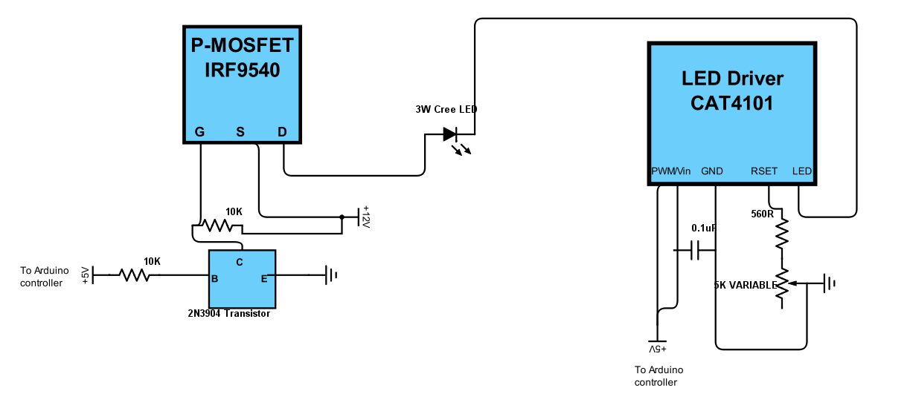
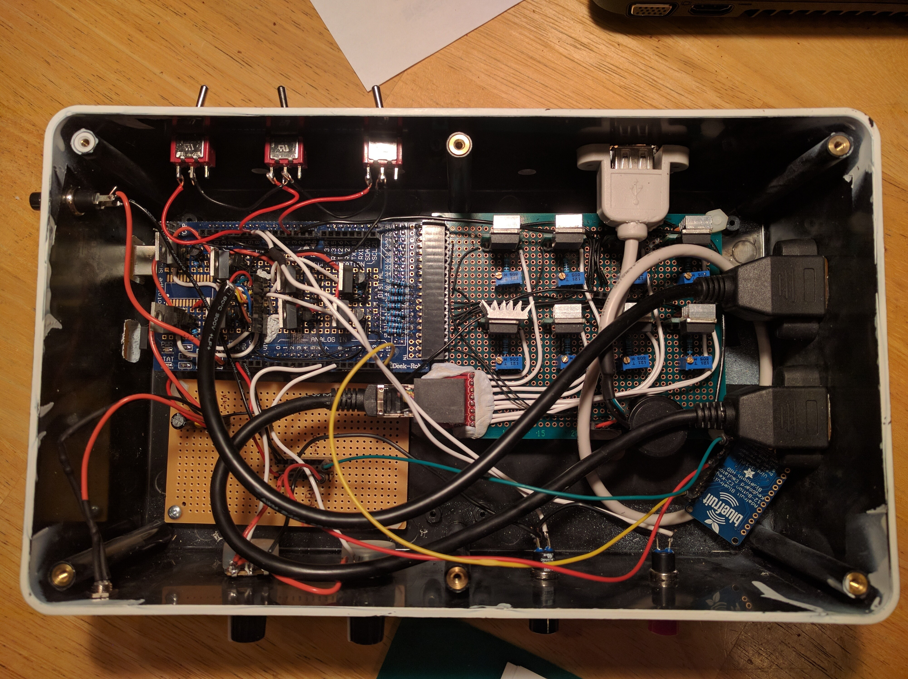

Design Considerations, or A Design History
==========================================

This is just a quick explanation of how I came up with the basic LED lighting and control system I use in my RTI system. You might find it useful in understanding how things work, and I hope it's not too technical; but you don't have to understand this to build the system.

I first started working on this project early in 2013. I needed a control system that could turn on a large series of individual LEDs in sequence. I knew the control system would be driven by an Arduino, since the control requirements were pretty basic - turn lights on and off, fire a camera shutter in sync with the lights. `A post on the Hackaday blog`_ linked to `a previous blog post`_ on my project, and one comment in particular struck me. The author said that my project was "not much more than some LEDs mounted to a camera", and that he could build a comparable system for less than $100. I had to smile - I used virtually the same words to a friend of mine three-and-a-half years ago when I started working on the idea, including that exact dollar amount. Turns out that there's a whole lot of complications that you don't think about until you actually start working on a project like this.

The main idea the author had was that you could use `inexpensive addressable RGB LED strips like this one`_ to simplify the whole process of controlling the lighting, as well as cutting the cost. Nice idea, but three big problems that aren't immediately obvious.

The three big problems
----------------------

LED strips
^^^^^^^^^^

The LEDs on these 1-meter strips use 60 mA of current each (3.5 A strip total / 60 LEDs). I spent a lot of time figuring out how powerful the LEDs needed to be in order to light up a system up to a meter in diameter. My first thought was to power LEDs individually from Arduino Mega outputs, which limited me to 30 mA current (spec max is 40 mA, but it's recommended you stay away from that if possible). I tried "superbright" LEDs, in both straw-hat variety (wide uniform light dispersion), and focused (bright in the center, but narrow non-uniform beam). The straw-hats simply didn't have enough light intensity for reasonable camera exposure times even with smaller domes, a minimum of several seconds. The focused LEDs resulted in reasonable exposure times, but the small size of the lit area and its non-uniformity made them an unacceptable choice. Based on my initial experiments, I calculated that I needed at least 100 mA of current for reasonable exposure times for large domes with wide dispersion LEDs, and bought 0.5 W straw-hat LEDs for that.

Turns out I was optimistic, and the exposure times for the first dome I built (18" diameter) were on the order of a second or more, which translates to more than 4 seconds for larger domes. And this was with the lowest f-stop I had; dropping the f-stop to improve depth of field could increase exposure time by a factor of 4 or more. An upgrade to 350 mA / 1W LEDs brought that exposure time to about 1/2 a second, which would translate to 2 seconds for a larger dome, but still not good enough. That's why I ultimately went to my current design, which supports 1 A / 3W LEDs, and could in principle be modified to double that. 60 mA LEDs just don’t produce enough light for reasonable exposure times.

A `recent paper by Tom Kinsman`_ had similar results. He built his own independent RTI system, using `an Adafruit LED matrix driver`_ controlled by an Arduino Uno that supplies a maximum of 50 mA of current to his LEDs. With a 12" diameter dome, and a macro lens stopped down to f/8.0, his exposure times were 4 seconds, which translates out to 40 seconds for a one-meter dome. OK for the small dome, albeit a bit slow, but way too long for a big dome.

Why are big domes important? Because a rough rule of thumb is that the largest object you can accurately image with Reflectance Transformation Imaging is half the distance to the light source you're using. So for a 12" dome, 6" radius, that's 3". I think this is conservative, and you can do a bit bigger, but there's still a limit. Larger domes allow for accurate imaging of larger objects - a one-meter-diameter dome can image an object about 10" in size.

Light intensity
^^^^^^^^^^^^^^^

When I was testing the 30 mA LEDs, I found that the variation in light intensity between different LEDs was as much as 20%. Reflectance Transformation Imaging requires that the light sources be as close to the same intensity as possible, otherwise the final result may be an inaccurate fitting of the light curve. I wasn't sure about the reason, but a bit of research brought up the most logical answer. While LEDs are sold with a quoted forward voltage for a specific current, what you actually get from a bunch of LEDs is a spread of forward voltages centered around the specification. Given how steep an LED I vs. V curve can be, a small change in Vf can result in big changes in the current, and big changes in the light intensity (see Grumpy Mike's `excellent discussion of these issues`_). The current-limiting resistor commonly used with low-current LEDs is there to drop the voltage across the LED so that you don't burn it out, and not to specifically control the exact current. Given the low cost of the LED strip, I have to believe that it uses resistors to limit current to the LEDs, which could translate into substantial differences in output power between different LEDs. Not acceptable. My systems have always used adjustable constant current regulators to get around this problem.

Spectrum
^^^^^^^^

Finally, RGB LED strips create "white" light by turning on the red, green and blue LEDs simultaneously. While it looks "white" based on appearance, it's not a very good white. Here's a "white" spectrum from an RGB LED:

.. figure:: ../figures/rgb_led_white_spectrum.png
   :align: center
   :alt: "white" spectrum from an RGB LED
   
   White spectrum from an RGB LED, not very uniform.

The LEDs I wound up using for my RTI systems are Cree 3W/1A neutral white star LEDs. Here's a spectrum from a neutral white Cree LED (the green line), like the ones I spec for my system:

.. figure:: ../figures/neutral_white_led_spectrum.png
   :align: center
   :alt: spectrum from a neutral white Cree LED (the green line)
   
   Spectrum from a neutral white Cree LED (the green line).

Much more balanced and uniform over the visible spectrum, with a peak near the blue end. This is easier to color correct than the RGB "white" spectrum. What’s more, Cree LEDs are “binned” to have color rendering indices (CRI) that are close to each other; cheap super-bright LEDs can have large differences in CRI in the same batch

Control a swarm of LEDs
-----------------------

Next issue is how to control a large number of high-current LEDs from an Arduino Mega. While in principle there are likely enough outputs from a Mega to control a fair number of LEDs individually, in practice that would make the circuit design and the wiring a nightmare. The obvious solutions was to use a LED matrix design, with 8 rows x 8 columns for a maximum of 64 LEDs.

.. figure:: ../figures/led_matrix_design_8x8.png
   :align: center
   :scale: 60%
   :alt: LED matrix design
   
   LED matrix design with 8 rows x 8 columns.

To turn on a single LED, you need to activate the appropriate electrical connections for the matching row and column, high-side voltage for the columns, low-side for the rows. For example, activating Column 4 and Row 5 lights up only the 4th LED in the 5th row.

Running sequentially through rows and columns, every light can be turned on just once. This requires the use of only 16 Arduino output pins to control all the LEDs.

Solving the next problem, getting accurate control of LED currents up to 1A, requires circuitry on both the high and low sides of the LED. Here's the solution I came up with:

   
   LED circuitry

Sorry about the crummy schematic - most of mine are hand-drawn. On the left is a standard high-side P-channel MOSFET driver layout, which is easily found on the Internet (e.g. `here <http://forum.arduino.cc/index.php?topic=130384.0>`_ and `here <http://forum.arduino.cc/index.php?topic=130384.0>`_); these control the columns of the LED matrix. I originally used a single-chip high-side Darlington array with 8 channels, but the maximum current was only 350 mA, resulting in LED light intensities that were still a bit dimmer than what I wanted; P-Channel MOSFETs can handle much higher currents, even though I had to now use 8 of them. 

The P-Channel MOSFET controls on/off for the LED power supply, shown as +12V, but which normally runs at +9V, and can run +8-12V. The connection from +12V through the 10K resistor to the Gate is required because P-channel MOSFETs are on when the Gate is unbiased, so a voltage equal to the Source-Drain bias voltage needs to be applied to keep the MOSFET normally turned off. When +5V is applied from an Arduino controller output pin to the base of the 2N3904 transistor, it turns that transistor on, which shunts the +12V voltage away from the gate and turns on the P-MOSFET supply voltage to the LED. Check out the links above for a more coherent explanation. 

Below is a better schematic of the high-side driver from the first site linked above; the "Load" in this case is an LED, and there's no need for a flyback protection diode (commonly used with inductive loads like motors or relays). I use IRF9540 P-Channel MOSFETs because they're cheap, and work fine, but an FQP27P06, FQ47P06, or NDP6020P P-Channel MOSFET would work just as well. You just need a P-channel MOSFET that can handle high currents, and has a low Rds.

.. figure:: ../figures/high_side_schematic.png
   :align: center
   :scale: 60%
   :alt: schematic of the high-side driver
   
   Schematic of the high-side driver.
   
On the right-side of my schematic is the low-side driver/control (handling the LED matrix rows), a CAT4101 LED driver that not only switches on and off the low (ground) side, but allows you to set a desired current between 150 mA and 1 A. This is a 5-pin chip. The first pin, EN/PWM, switches on the LED and can control intensity through Pulse Width Modulation; the 2nd pin, Vin, supplies +5V of power to the chip. I have these two pins bridged in my control system, so that the same Arduino controller pin both switches the chip on and supplies power. I did this because leaving all of the CAT4101 chips powered on continuously led to some weird issues with multiple LEDs turning on even when only one should have. The GND pin goes to ground. RSET connects to resistors that set the output current, with 560R giving you about 1 A, the maximum. 

The 5K variable resistor lets you fine-tune the current to allow for variations between different chips, and also allows you to set currents lower than the max 1A. This is useful for extending the life of the LEDs by keeping them from overheating, and also in certain use cases. For example, I sometimes use USB microscopes for micro-RTI, and full LED intensity is usually too bright for those; if I turn the current down to 150 mA, then there's no problem with sensor saturation. Finally, the LED pin connects to the ground side of the LED.

The schematic shows one high-side and one low-side driver, connected to one LED. But in the control system, there are eight high-side drivers, each connected to a column in the LED matrix, and 8 low-side drivers/constant current controls, each connected to a row in the matrix. Each driver is connected to an Arduino controller output pin that can turn it on and off as needed in software. This setup can drive up to 64 Cree 3W LEDs to their full power limit, at a current of 1 A.

Just for laughs, here's the inside of my original controller box from 2013, using a Darlington array:

.. figure:: ../figures/original_controller_box.jpg
   :align: center
   :scale: 30%
   :alt: original controller box from 2013
   
   Original controller box from 2013.

And here's the most recent version I've built, the prototype for the system I'm describing on these project pages:

   
   P-Channel MOSFETs on the left, CAT4101 chips on the right side.

.. _A post on the Hackaday blog : http://hackaday.com/2016/09/14/mit-researchers-can-read-closed-books-and-defeat-captcha/
.. _a previous blog post : https://hackaday.com/2016/07/29/hackaday-prize-entry-reflectance-transformation-imaging/
.. _inexpensive addressable RGB LED strips like this one : http://amzn.to/2cZds3u
.. _recent paper by Tom Kinsman : http://firstmonday.org/ojs/index.php/jbc/article/view/6625/5247
.. _an Adafruit LED matrix driver : http://amzn.to/2cZdKaA
.. _excellent discussion of these issues : http://www.thebox.myzen.co.uk/Tutorial/LEDs.html