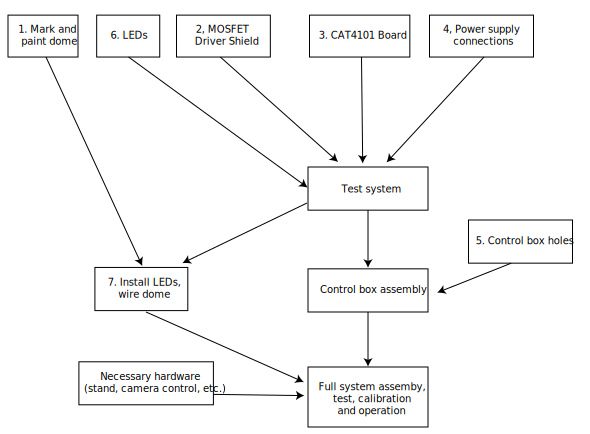

Assembly Logistics
==================

I've had a few emails asking about how difficult this project will be to make, and how long it will take. Not exactly sure how to answer the first question, as it depends on your level of experience and willingness to learn. Having said that, if you know or can pick up simple soldering, and know how to use tools, there's nothing that you should find particularly challenging. Hopefully that's especially true because, for better or for worse, I'm trying to document every single step as thoroughly as I can.

As far as time, I think that if I were pushed, and had all the parts, I could probably put together a system in a long weekend plus a few extra weeknights (given the benefit of experience plus now having a set of written instructions). However, if you can grab a bunch of friends to help, much of the project could be broken down into subsections that people can work on independently of others at various stages.

Even some of these can be broken into separate concurrent processes that several people can work on at the same time:

1. Dome prep, marking and painting (do this one day ahead of all other steps)
2. MOSFET driver shield assembly
3. CAT4101 driver board assembly
4. Power board and Arduino power wiring
5. Control box preparation (drilling/cutting holes)
6. Individual LED wiring
7. LED Matrix / Dome wiring (allow one day for adhesive to dry)
8. Necessary hardware (stand, camera control, etc.)

With multiple assemblers at work, this can easily be a one-weekend project. Beer is a useful bribe. 

I’ve embedded an assembly flow chart below that shows all of the above subsections numbered:

   
   RTI-Mage System Build Flowchart