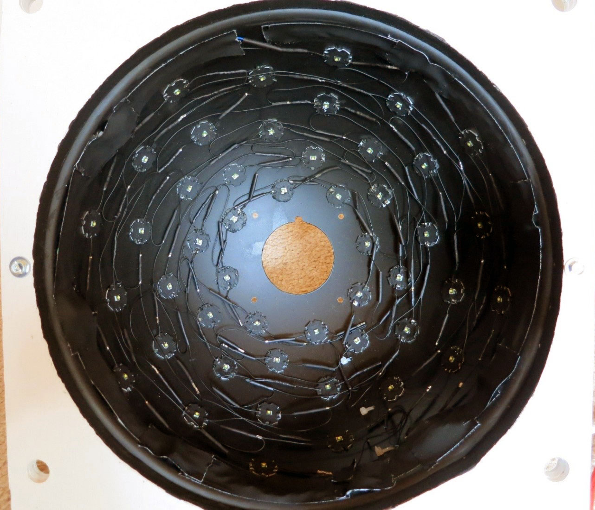
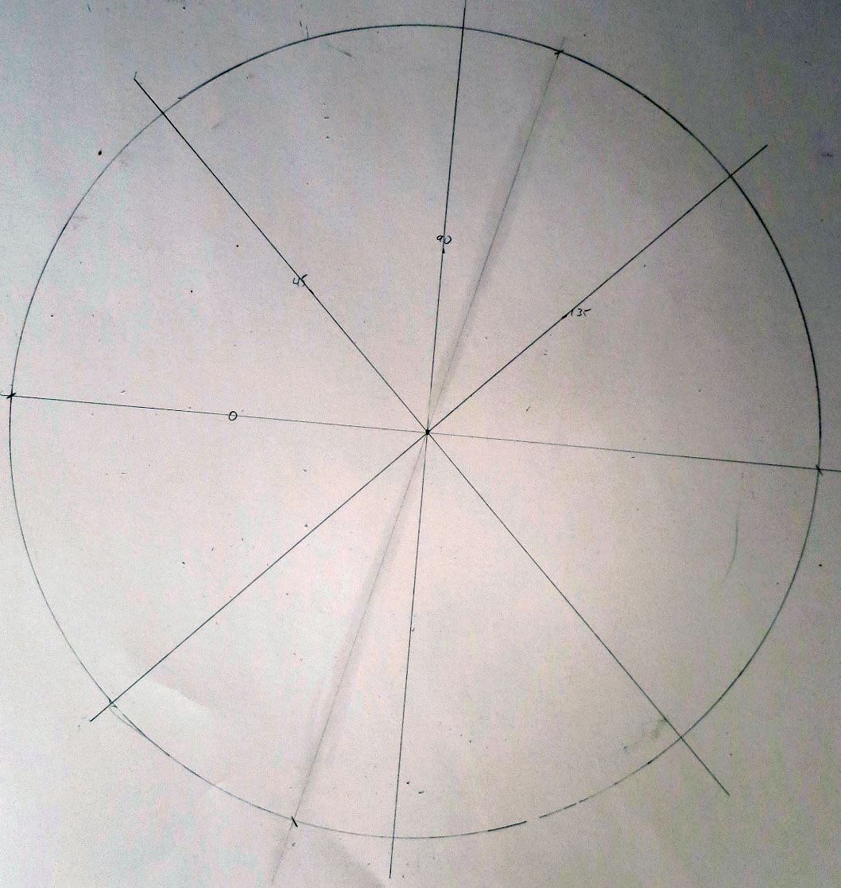
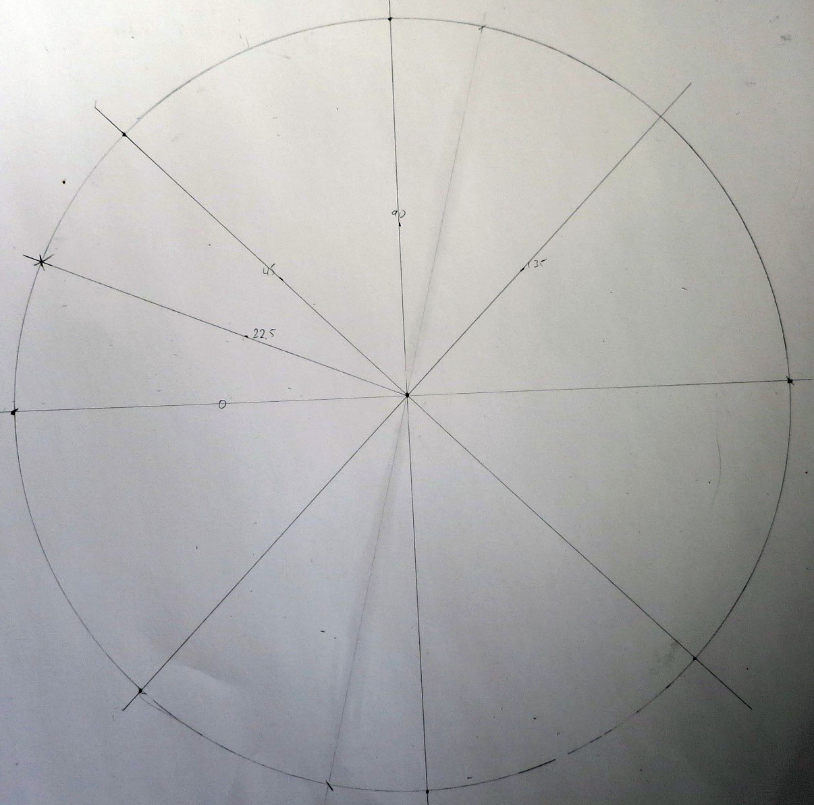
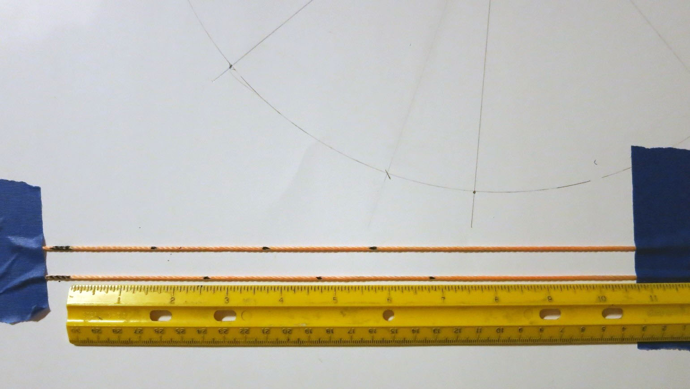
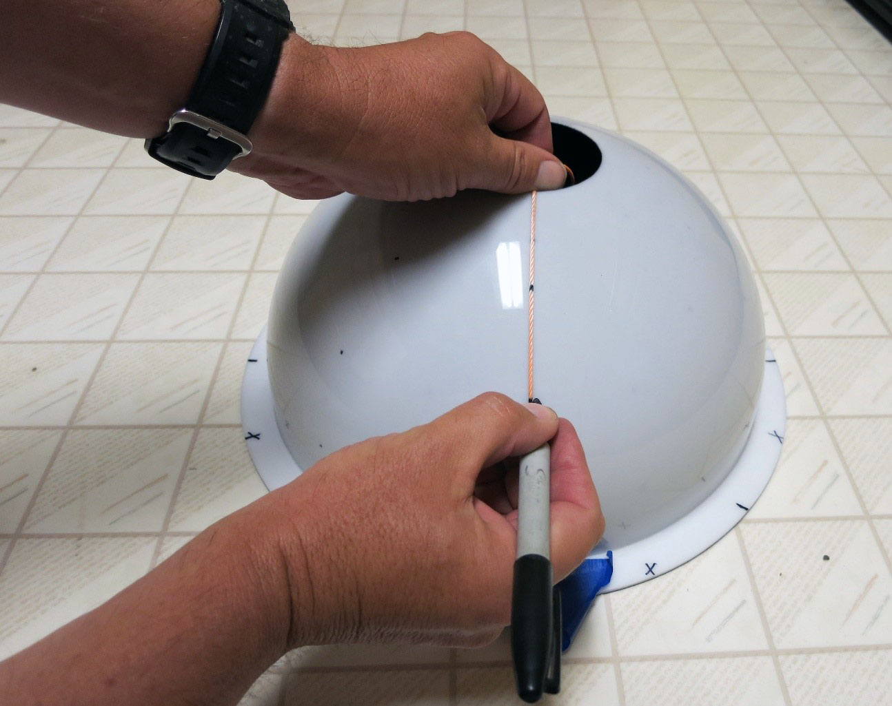
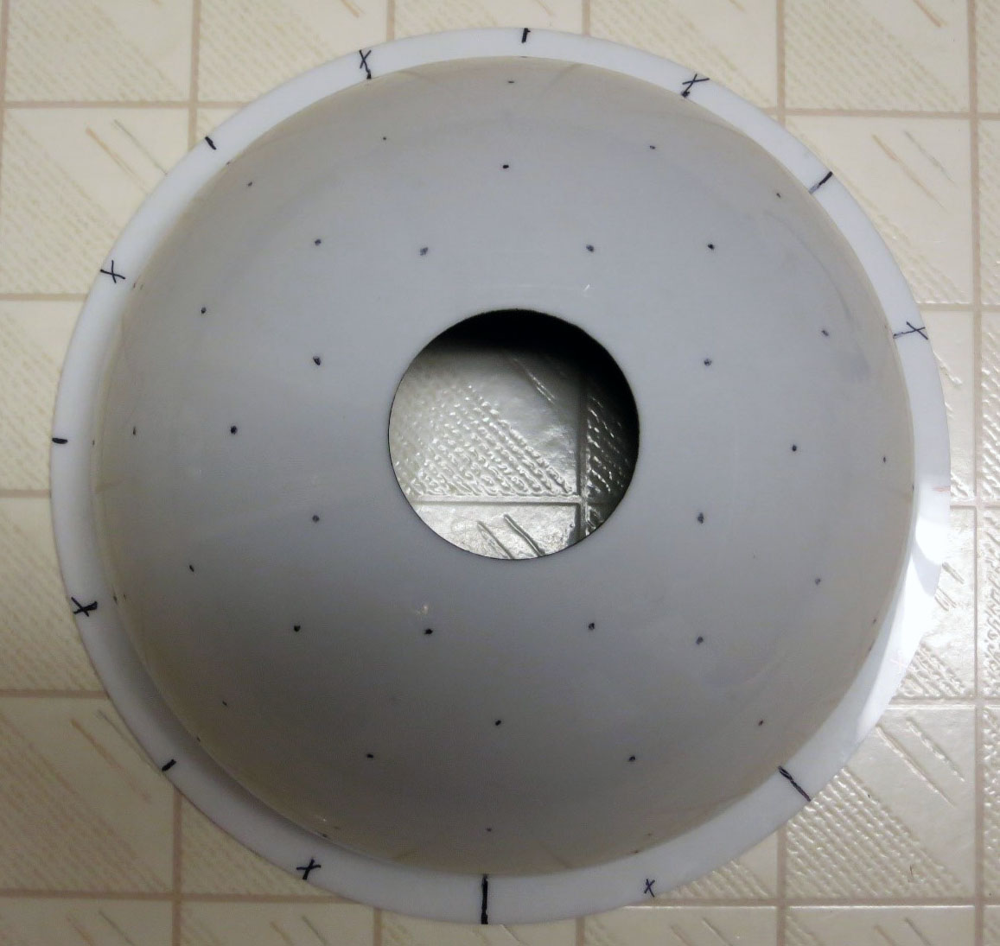
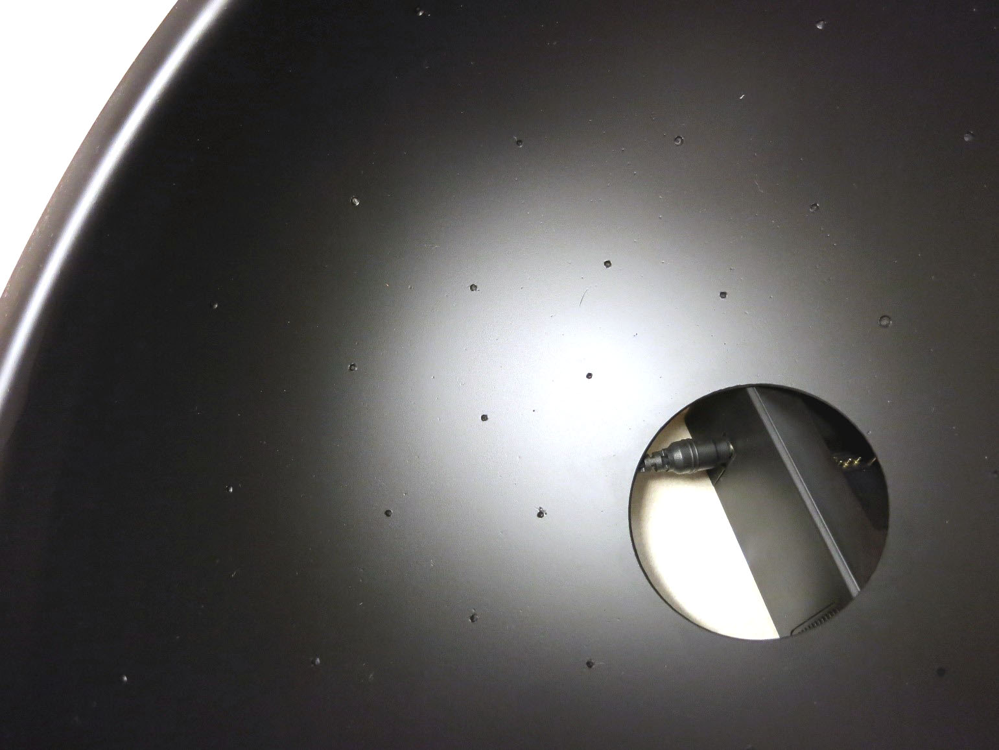

Prepping the dome
=================

This first section will deal with prepping the dome for installing the LED lights on the inside. In a general sense, this boils down to two operations:

1. Marking the positions where the LEDs will be mounted evenly on the inside, so that they'll still be visible after you paint the inside of the dome.

2. Painting the inside of the dome matte/flat black, to minimize scattered light.

By now, you've hopefully read the previous section on how to select a dome, have ordered it, and now have it sitting before you, like this one :

.. figure:: ../figures/dome/dome_white.jpg
   :align: center
   :width: 8cm
   
   Not exactly like this one - I've already marked the LED positions and painted the inside. But I'll use it as a model for this section.

When construction is completed, and all the LEDs installed, the inside of the dome will look something like one of these :

   
   Interior of 12" diameter dome, with 48 LEDs

.. figure:: ../figures/dome/dome_interior_64_led.jpg
   :align: center
   :width: 8cm
   
   Interior of 18" diameter dome, with 64 LEDs

The LEDs are mounted in rows with shifted columns, with even rows lining up with even rows, and odd with odd; this is to maximize the variation in angular position. The 12" dome has 48 LEDs in 6 rows/8 columns, while the 18" dome has the maximum of 64 LEDs, 8 rows and 8 columns. 8 rows and 8 columns are the maximum, but you can have fewer than those.

It’s possible to have rows with varying numbers of columns, but I don't recommend it - it makes wiring the system and managing the software a real pain. Plus, you want to have the LEDs spaced uniformly in angle for best results, and that can be tricky with varying column counts. So the first thing to do is figure out where the LEDs will need to be mounted inside the dome, and mark those positions. It's best to do this before you paint the inside of the dome black.

Before proceeding, a quick comment about accuracy. While getting the rows and columns laid out evenly will make assembly easier, don’t worry too much about accuracy, as small errors won't make that big a difference in the results you get from the system. While the software needs to know the positions of the lights in order to do its calculations, it gets those positions from a calibration file that's generated from the actual light positions. So even if one or more lights are a bit "out of line" with others in their row or column, it won't make a significant difference in the results, since the calibration file will take that into account. 

Determine and mark the angular positions of the columns
-------------------------------------------------------

To find the angular spacing, just divide the number of columns into 360 degrees. So for 8 columns, the spacing would be 45 degrees; 60 degrees for 6. I wouldn't use fewer than 6 columns, and 8 is preferable to 6.

Place the dome on a sheet of paper large enough to allow you to trace a circle around the edge of the dome flange, then trace the circle.

.. figure:: ../figures/dome/dome_trace_circle.jpg
   :align: center
   :scale: 50%
   
   Trace circle; dome obscures about half of it

Find the center of the circle you've just drawn. There are several methods you can use (`ask Google <https://www.google.com/search?q=find+the+center+of+a+circle&oq=find+the+&aqs=chrome.0.69i59j69i65l3j69i57j0.1575j0j4&sourceid=chrome&ie=UTF-8>`_), but `this one <http://www.mathopenref.com/constcirclecenter2.html>`_ is probably the simplest and cleverest.

.. figure:: ../figures/dome/dome_center.jpg
   :align: center
   
   Center found!

Erase all the lines you've drawn except one, which you'll use as a reference. Using a protractor, and the reference line, mark the angles at the spacings you determined in A.1, i.e. 45 degrees or 60 degrees; 45 degrees for the picture below.

dome_angles.jpg
Angles marked at 0/45/90/135 degrees

Draw lines through these marks extending out to the edges of the circle; make an accentuating mark (x, dot, whatever) where the line and circle intersect.

   
   Lines intercept edge of circle at 8 points (45-degree spacing)

   
   Extra mark at 22.5 degree angle

Place the dome back on the paper so that it is centered inside the traced circle. Mark the flange clearly at every position where the angle lines intersected the circle. You may find it tough to find something that can temporarily mark acrylic plastic. Sharpie permanent markers work quite well, and the mark can be removed by rubbing with a paper towel soaked in WD-40; other solvents may work, but test them first to make sure they don't dissolve the plastic. Bits of masking tape are another option.

.. figure:: ../figures/dome/dome_flange_marks.jpg
   :align: center
   :scale: 50%
   
   Dome flange marked at 45-degree increments

Now take the dome and rotate it in the traced circle until one of the initial marks lines up with the mark created in step 6 above. Repeat the process of marking the dome flange at all the positions where the angle lines intersected the circle; try and differentiate this mark somehow from the first set (different color, put a slash through it, etc.). You have now marked the angular positions for all the columns. Half the rows will have their LED columns lined up with the first set of marks, the other half will be lined up with the second set of marks.

.. figure:: ../figures/dome/dome_flange_marks_2.jpg
   :align: center
   :scale: 50%
   
   Second set of marks spaced at 45 degrees, located between first set of marks

Determine the heights of the rows, and mark the LED positions on the dome
-------------------------------------------------------------------------

Using standard RTI guidelines, the lowest angle the LEDs should be mounted is at 15 degrees above the plane of the ground; below this lighting angle, the object you're photographing may be too dim. The highest angle should be somewhere around 65-75 degrees; above this, the LED lighting angle may make the object too bright. With your desired top and bottom angles, the number of LED rows you'll be installing, and the size of the dome, you can figure out the proper spacing on the rows.

Example 1
^^^^^^^^^

My big dome (18" dome diameter, 8 rows of 8 LEDs, 16 through 72 degrees). With 8 rows, there will be 7 angular gaps between the rows (8-1). The total angular distance between the low and high rows will be 72-16 = 56 degrees. The angular distance between individual rows will be 56/7=8 degrees. So there will be rows at the following angular positions (where bottom = 0 degrees):

.. hlist::
   :columns: 3

   * 16
   * 24
   * 32
   * 40
   * 48
   * 56
   * 64
   * 72

To figure out the true arc distance up the side of the dome these angles correspond to, divide the angle by 90, then multiply by 1/4 the circumference of the dome. For an 18" diameter, the circumference is 18" x pi, or about 56.4"; 1/4 of that is 14.1". Divide the table above by 90 and multiply by 14.1", and you get (after rounding):

.. hlist::
   :columns: 3

   * 2.5"
   * 3.8"
   * 5.0"
   * 6.3"
   * 7.5"
   * 8.8"
   * 10.0"
   * 11.3"

So these are the row distances above the base of the dome/flange junction. But the columns in adjacent rows will be shifted by half the angular spacing, so you should group the heights into two staggered sets of rows (each set has LED columns aligned with each other):

===== =====
Set 1 Set 2
===== =====
2.5"  3.8"
5.0"  6.3"
7.5"  8.8"
10.0" 11.3"
===== =====

Example 2
^^^^^^^^^

The small dome (12" dome diameter (the size of the dome I'm building here), 6 rows of 8 LEDs, 15 through 65 degrees).

* Angular distance between high & low = 65 - 15 = 50.
* Angular distance between individual rows = High & Low / (# rows -1) = 50 / (6-1) = 10 degrees between rows.
* Row angles = 15, 25, 35, 45, 55, 65.
* 1/4 circumference = 12" x pi/4 = 9.4"
* Row distances (from bottom) = 1.6", 2.6", 3.7", 4.7", 5.7", 6.8"
* Row distances paired by column alignment = 1.6", 3.7", 5.7" and 2.6", 4.7", 6.8"

.. warning::
   
   If this isn't 100% clear, just keep reading - hopefully after you see the actual marking operation, you'll understand.

Now you need some way to mark these distances on the dome. Take a piece of string, make one mark on it to indicate the zero reference point, and then measure and mark positions for the first set of row distances on that piece of string (1.6", 3.7", 5.7" in this case). Create a similar second string for the other set of row distances (2.6", 4.7", 6.8"). Taping the ends of the strings down while marking them helps keep them straight.

   
   Marking sets of distances on two string segments. The long marks at left mark the zero point on the right edge of the mark. These are distances for the 12" dome, Example 2.

Tape the first string to the dome at the base with the flange at one of the marked angles, so that the zero distance mark is at that base. Tape or hold the other end of the string on the top edge of the hole, making the string as perpendicular to the base as you can. Make marks on the dome next to the marks on the string. Repeat this for all matching marks with the same angular spacing as in A.1.

   
   Marking the first set of columns
   
Repeat step B.3 with the second piece of string, on the other set of marked angles (the ones offset by half the spacing of the first set; these should lie exactly halfway between the first set of marks you made).

And this is how the dome should look when you're done when viewed from above:

   
   48 marks on this dome for 8 columns x 6 rows of LEDs
   
Transfer the marked positions to the interior of the dome
---------------------------------------------------------

The marks on the outside of the dome correspond to the positions of the LEDs on the inside of the dome. Thing is, you're about to paint the inside of the dome black, which will make it difficult to figure out what the corresponding position is. So, before you paint the dome, you'll want to put some kind of mark on the inside that will remain visible even after you paint it.

There are several options:

a. Put a blob of paint or nail polish on the inside of the dome at the same position as the mark on the other side.
b. Drill or scratch a small dimple at the same position as the mark on the other side. Be careful with this approach - I used an electric drill with the dome picture above, and came close to punching through the dome in several spots. Do it by hand and you should be OK.
c. Put a tiny piece of masking tape in the matching position, and peel it off after you've painted the inside.
d. Got a better idea? Let me know!

This is why I recommend either a clear or white dome; both of those make it easy to see where the marks are on the outside of the dome when you're looking at the inside. A dark-colored dome makes this a lot tougher.

Paint the inside of the dome
----------------------------

To minimize scattered light, the inside of the dome should be painted flat/matte black. Up to now, all the domes I’ve painted have been done with spray paint. You can use a brand specifically labeled as being appropriate for plastic, with the color marked as "flat black" or "matte black" to minimize reflections and light scattering. Avoid "satin" or "glossy" finishes. My preferred brand is `Rustoleum Flat Black Ultra Cover Paint + Primer <http://amzn.to/28U2jSy>`_ ; Krylon will work, but seems to require more coats.

Just recently, I stumbled across another option for painting the interiors of the domes. This involves using a deep black chalkboard paint, sometimes mixed 50/50 with a roughening agent like flour, finely-sifted sand or poppy seed, to create a dark light-absorbing surface. I think this is probably a superior option to spray paint, especially for larger domes.

1. Make sure interior of dome is clean and dust-free; use soap and water if necessary, then dry completely. Instructions suggest lightly sanding the inside; that's not really necessary for spray painting, as long as the surface is clean, but is probably a good idea for chalkboard paint.
2. Cover the outside of dome with masking tape to protect it from stray sprayed or brushed paint. Pay special attention to the hole at the top, as that's the most likely place for paint to leak through.
3. Follow instructions on paint can. 

   a. For spray paint, apply paint to inside of dome in steady back-and-forth motion, overlapping strokes. Not too heavy, or you will get drips/runs inside the dome. You will almost certainly have to apply more than one coat to achieve full light blockage. Allow the first coat to dry for a few minutes, then apply a second coat. I'd even recommend a third coat if you have enough paint left. Let the final coat dry to the touch, then remove the masking tape from the outside. Hold the dome up to a bright light source (the sun works great for this), and check to see if you've put on enough paint to block all the light. If not, re-mask and put on another coat. The Rustoleum instructions say you should put successive coats down less than one hour before applying the previous coat, or after 48 hours.
   b. For chalkboard paint, follow can instructions. If one coat isn’t sufficient, you can apply a second coat 4 hours later.
   
4. Set the dome aside to dry. The instructions on the Rustoleum can say that it takes 5-7 days for the paint to fully bond with the plastic, but don't worry too much about that - you can work with the dome in a day or two if you need to, since you won't be putting any stress on the paint. Same thing with the chalkboard paint. But I'm putting these instructions first so that you can let the paint dry longer while you're working on the rest of the project.

That's it. Hopefully, you will see the LED position marks you created in Step C, like these drilled dimples in my dome, visible after painting:

   
   Drilled "dimples" that mark LED positions in painted interior of dome. I made these too deep, to the point that some of them almost punched through the outside of the dome.

If some of the marks are indistinct or missing, use the marks on the outside as a guide to adding them on the inside.

Once you have clearly-marked LED positions on the inside of the painted dome, you can remove all the marks from the outside, including the flange marks. If you use WD-40, take care not to get any on the inside of the dome, and wipe off the dome exterior with a damp soapy cloth to remove the WD-40.