Building the MOSFET driver shield
=================================

This instruction step documents the building of the high-side driver controller. This has the P-channel MOSFETs that control the plus-side voltage to the LEDs, through the columns of the LED matrix. These will be installed on the Arduino Mega Shield, which plugs directly into the Arduino Mega control board:

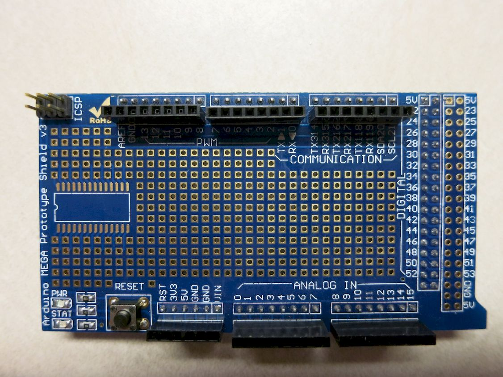

On the bottom are the pins that go into the female headers on the Arduino. This shield makes connections with the Arduino so easy and convenient, I had to use it. But there is one drawback: the limited amount of space you have for components. There is just barely enough room for every component needed for the MOSFET drivers, as long as you place them correctly on the board. I will show you where everything needs to go; modify these positions at your own risk.

The first set of parts is easy, and is good warmup practice if you haven't done any soldering recently. You'll be soldering a female pin header to the right side of the board - this is where the protoboard with the minus-side current controllers will plug in and connect to the Arduino. Then, you'll be soldering eight resistors in that will eventually connect to transistors that control the P-channel MOSFETs.

First, grab the 20-pin right-angle female header:

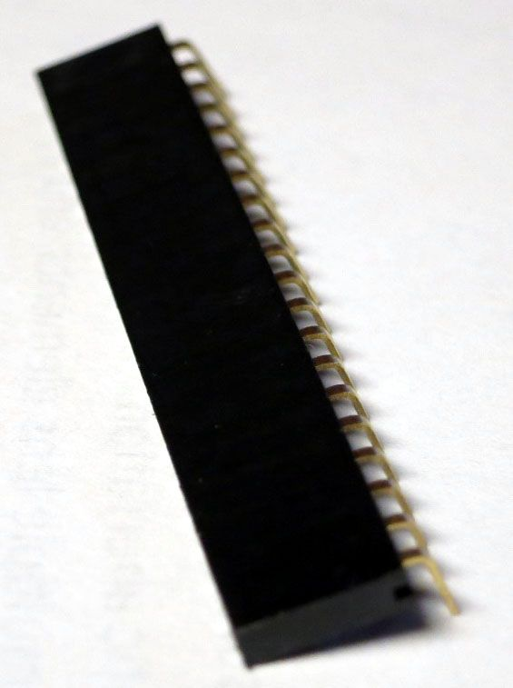

And stick it into the 20 holes on the far right side of the shield. Don't do what I almost did, and stick it in the holes to the left of the correct ones! If you've got something you can use to clamp it in place (binder clips, alligator clips), use those to hold it in place:
   
.. figure:: ../figures/mosfet/mosfet_03.jpg
   :align: center
   :scale: 30%
   
Now flip the shield over, and solder the pins at opposite ends. Once done, you can remove the clamps/clips and solder the remaining pins to the holes:
   
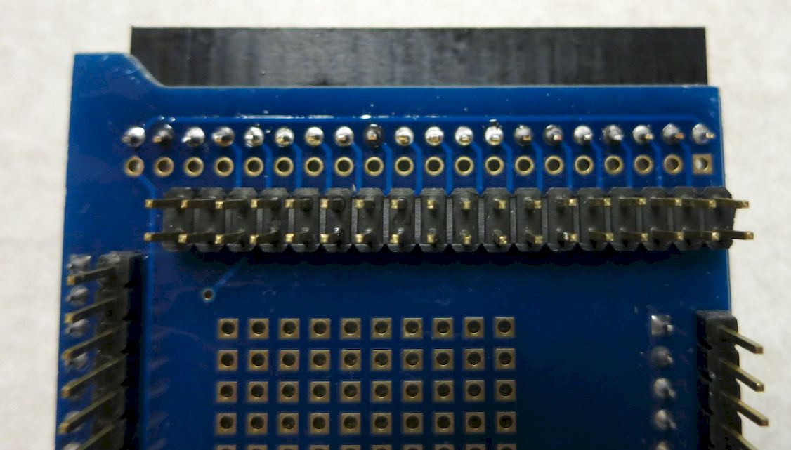
   
Next, you'll be soldering 8 10K resistors to the shield; these will eventually be connected to the bases of the 2N3904 transistors, which will in turn control the P-channel MOSFETs. The resistors are there to limit the current to the transistors – Arduino recommends no more than 40 mA of current from any of its output pins. One lead of each resistor will go into a hole immediately to the left of the header you just installed, the resistor will straddle another set of soldered pins on the shield (the ones marked 36-52), then most of them will have their other lead go into the holes directly to the left of the number labels. 

When you solder the resistors, give them enough height so that they clear the soldered pins underneath, or you might have problems with shorting. If you like, you can put a thin strip of electrical tape on top of the pins, or paint the pins with nail polish or rubber paint, to make sure they don't short out the resistors.

Start by putting the leads of the first resistor into the shield, as in the picture below. Note the hole positions - on the left, the hole at bottom right on the shield, on the left, the 4th hole from the bottom:

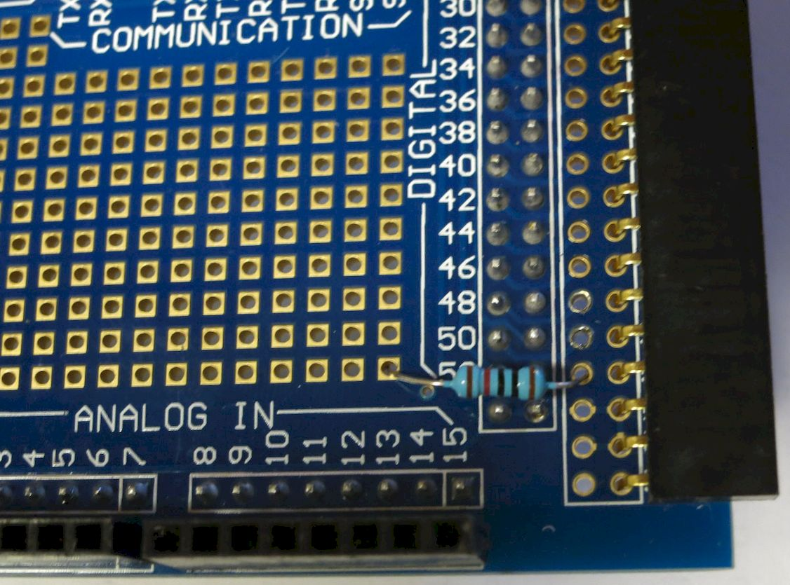
   
Flip the shield over, and you'll see the two leads sticking out:
   
.. figure:: ../figures/mosfet/mosfet_06.jpg
   :align: center
   :scale: 30%

Solder the resistor leads to the shield holes they're in, and trim the outside lead, the one next to the connector. Put the next resistor into the next set of holes (above the first set), and repeat the process until you've done all 8 resistors. If you have trouble getting the resistors to stay in place when you flip the shield, you can bend one or both of the leads down to hold it more securely:

.. figure:: ../figures/mosfet/mosfet_07.jpg
   :align: center
   :scale: 30%

When you're done, the top of the shield should look like this:

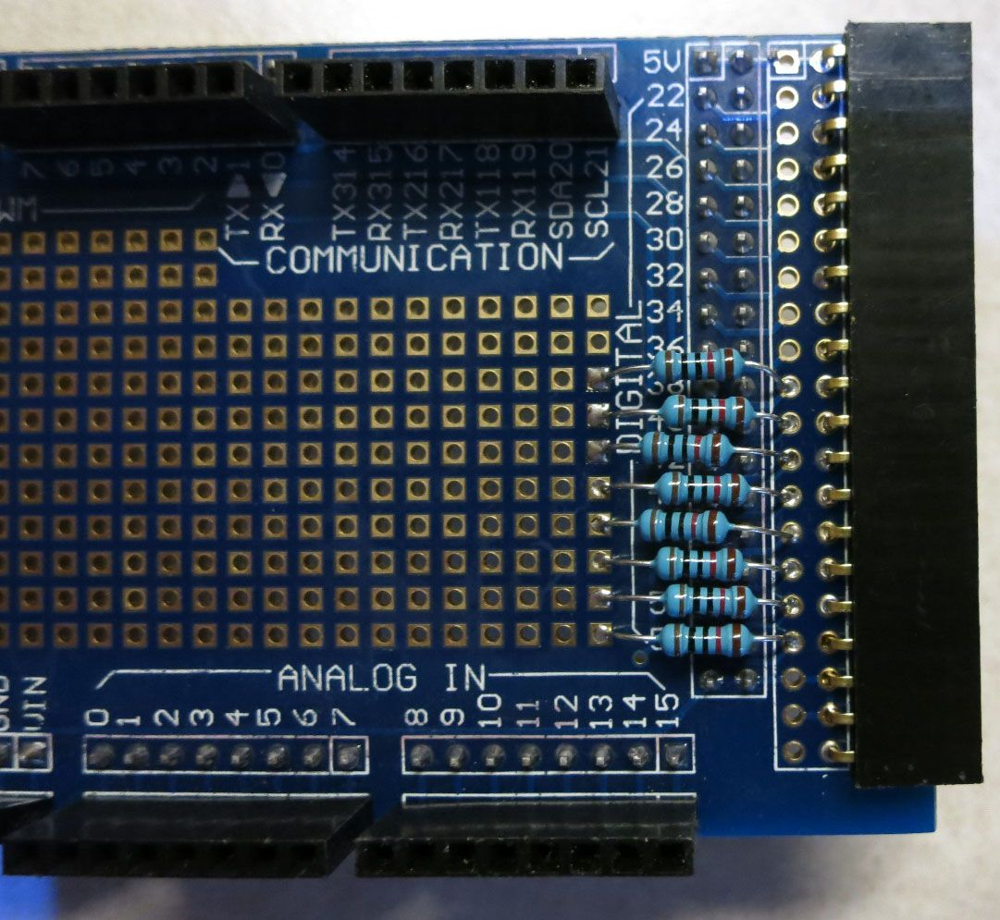

On the opposite side, leave the leads for the first and fifth resistors from the top uncut (you can bend them down to get them out of the way if you like), and trim the leads for the rest to a length of about 1/4": 

.. figure:: ../figures/mosfet/mosfet_09.jpg
   :align: center
   :scale: 30%

Now it's time to solder in the high-side driver channel components - P-Channel MOSFET, npn transistor, and 10K resistor. Here's a rough schematic for one driver. The reason for the complicated circuit is that the P-MOSFET is normally on when the gate is unbiased. This circuit biases the gate with +9-12V when power is turned on, turning the P-MOSFET off. When +5V is applied to the 2N3904 transistor, it shunts the voltage away from the MOSFET gate to ground, allowing the P-MOSFET to turn on.

.. figure:: ../figures/mosfet/mosfet_10.png
   :align: center

You've already installed the 10K resistor at left, though it still has to be connected to the transistor base (a future step). So this section will deal only with the MOSFET, the npn transistor, and the other 10K resistor. Here's a pic of the MOSFET; note that the position of drain and source in my schematic are swapped compared to the actual MOSFET (gate is correct):

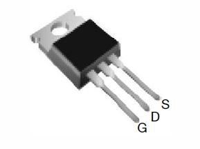

And here's a pic of the npn transistor, showing collector, base and emitter leads:
   
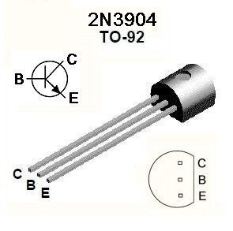

.. warning::

   A few cautions before you begin. Some of these may seem obvious, but I'm including them because I've either come close to making all these mistakes, or have actually made them and had to go through the pain of fixing them.

   1. MOSFETs are notoriously sensitive to static discharge. Make sure you've discharged any static buildup before handling MOSFETs. If you have a grounding wrist strap, now would be a good time to put it on.
   2. Make sure you install both transistors in the correct orientation.
   3. Remember that when you flip the shield over, what was on the left is now on the right, and vice-versa; make sure you're making the right solder connections.
   4. When trimming leads, take care to make sure the trimmed lead doesn't wind up wedged someplace where it can cause a short. This has happened to me several times, and can drive you crazy as you try to figure out why things aren't working.

Here's a picture of the shield board, with the location of the first MOSFET circled in red:

.. figure:: ../figures/mosfet/mosfet_13.jpg
   :align: center
   :scale: 30%

Insert the MOSFET into the marked pins, with the black labeled side facing to the right of the shield, and the metal backside facing left; solder one pin in place to fasten it to the shield:

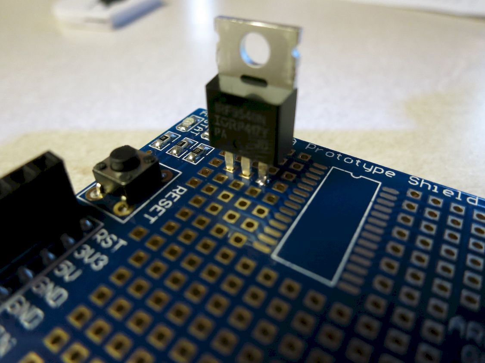

It can be tough to solder it upright - what I usually do is solder it in place at any angle, then re-melt the solder while pushing he MOSFET until it's perpendicular. Careful - it can get hot.

Next, the 10K resistor is inserted as shown in the picture below, with one lead in a hole right next to the source pin, and the other lead two rows up and one row to the left of the gate pin. Pull the leads tight from the underside so that the resistor is flush with the shield board, using needle nose pliers if necessary.

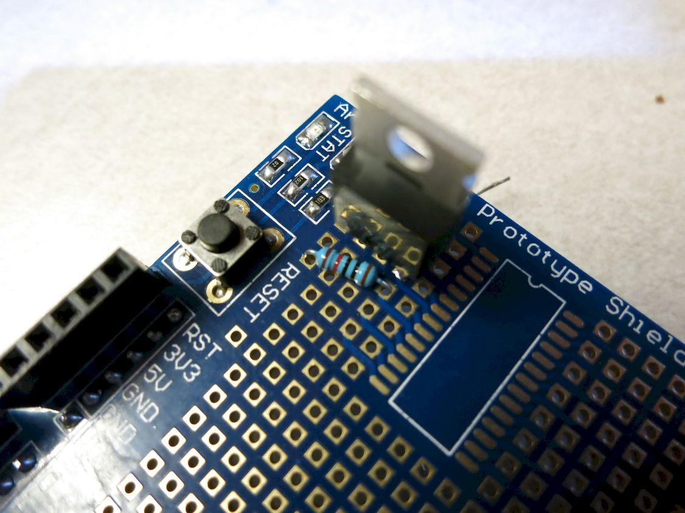
 
Flip the shield over, and bend the resistor leads so that the one closest to the source pin is flat and next to the source pin, while the other lead is bent parallel to the MOSFET pins:

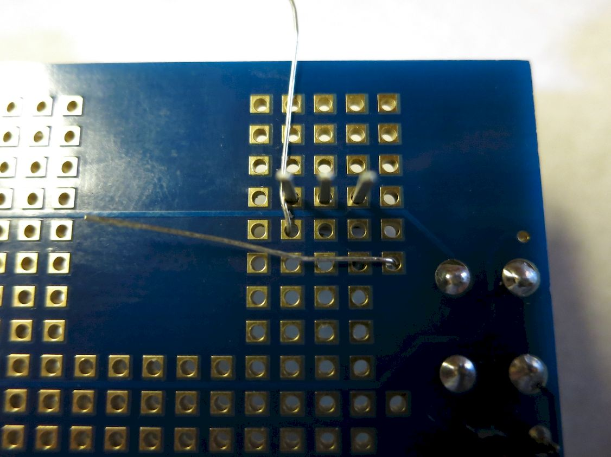

Now it's time for the 2N3904 npn transistor. The lead spacing on this resistor is smaller than the hole spacing on the shield, so you'll have to first gently spread the leads further apart until they will fit into the shield. Then insert the transistor with the flat part facing the MOSFET, and the curved part facing toward the right side of the shield:

.. figure:: ../figures/mosfet/mosfet_17.jpg
   :align: center
   :scale: 30%   

Note that the three npn transistor leads are in the same rows as the MOSFET leads.

Flip the shield over, and bend the collector pin down over the resistor lead and next to the MOSFET gate pin (better than I did in this pic):

.. figure:: ../figures/mosfet/mosfet_18.jpg
   :align: center
   :scale: 30%

Now solder the collector pin on the npn transistor to the gate pin on the MOSFET; the resistor lead under the collector pin to the collector pin; and the other resistor lead to the source pin:

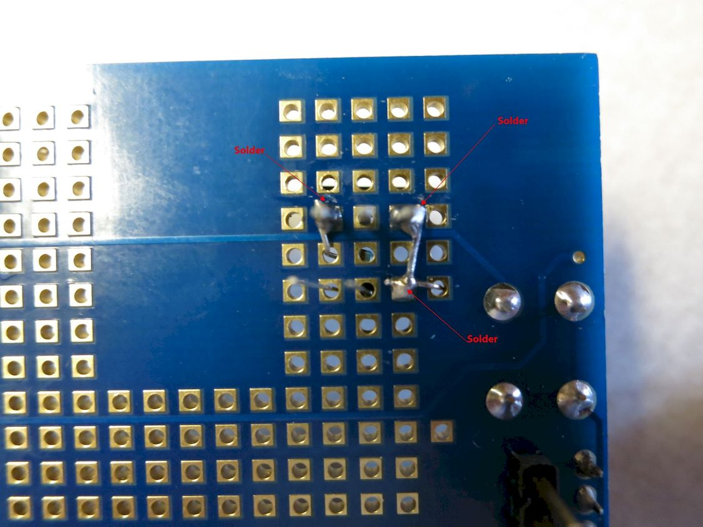

Trim off the excess lead on the resistor leads, and on the collector lead:

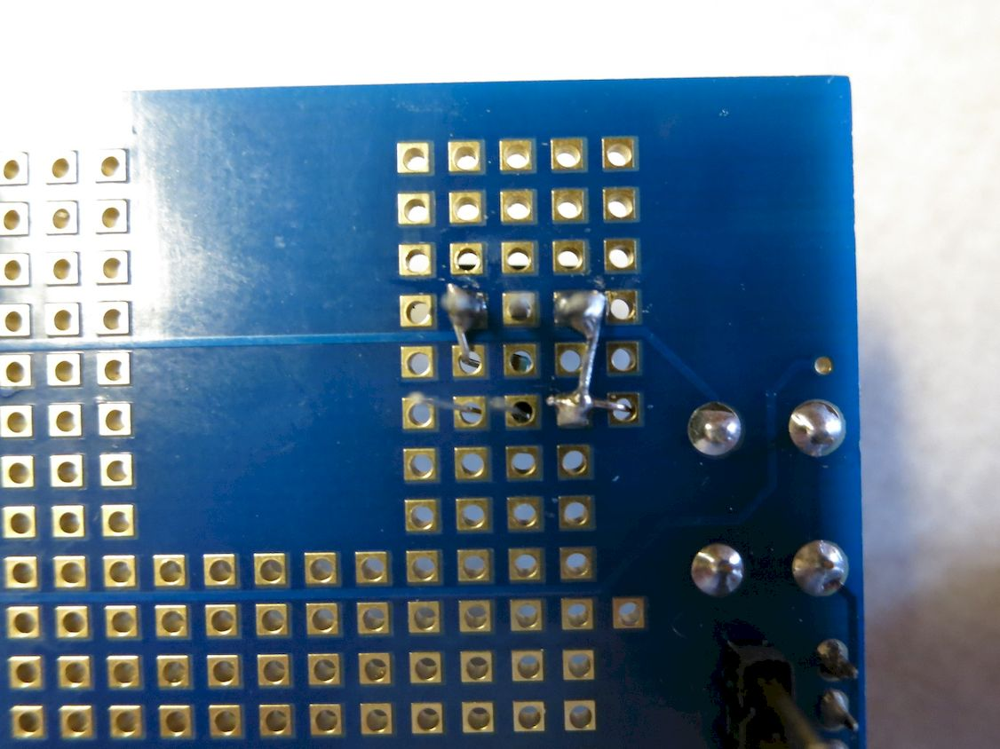

And that's it - you've created a high-side p-channel MOSFET driver circuit! Hope you enjoyed that, because you'll now have to repeat the process 7 more times for the remaining high-side driver circuits. 

Here's a picture showing the locations of all the MOSFETs, including the one you just did:

.. figure:: ../figures/mosfet/mosfet_21.jpg
   :align: center
   :scale: 30%

Just follow the exact same steps as the first driver circuit for all the successive ones. It's best to work left to right on the shield when installing the driver circuits, as it gives you the easiest access to the board when installing parts. When it's all done, the shield should look like this on top:

.. figure:: ../figures/mosfet/mosfet_22.jpg
   :align: center
   :scale: 30%

And like this underneath:

.. figure:: ../figures/mosfet/mosfet_23.jpg
   :align: center
   :scale: 30%   

Next is a simple step - adding several female headers to the shield, for wiring power and ground connections. But I screwed up the first time through. I soldered two 2-pin female headers to the board for power connections in the positions indicated below (circled in red):

.. figure:: ../figures/mosfet/mosfet_24.jpg
   :align: center
   :scale: 30%

But I screwed up here – the top header keeps the shield from properly fitting into the Arduino Mega. So I removed it at a later step, but too late to fix most of these pictures. I’ve crossed out the errant header and associated soldering steps in a few upcoming pictures -  just don’t do them. Some later pics may not have that header crossed out – just ignore it.

So here’s the modified pic, with the header to be omitted left out:

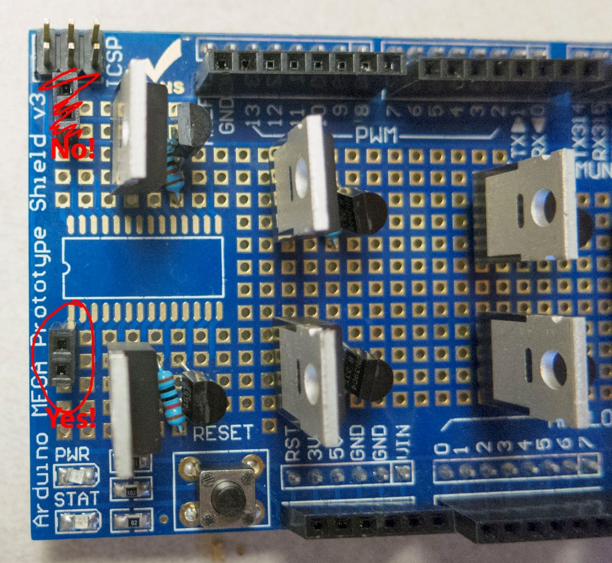

It’s tough to hold these in place for soldering - I usually use masking tape on the top to hold the header in place when I flip the board over.

You want the two sockets on the header to be connected electrically - the simplest way to is put a blob of solder between the pins on the bottom of the board:

.. figure:: ../figures/mosfet/mosfet_26.jpg
   :align: center
   :scale: 30%   

This header will be used for connecting "high" DC voltage (8-12V) to the shield, for powering the 3W LEDs.

Next, solder a 2-pin female header in the location indicated below, for a ground connection:

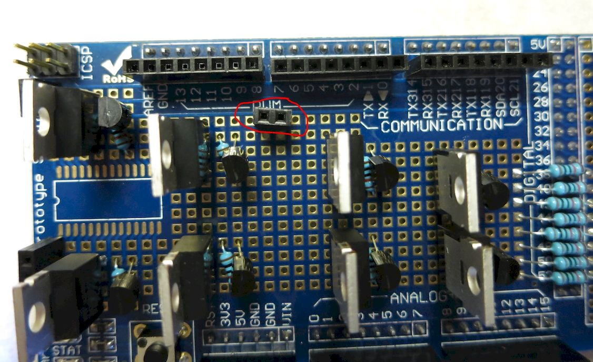

As with the previous headers, you also want the two pin sockets to be connected electrically with a solder blob:

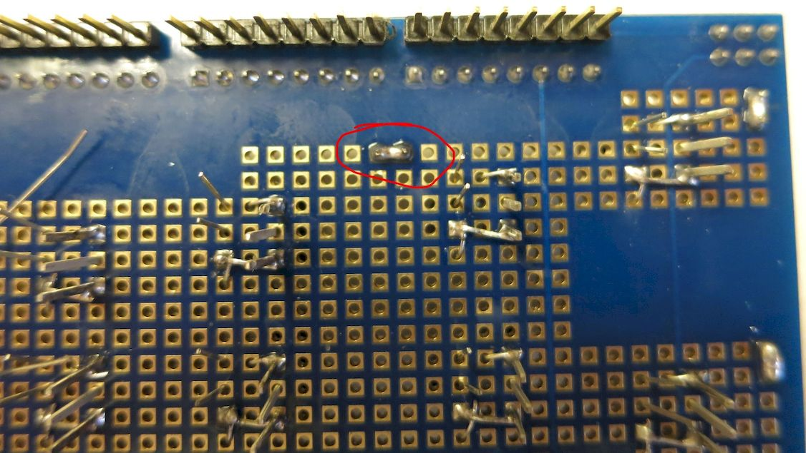

This connector will be used to add some extra ground connections; the ones already present on the Arduino aren’t sufficient, and also aren't convenient for several future connections.

Finally, an 8-pin male header strip needs to be soldered in place; this will be used to connect the high-side drivers to the columns in the LED matrix. IMPORTANT: On this one, you will NOT be bridging pins with solder blobs, but keeping all the pins electrically separate from each other. Also, don't solder all the pins at once – first do only two pins to hold it in place, one row in from each edge, then do the rest.

From the `40-pin male header strip <http://www.taydaelectronics.com/connectors-sockets/pin-headers/40-pin-2-54-mm-single-row-pin-header-strip.html>`_ listed in the components section, break off an 8-pin section (they're notched to break easily). The photo below shows it in place, but I put it in one row higher than I probably should have. It will work in this position, but you will have a bit more room to work with if you move it down one row, closer to the "Vin" label at the bottom.

.. figure:: ../figures/mosfet/mosfet_29.jpg
   :align: center
   :scale: 30%   

Here's a side shot:

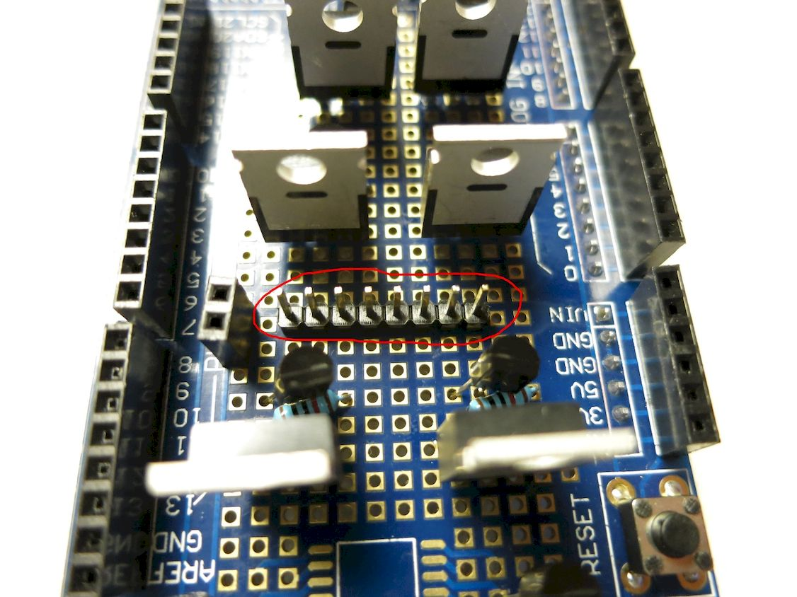
   
And the view from below, showing the two pins soldered to the shield, to hold the pin strip in place. Continue soldering all the pins to the holes they’re in.

.. figure:: ../figures/mosfet/mosfet_31.jpg
   :align: center
   :scale: 30%

Now comes one of the toughest sections of work on the whole project - wiring up the connections on the MOSFET driver shield. It's not too hard, but it is a bit tedious. A few pieces of advice:

1. Work slowly and carefully.
2. Make sure you're wiring up the right connections, i.e. connecting the wires to the proper component parts. A mistake here shouldn't be fatal, but it would be a huge pain to repair (believe me, I know :-/).
3. Make solid solder joints that only connect the right parts. Watch out for solder "bridges", where a bit of solder connects two leads/components that shouldn't be connected. Also watch out for loose trimmed leads that could lead to shorts.
4. Inspect your solder joints when done with a magnifier to make sure they're good.
5. Don't make your wires "just fit" - add some slack so that you can re-arrange them later on. As you'll see in a few steps, I didn't do that, and I wound up with a couple of spots where the wires blocked some holes where I wanted to solder a wire, and I didn't have enough slack to move the wires to free up the holes. I had to modify my wiring configuration on the fly to make up for that, and given the limited space I had to work with, that was not fun.

.. note::
   
   In schematic wiring drawings, the wire lines are drawn from one hole on the shield to another. The wires connecting these holes should have the insulation stripped from their ends, and have the bare lead inserted into the hole. The bare lead should then be connected to the specified nearest component/connector lead.

First set of wiring will be to connect the base of the npn transistor (the central lead of the D-shaped thingies) to the 10K resistors on the side of the board; these will control turning on/off the main p-channel MOSFETs that run to the positive (high) leads of the LEDs. The numbers next to the resistors are the LED column they control, and need to be connected via wires to the npn transistor next to the correspondingly-numbered MOSFETs:

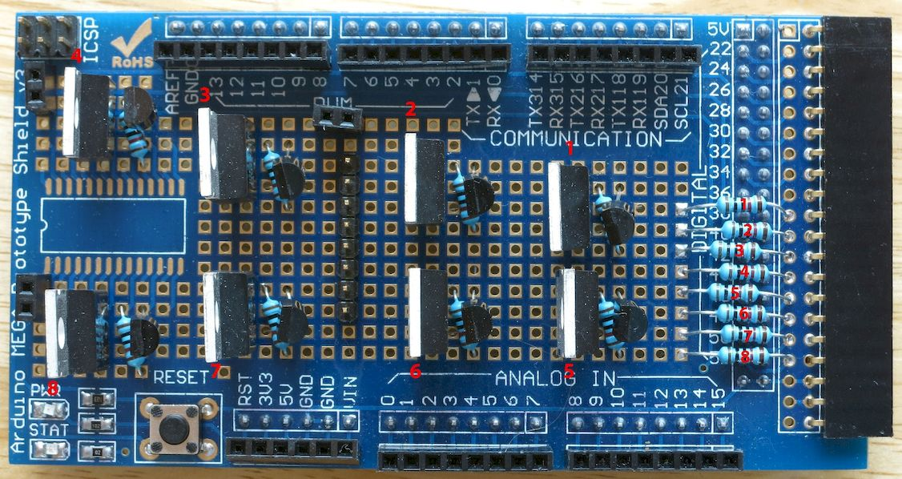

Here's my recommended wiring layout, with one end of the wire to be soldered to the resistor, and the other soldered to the central lead of the transistor:

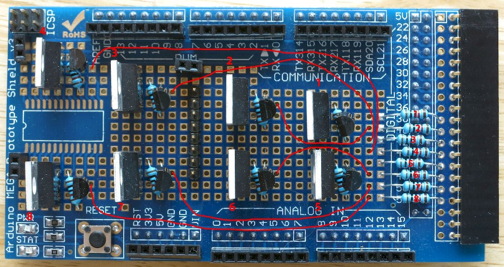
 
You'll notice that there are no wires coming from resistors 1 and 5 to their corresponding transistors. That's because in step 2, we left the resistor leads untrimmed for those two resistors, and we can now attach them directly to the nearby transistors using those leads on the underside of the board. Just bend them down to make contact with the central npn transistor lead, as shown below:

.. figure:: ../figures/mosfet/mosfet_34.jpg
   :align: center
   :scale: 30%

Now solder the connections; trim off the excess lead when done:

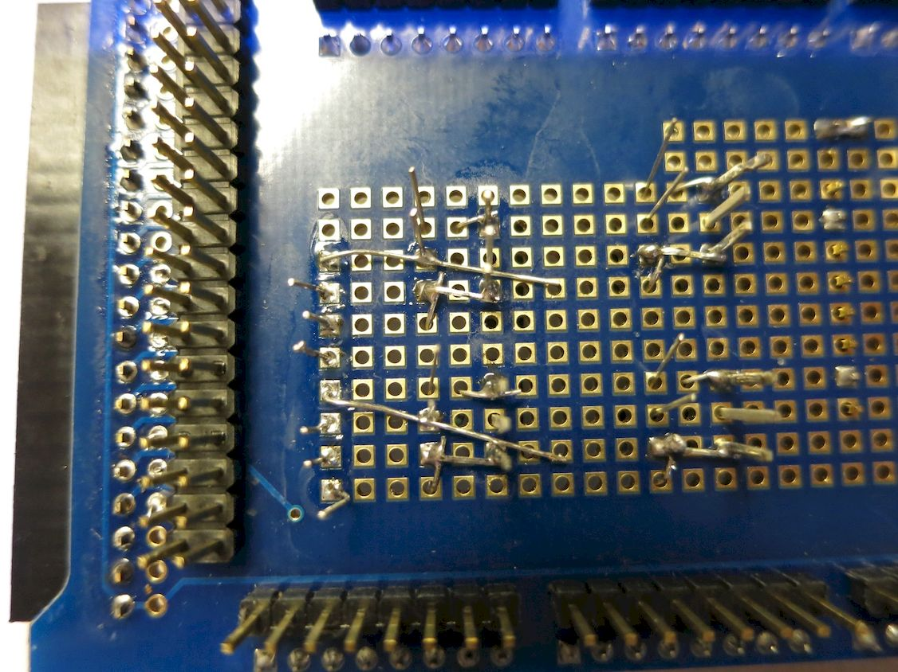

I usually play it safe now by blocking the hole next to resistors 1 and 5 with a bit of solder, to make sure I don't accidentally put a wire into those holes (which I have done; multiple times :-/).

Now follow the wiring diagram above, and connect the remaining resistors to the matching transistors with the 24 AWG Kynar wire. When the connection is soldered, trim off the excess leads. Once you're done, it should look something like this from above:

.. figure:: ../figures/mosfet/mosfet_36.jpg
   :align: center
   :scale: 30%

And this from below:

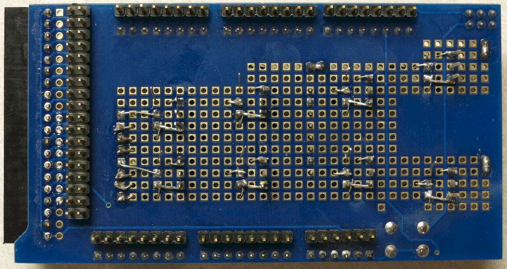

Next step is to connect the drains of the MOSFETs (their center leads) to the central 8-pin connector; there will ultimately be a header that plugs into this connector, connecting the output of the P-Channel MOSFETs to the LEDs.

As you’ll see in succeeding steps, I didn’t do a very good job on the wiring. Two big fails on my part: I didn't give the wires enough slack, and I kept bending them flat against the board to take up less space and look neater. As a result, access to some of the holes on the shield became very difficult, and I wound up having to use a number of workarounds to finish the wiring. And all for no good reason - wire is cheap, and since all the electronics will sit inside an enclosure with lots of room, it doesn't matter how neat it looks (no one will see it), or how much space I saved (there'll be plenty of space to spare). So use the following as a general guide, but be generous with the wire, and don't bend the wires flat to the board like I did unless you absolutely have to. And don't think you have to follow the wiring layout exactly as I give it - as long as the wires are soldered to the correct leads, they will work (you'll see an example of this shortly).

So here's a pic with the MOSFETs numbered, and the matching pins on the central connector numbered:

.. figure:: ../figures/mosfet/mosfet_38.jpg
   :align: center
   :scale: 30%   

You want to connect the central drain lead on the MOSFETs to the corresponding pin on the central connector:

.. figure:: ../figures/mosfet/mosfet_39.jpg
   :align: center
   :scale: 30%

Here's how it looks after the drain wiring was completed:

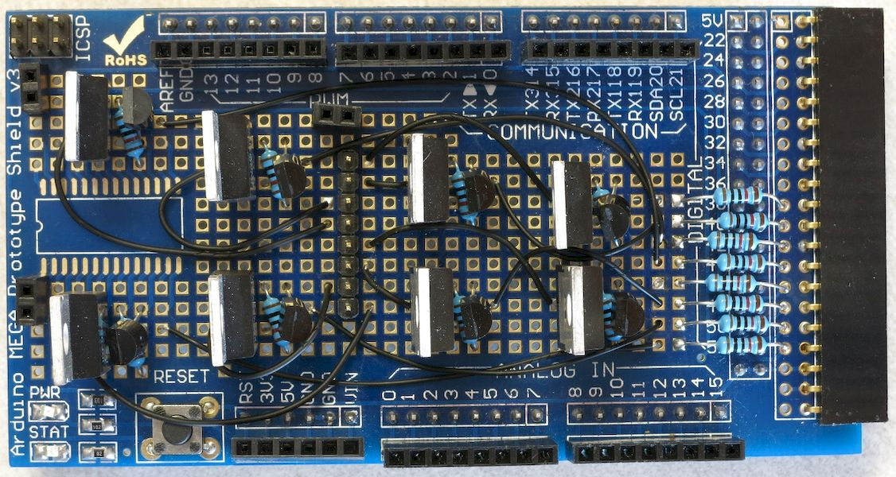

Most of the wires were connected per the wiring plan above, but you will notice that the wire for MOSFET 8 (lower left) does not go into the hole in the wiring plan; there was another wire from a previous step that interfered with it. So I had to move that wire to the hole on the opposite side of the connector, but since I soldered it to the correct pin, it will work fine.

Here's a view of the bottom of the board after this wiring step:

.. figure:: ../figures/mosfet/mosfet_41.jpg
   :align: center
   :scale: 30%   

You can clip off the central drain lead of the MOSFET now to free up some room (that's the MOSFET leads you soldered the wires to in this step). You may need that room to maneuver in - there are still two more sets of wires to solder in place.

Next step is to wire all the source leads on the MOSFETs together (the right lead when you're looking straight on at it), and also connect them electrically to the 2-pin female header on the lower left side of the board (which will be connected to the positive lead of the power supply):

.. figure:: ../figures/mosfet/mosfet_42.jpg
   :align: center
   :scale: 30%
   
The easiest way to make the connection between the MOSFET at lower left and the female header is to bend the source leads of the lower left MOSFET:

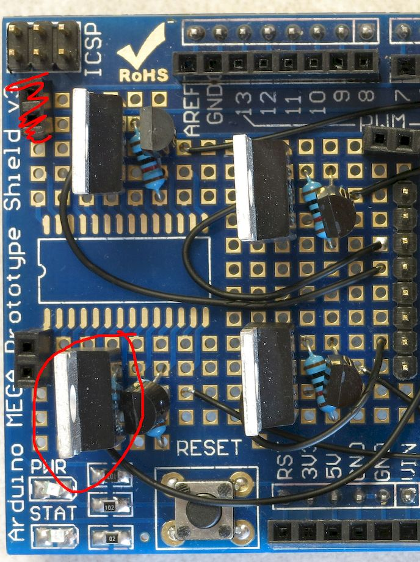

So that they come close to the soldered female headers (on the back side of the shield board):

.. figure:: ../figures/mosfet/mosfet_44.jpg
   :align: center
   :scale: 30%   

Then glob solder between that bent lead and the solder blob for the headers to connect them electrically:

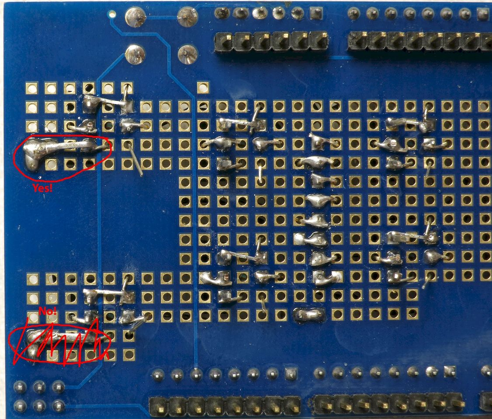
   
For the rest of the source connections, just wire jumpers between MOSFET connections in the same row:

.. figure:: ../figures/mosfet/mosfet_46.jpg
   :align: center
   :scale: 30%

So here's how my board looked after I wired the source jumpers:

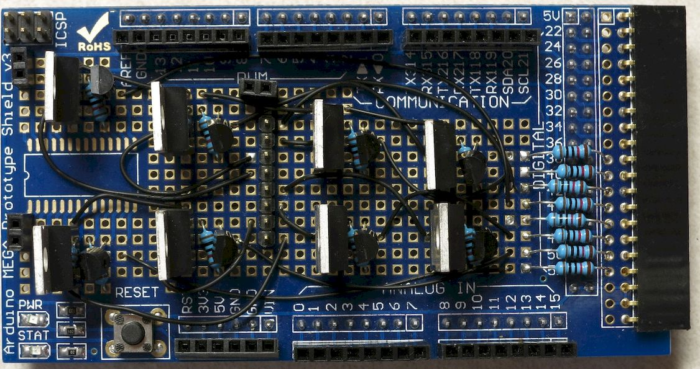

Notice anything missing? Yup, there's two jumpers missing from the shield, on the bottom row. As I mentioned earlier, I pressed the wires flat, and didn't leave enough slack, so I wound up with a situation where I didn't have enough room to get access to the holes from the top. I wound up soldering jumper wires between the MOSFET source leads on the bottom of the board (circled below):

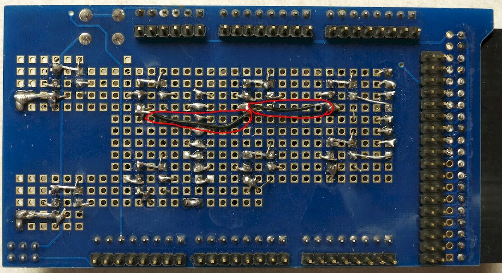
   
This works, but it's not very neat. What's more, I made the jumper connection on the right in the above picture too short, and blocked one of the last solder connections I'll need to make in the next step. Once again, I emphasize - leave yourself lots of slack in the wires so that you can move them out of the way if necessary for subsequent wiring/soldering steps.

Because I removed one of the two-pin female headers, I also had to add a jumper from the remaining two-pin header on the left to the source pin of the top left MOSFET; the wiring connection is paralleled with the red line:

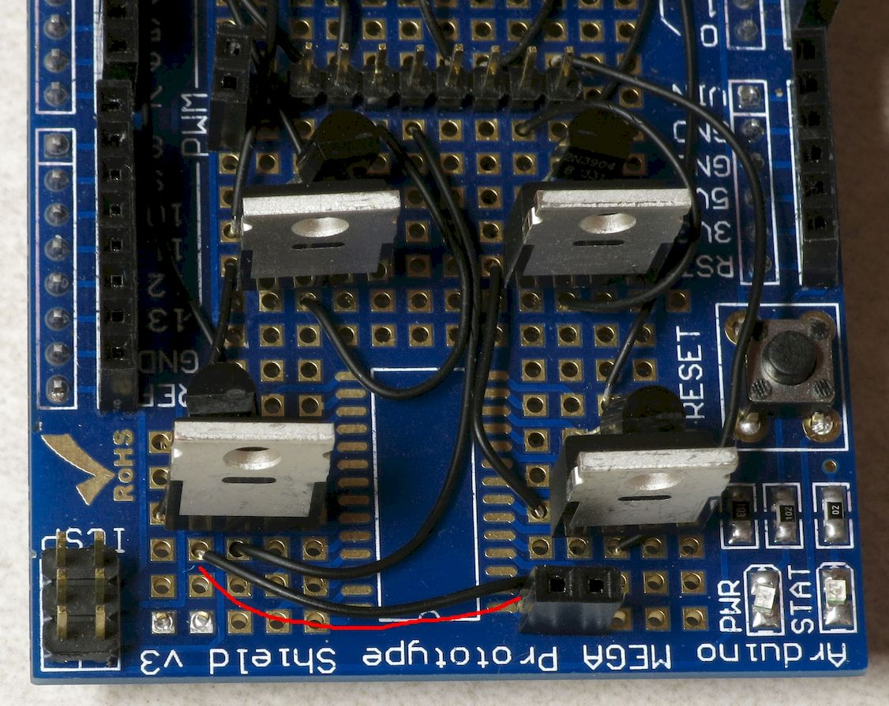

And here’s how those connections look like on the bottom (solder points for the jumper are circled in red):

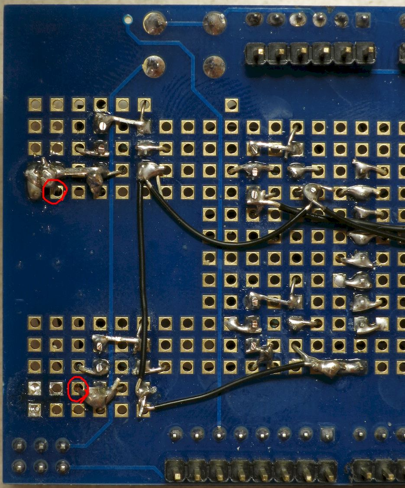

Last step in the MOSFET driver shield board construction is to connect all the emitter lead on the npn transistors to ground. The npn transistors are the small D-shaped transistors, and the emitter is the lead furthest to the right when looking head on:

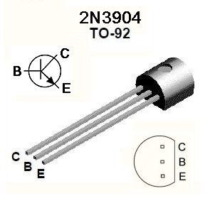

The best way to minimize the amount of wiring on the board (which is already crazy with wiring) is to connect the emitter lead closest to the ground connection header to that header:

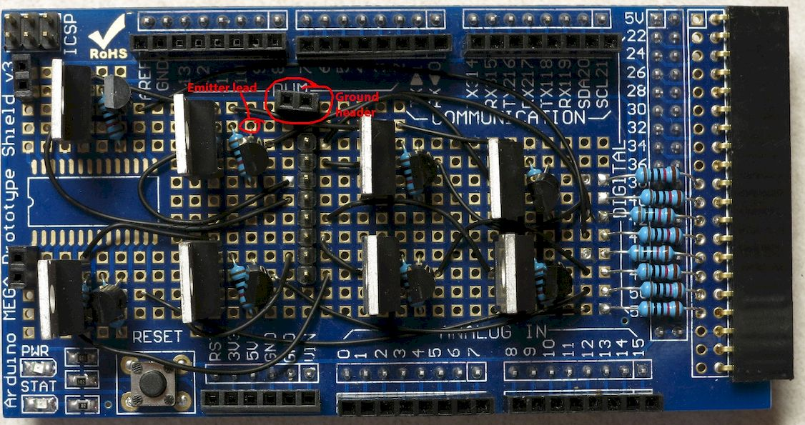

Then use jumper wires to connect all the remaining emitter leads to each other. Because of the limited space on top (thanks to my poor wire management skills), I didn't think there was room on top to do this, so I did the emitter ground wiring on the bottom. First I bent the emitter lead to make contact with the ground header solder blob, and then attached a jumper wire to that junction:

.. figure:: ../figures/mosfet/mosfet_53.jpg
   :align: center
   :scale: 30%   

I then soldered that connection so that the emitter lead, jumper wire end, and ground header solder blob were all electrically connected, and starting adding successive jumper wires to connect additional emitter leads (taking care to make sure they didn't short out any other connections):

.. figure:: ../figures/mosfet/mosfet_54.jpg
   :align: center
   :scale: 30%
   
When all the jumper wires were in place, they were soldered to connect them to the emitters (though you can just as well solder them one at a time):

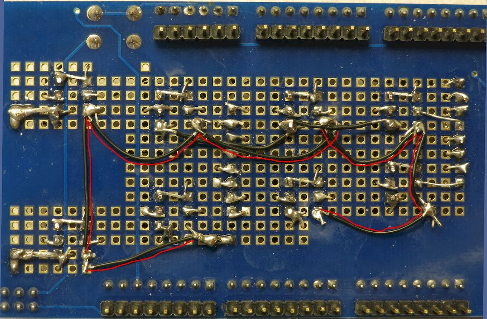

I've highlighted all the jumper wires with an adjacent red line, so that you can see exactly where they go.

Once you're done with soldering the emitters, you should cut all the protruding leads (transistors, wires, whatever) as flush as you can without affecting the soldered connections.

You're now done with the toughest system assembly steps, tough because of the tight space limitations. There's more wiring /soldering coming up, but it should be easier, as you'll have a lot more room to work with.

In the past, I've always assumed that I've wired the MOSFET driver shield correctly, and that's usually been the case (with a few minor shorts due to stray clipped leads). But for these instructions, I came up with a fairly simple way to test all 8 driver circuits on the driver board, to make sure they work correctly.

You will need:

1. Arduino Mega and wall wart power supply
2. Multimeter with either alligator clip leads, or separate alligator clip leads
3. One female Dupont pin
4. Jumper wires. I use breadboard connectors, but you can cut a few wire segments from the 22 AWG wire on the parts list (just save it when you're done).
5. The driver shield you've just finished assembling.

Here are all the parts in a neat assemblage:

.. figure:: ../figures/mosfet/mosfet_56.jpg
   :align: center
   :scale: 30%   

The Arduino will only be used for supplying +5V and ground, nothing more. So you'll connect one wire to a +5V connection on the Arduino, and the other to a ground connection:

.. figure:: ../figures/mosfet/mosfet_57.jpg
   :align: center
   :scale: 30%
   
Note that the power supply isn't connected yet - I save that until all the wiring connections are done. I'm using standard breadboard jumper wires here, red for +5V and blue for ground, but you can use sections of 22 AWG wire. These wires should now be connected to the driver board, along with the remaining jumpers.

Because I removed the top left header, there’s no red jumper between the two headers as seen in the photo, and you should plug the white wire equivalent into the open socket in the lower left header:

.. figure:: ../figures/mosfet/mosfet_58.jpg
   :align: center
   :scale: 30%

Here's an annotated connection pic:

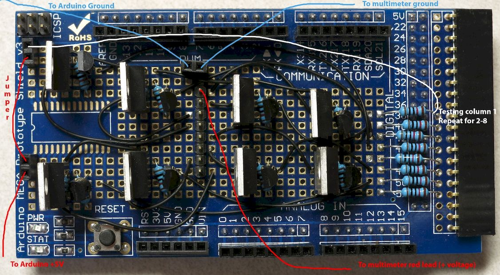

The idea is that when the white wire (at +5V) isn't touching any of the 10K resistor connections on the right, there's no voltage across the multimeter. When you touch the white wire to one of the resistors, you switch on the npn transistor, which "effectively" turns on the MOSFET transistor (technically, you're unbiasing the p-channel MOSFET gate, which turns it on). You should then see 5V on the multimeter, which is measuring the output voltage from the MOSFET driver. In the pic above, the red (+V) multimeter lead is connected to the #1 MOSFET output driver connection, while the blue multimeter lead is connected to ground.

I tried connecting the multimeter lead directly to the output pins in the center, but the spacing is too close. So I took a female Dupont header pin, spread the clamps apart, then clipped it to an alligator clip:

.. figure:: ../figures/mosfet/mosfet_60.jpg
   :align: center
   :scale: 30%

The female Dupont header slides easily onto each of the 8 pins on the output connector, so that you can test all 8 circuits sequentially.

Plug in the Arduino to the power supply now. Here's a pic of me testing MOSFET drive transistor 1 by holding the white bias wire to the end of the top 10K resistor; the red multimeter lead is connected to pin 1 (the top pin) of the 8-pin male connector in the center using the Dupont female header. You'll see that the multimeter, set at the 20V DC scale, shows about 5V when the connection is made, and should show zero when there's no connection:

.. figure:: ../figures/mosfet/mosfet_61.jpg
   :align: center
   :scale: 30%

Now I connect the multimeter red lead to the 2nd pin down, corresponding to MOSFET driver 2, and do the same test by touching the second resistor down:

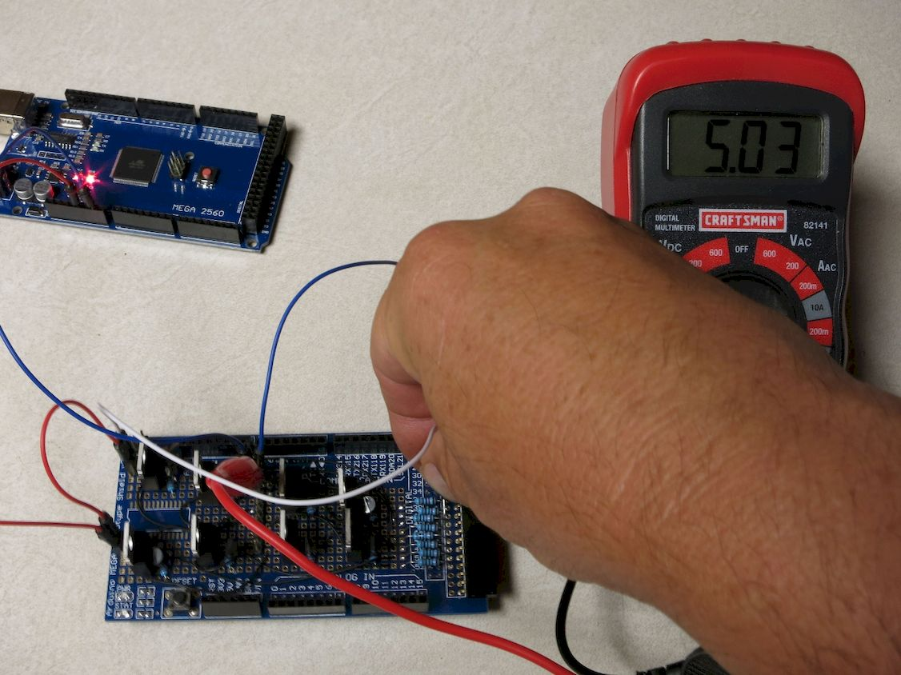

You should only see 5V on the multimeter when the white wire is touching the resistor that corresponds to the output pin. It's worth testing this by touching every resistor when you have the red multimeter lead connected to a single output pin - only when the resistor that corresponds to that output pin is touched should you see 5V on the multimeter. If you see voltage on more than one resistor, you have a wiring problem (electrical short, wrong connection, etc.), and you'll have to double-check your work to find out where you went wrong. But hopefully, everything will work fine (as it did for me in this case). Repeat the process for all 8 output pins. Once you're done testing, set the driver shield assembly aside somewhere - you won't need it for a while.

