Building the MOSFET driver shield
=================================

This instruction step documents the building of the high-side driver controller. This has the P-channel MOSFETs that control the plus-side voltage to the LEDs, through the columns of the LED matrix. These will be installed on the Arduino Mega Shield, which plugs directly into the Arduino Mega control board:

.. figure:: ../figures/mosfet_01.jpg
   :align: center
   :scale: 30%

On the bottom are the pins that go into the female headers on the Arduino. This shield makes connections with the Arduino so easy and convenient, I had to use it. But there is one drawback: the limited amount of space you have for components. There is just barely enough room for every component needed for the MOSFET drivers, as long as you place them correctly on the board. I will show you where everything needs to go; modify these positions at your own risk.

The first set of parts is easy, and is good warmup practice if you haven't done any soldering recently. You'll be soldering a female pin header to the right side of the board - this is where the protoboard with the minus-side current controllers will plug in and connect to the Arduino. Then, you'll be soldering eight resistors in that will eventually connect to transistors that control the P-channel MOSFETs.

First, grab the 20-pin right-angle female header:

.. figure:: ../figures/mosfet_02.jpg
   :align: center
   :scale: 30%

And stick it into the 20 holes on the far right side of the shield. Don't do what I almost did, and stick it in the holes to the left of the correct ones! If you've got something you can use to clamp it in place (binder clips, alligator clips), use those to hold it in place:
   
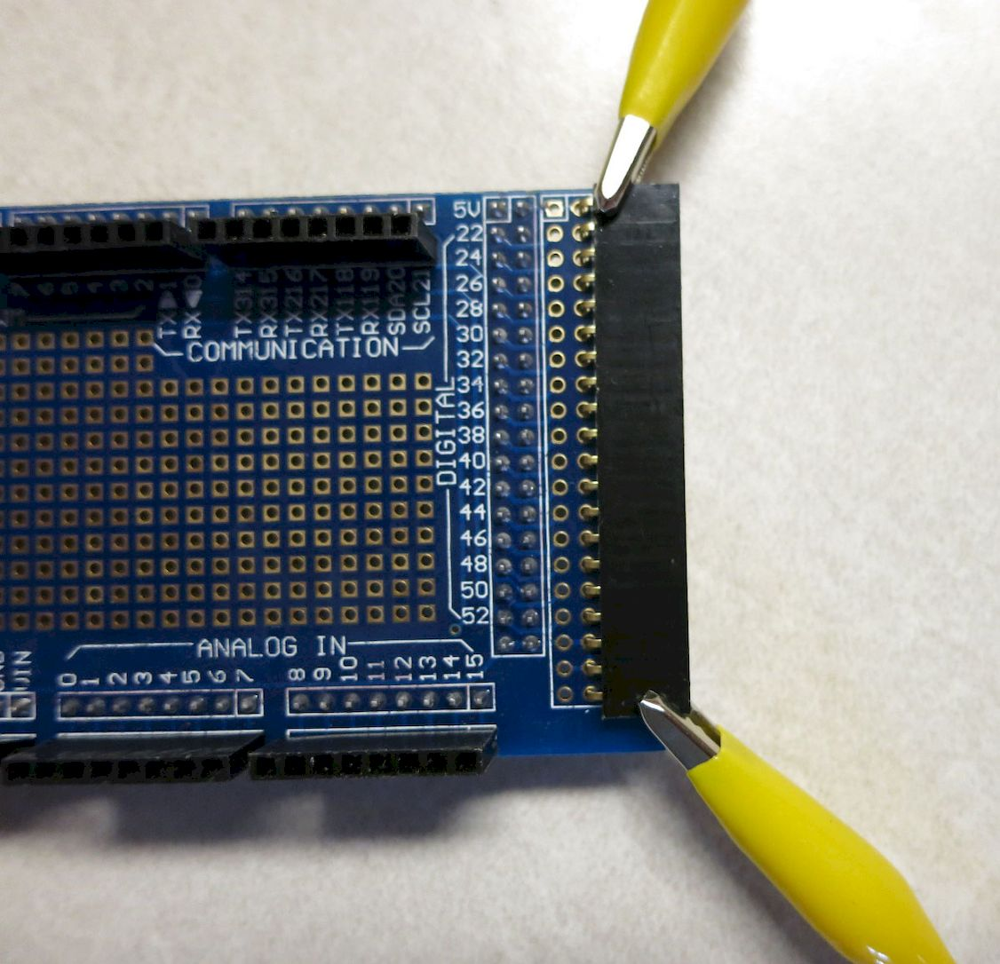
   
Now flip the shield over, and solder the pins at opposite ends. Once done, you can remove the clamps/clips and solder the remaining pins to the holes:
   
.. figure:: ../figures/mosfet_04.jpg
   :align: center
   :scale: 30%
   
Next, you'll be soldering 8 10K resistors to the shield; these will eventually be connected to the bases of the 2N3904 transistors, which will in turn control the P-channel MOSFETs. The resistors are there to limit the current to the transistors – Arduino recommends no more than 40 mA of current from any of its output pins. One lead of each resistor will go into a hole immediately to the left of the header you just installed, the resistor will straddle another set of soldered pins on the shield (the ones marked 36-52), then most of them will have their other lead go into the holes directly to the left of the number labels. 

When you solder the resistors, give them enough height so that they clear the soldered pins underneath, or you might have problems with shorting. If you like, you can put a thin strip of electrical tape on top of the pins, or paint the pins with nail polish or rubber paint, to make sure they don't short out the resistors.

Start by putting the leads of the first resistor into the shield, as in the picture below. Note the hole positions - on the left, the hole at bottom right on the shield, on the left, the 4th hole from the bottom:

.. figure:: ../figures/mosfet_05.jpg
   :align: center
   :scale: 30%
   
Flip the shield over, and you'll see the two leads sticking out:
   
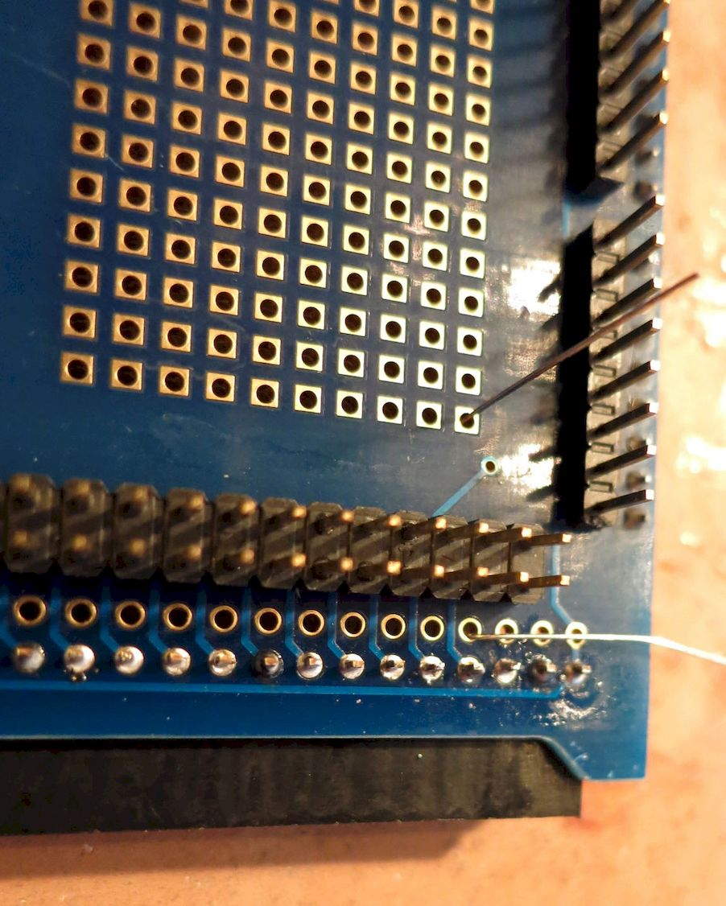

Solder the resistor leads to the shield holes they're in, and trim the outside lead, the one next to the connector. Put the next resistor into the next set of holes (above the first set), and repeat the process until you've done all 8 resistors. If you have trouble getting the resistors to stay in place when you flip the shield, you can bend one or both of the leads down to hold it more securely:

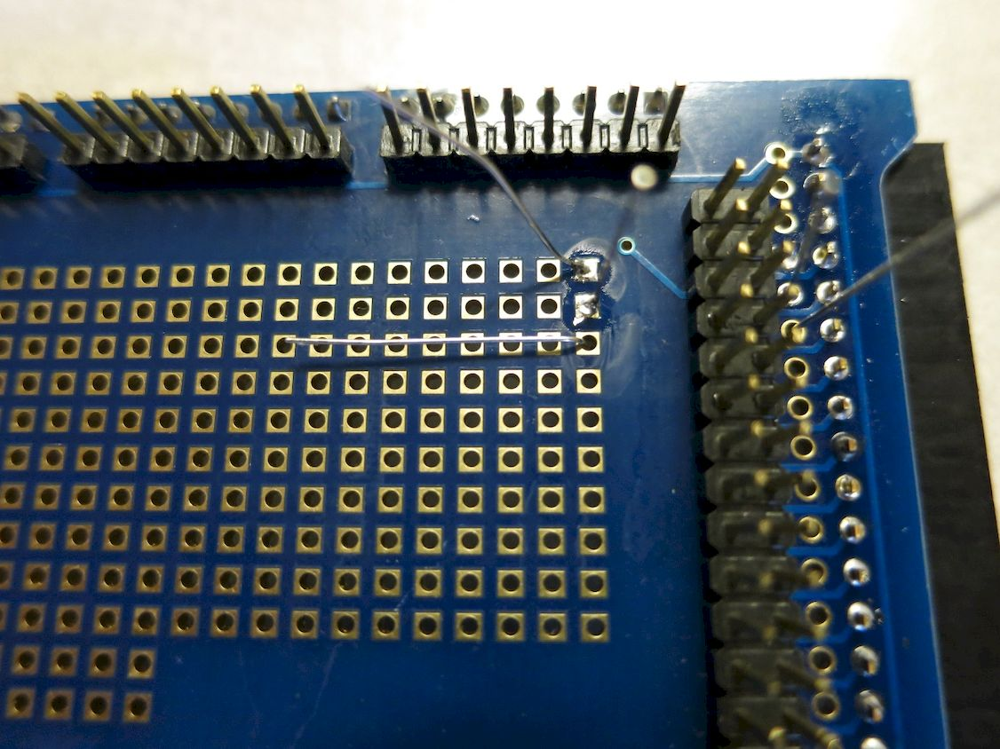

When you're done, the top of the shield should look like this:

.. figure:: ../figures/mosfet_08.jpg
   :align: center
   :scale: 30%

On the opposite side, leave the leads for the first and fifth resistors from the top uncut (you can bend them down to get them out of the way if you like), and trim the leads for the rest to a length of about 1/4": 

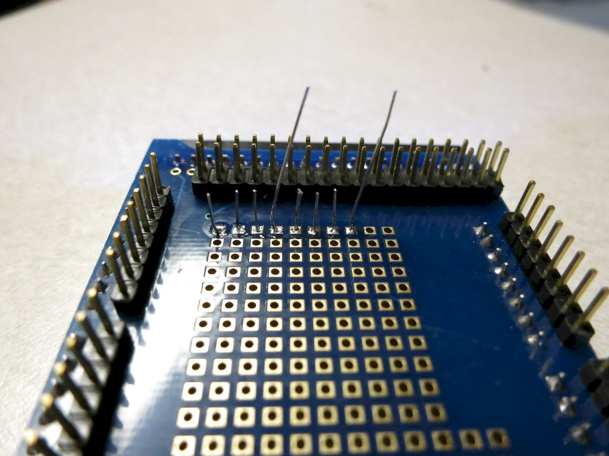

 Now it's time to solder in the high-side driver channel components - P-Channel MOSFET, npn transistor, and 10K resistor. Here's a rough schematic for one driver. The reason for the complicated circuit is that the P-MOSFET is normally on when the gate is unbiased. This circuit biases the gate with +9-12V when power is turned on, turning the P-MOSFET off. When +5V is applied to the 2N3904 transistor, it shunts the voltage away from the MOSFET gate to ground, allowing the P-MOSFET to turn on.

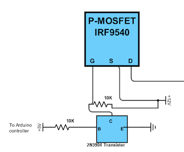

You've already installed the 10K resistor at left, though it still has to be connected to the transistor base (a future step). So this section will deal only with the MOSFET, the npn transistor, and the other 10K resistor. Here's a pic of the MOSFET; note that the position of drain and source in my schematic are swapped compared to the actual MOSFET (gate is correct):

.. figure:: ../figures/mosfet_11.jpg
   :align: center
   :scale: 100%

And here's a pic of the npn transistor, showing collector, base and emitter leads:
   
.. figure:: ../figures/mosfet_12.jpg
   :align: center
   :scale: 100%

.. warning::

   A few cautions before you begin. Some of these may seem obvious, but I'm including them because I've either come close to making all these mistakes, or have actually made them and had to go through the pain of fixing them.

   1. MOSFETs are notoriously sensitive to static discharge. Make sure you've discharged any static buildup before handling MOSFETs. If you have a grounding wrist strap, now would be a good time to put it on.
   2. Make sure you install both transistors in the correct orientation.
   3. Remember that when you flip the shield over, what was on the left is now on the right, and vice-versa; make sure you're making the right solder connections.
   4. When trimming leads, take care to make sure the trimmed lead doesn't wind up wedged someplace where it can cause a short. This has happened to me several times, and can drive you crazy as you try to figure out why things aren't working.

Here's a picture of the shield board, with the location of the first MOSFET circled in red:

.. figure:: ../figures/mosfet_13.jpg
   :align: center
   :scale: 30%

Insert the MOSFET into the marked pins, with the black labeled side facing to the right of the shield, and the metal backside facing left; solder one pin in place to fasten it to the shield:

.. figure:: ../figures/mosfet_14.jpg
   :align: center
   :scale: 30%   

It can be tough to solder it upright - what I usually do is solder it in place at any angle, then re-melt the solder while pushing he MOSFET until it's perpendicular. Careful - it can get hot.

Next, the 10K resistor is inserted as shown in the picture below, with one lead in a hole right next to the source pin, and the other lead two rows up and one row to the left of the gate pin. Pull the leads tight from the underside so that the resistor is flush with the shield board, using needle nose pliers if necessary.

.. figure:: ../figures/mosfet_15.jpg
   :align: center
   :scale: 30%
 
Flip the shield over, and bend the resistor leads so that the one closest to the source pin is flat and next to the source pin, while the other lead is bent parallel to the MOSFET pins:

.. figure:: ../figures/mosfet_16.jpg
   :align: center
   :scale: 30%

Now it's time for the 2N3904 npn transistor. The lead spacing on this resistor is smaller than the hole spacing on the shield, so you'll have to first gently spread the leads further apart until they will fit into the shield. Then insert the transistor with the flat part facing the MOSFET, and the curved part facing toward the right side of the shield:

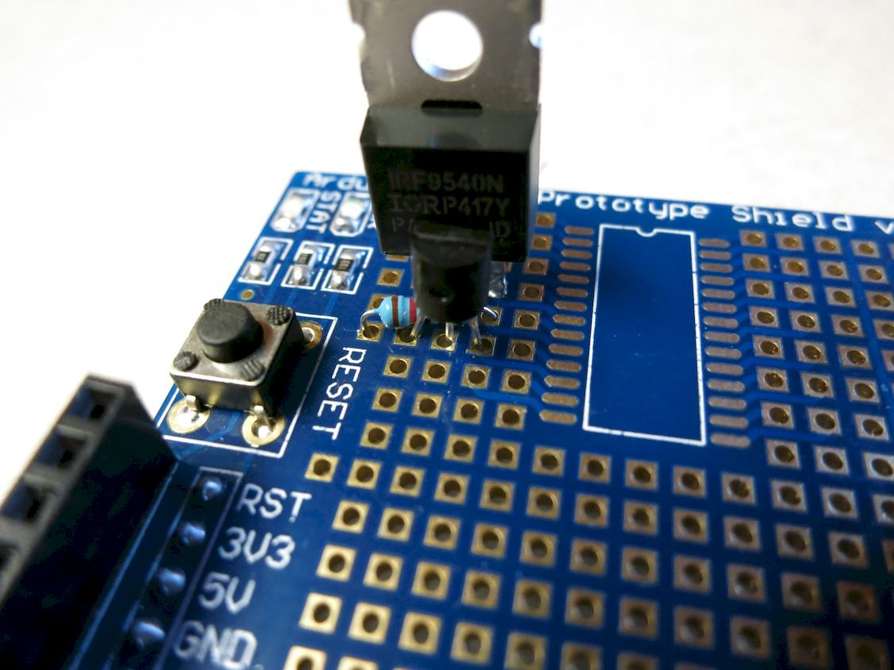

Note that the three npn transistor leads are in the same rows as the MOSFET leads.

Flip the shield over, and bend the collector pin down over the resistor lead and next to the MOSFET gate pin (better than I did in this pic):

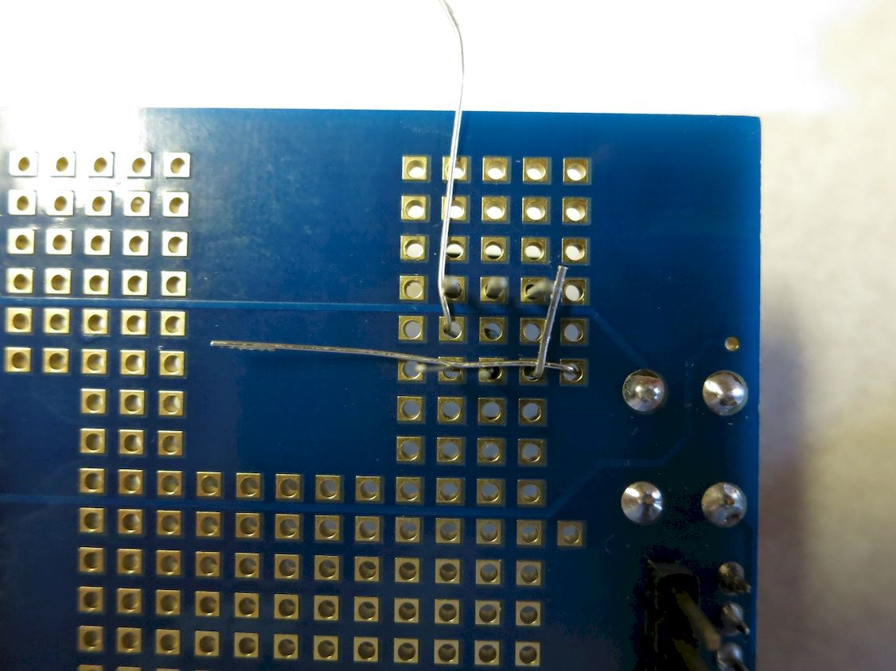

Now solder the collector pin on the npn transistor to the gate pin on the MOSFET; the resistor lead under the collector pin to the collector pin; and the other resistor lead to the source pin:

.. figure:: ../figures/mosfet_19.jpg
   :align: center
   :scale: 30%

Trim off the excess lead on the resistor leads, and on the collector lead:

.. figure:: ../figures/mosfet_20.jpg
   :align: center
   :scale: 30%   

And that's it - you've created a high-side p-channel MOSFET driver circuit! Hope you enjoyed that, because you'll now have to repeat the process 7 more times for the remaining high-side driver circuits. 

Here's a picture showing the locations of all the MOSFETs, including the one you just did:

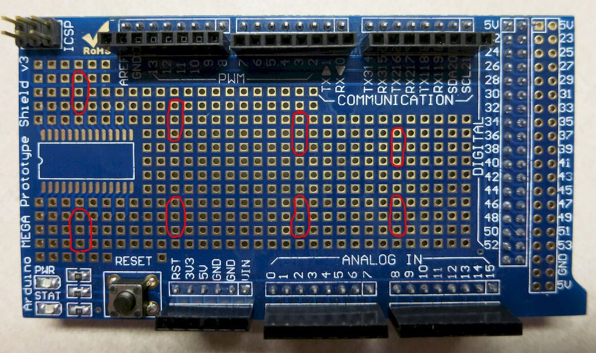

Just follow the exact same steps as the first driver circuit for all the successive ones. It's best to work left to right on the shield when installing the driver circuits, as it gives you the easiest access to the board when installing parts. When it's all done, the shield should look like this on top:

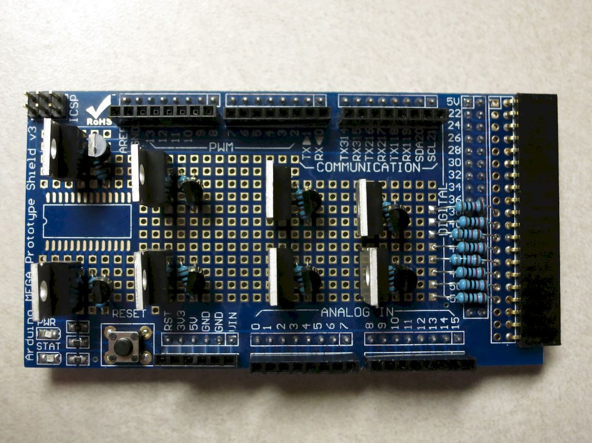

And like this underneath:

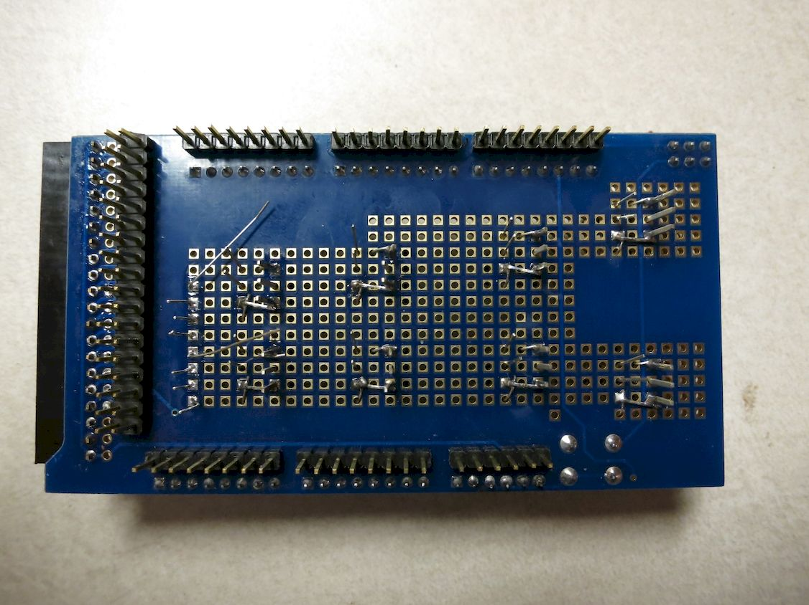

Next is a simple step - adding several female headers to the shield, for wiring power and ground connections. But I screwed up the first time through. I soldered two 2-pin female headers to the board for power connections in the positions indicated below (circled in red):

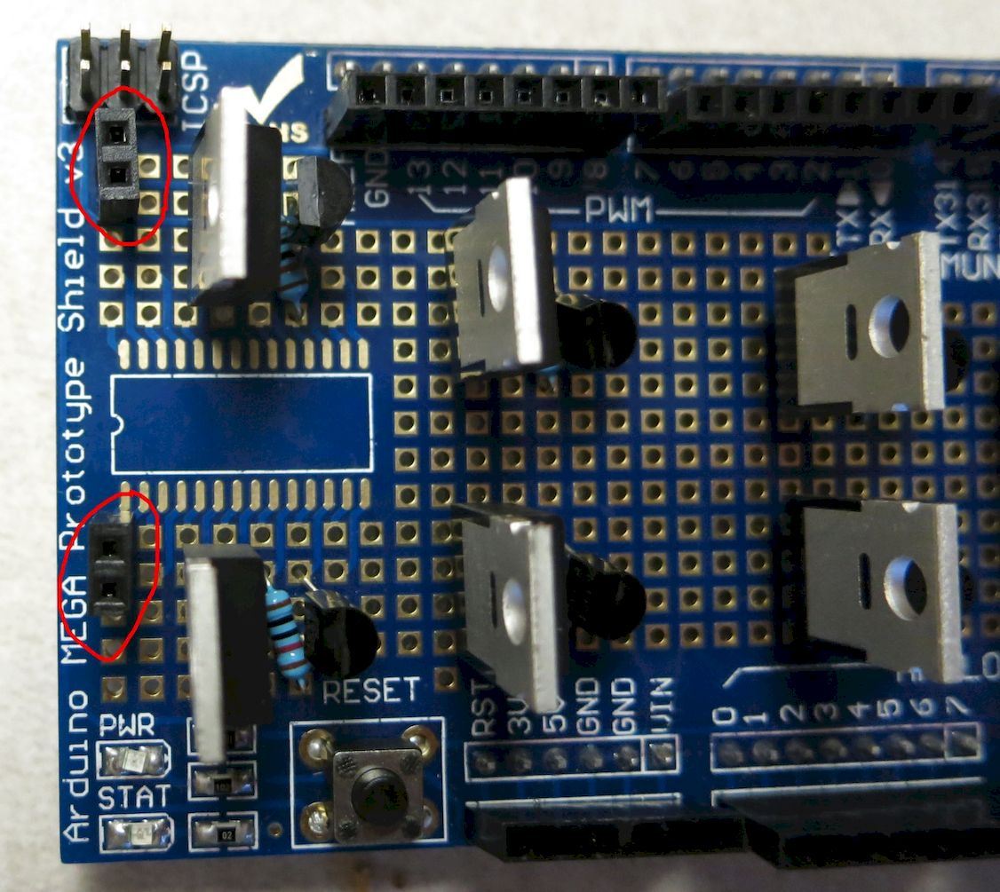

But I screwed up here – the top header keeps the shield from properly fitting into the Arduino Mega. So I removed it at a later step, but too late to fix most of these pictures. I’ve crossed out the errant header and associated soldering steps in a few upcoming pictures -  just don’t do them. Some later pics may not have that header crossed out – just ignore it.

So here’s the modified pic, with the header to be omitted left out:

.. figure:: ../figures/mosfet_25.jpg
   :align: center
   :scale: 30%

It’s tough to hold these in place for soldering - I usually use masking tape on the top to hold the header in place when I flip the board over.

You want the two sockets on the header to be connected electrically - the simplest way to is put a blob of solder between the pins on the bottom of the board:

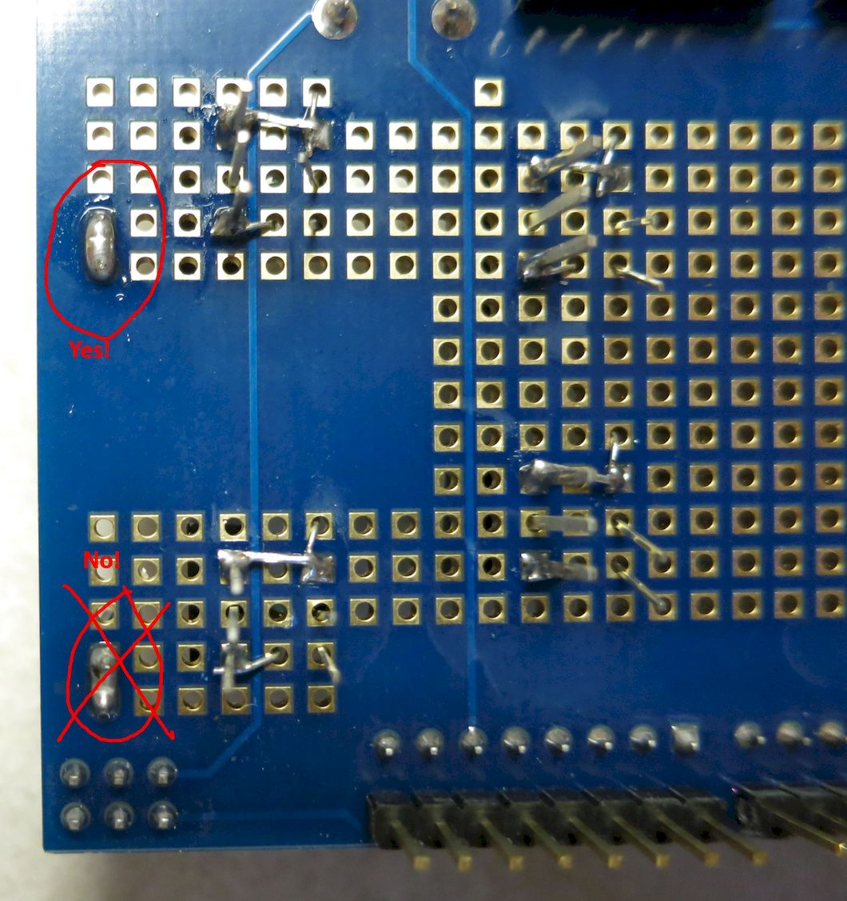

This header will be used for connecting "high" DC voltage (8-12V) to the shield, for powering the 3W LEDs.

Next, solder a 2-pin female header in the location indicated below, for a ground connection:

.. figure:: ../figures/mosfet_27.jpg
   :align: center
   :scale: 30%

As with the previous headers, you also want the two pin sockets to be connected electrically with a solder blob:

.. figure:: ../figures/mosfet_28.jpg
   :align: center
   :scale: 30%

This connector will be used to add some extra ground connections; the ones already present on the Arduino aren’t sufficient, and also aren't convenient for several future connections.

Finally, an 8-pin male header strip needs to be soldered in place; this will be used to connect the high-side drivers to the columns in the LED matrix. IMPORTANT: On this one, you will NOT be bridging pins with solder blobs, but keeping all the pins electrically separate from each other. Also, don't solder all the pins at once – first do only two pins to hold it in place, one row in from each edge, then do the rest.

From the `40-pin male header strip <http://www.taydaelectronics.com/connectors-sockets/pin-headers/40-pin-2-54-mm-single-row-pin-header-strip.html>`_ listed in the components section, break off an 8-pin section (they're notched to break easily). The photo below shows it in place, but I put it in one row higher than I probably should have. It will work in this position, but you will have a bit more room to work with if you move it down one row, closer to the "Vin" label at the bottom.

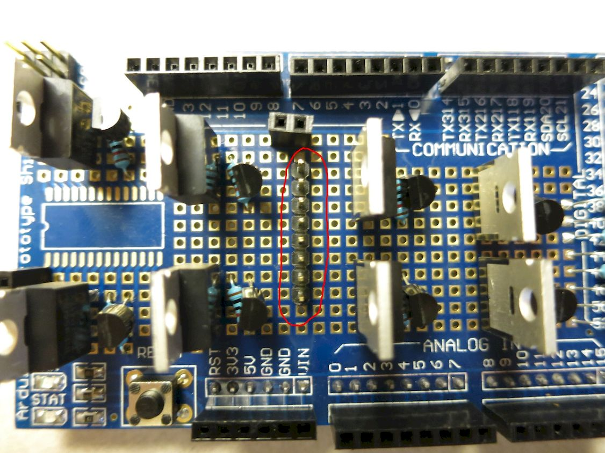

Here's a side shot:

.. figure:: ../figures/mosfet_30.jpg
   :align: center
   :scale: 30%