CAT4101 board
=============

This board controls the “low side” (ground connection) for the LED matrix.

Most of the components used for building the RTI controller are "through-the-hole", which means that they can be installed and soldered onto a standard protoboard/shield with 0.1" spacing between holes (2.54 mm). These are a lot easier to install and solder than the other common option, "surface mount devices" (SMD). The latter are designed for easier mechanical placement and bulk automated soldering. You supposedly can hand-solder SMD devices, but I am apparently too incompetent to do this well.

Unfortunately, there is one set of RTI controller components that is only available in SMD format - the CAT4101 LED drivers. Here's a pic of a standard MOSFET transistor on the left with 0.1" lead spacing, and a CAT4101 on the right; note the difference in lead spacing:

.. figure:: ../figures/cat4101_board/cat4101_board_01.jpg
   :align: center
   :width: 8cm   

Fortunately, there's something called a "breakout board" for the style of chip package used in the CAT4101 (technically, a TO-263 5 lead package). The breakout board has leads with the standard 0.1" spacing, and you solder the chip to pads that connect electrically to the leads. Here's one example of such a breakout board:

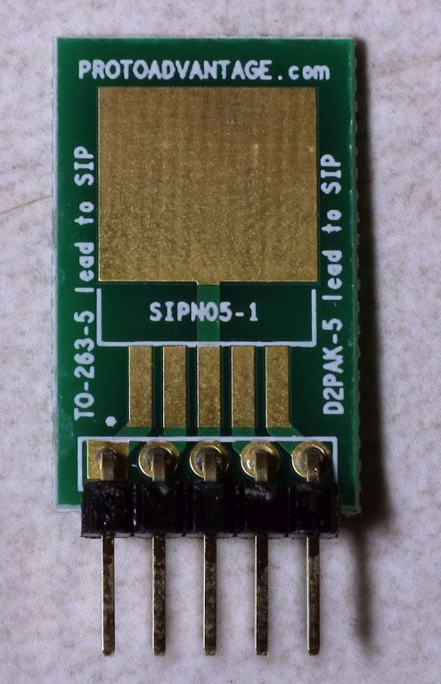

And here's the two chips again, this time with the CAT4101 sitting on the breakout board:

.. figure:: ../figures/cat4101_board/cat4101_board_03.jpg
   :align: center
   :width: 8cm

You still have to solder the CAT4101 chip to the breakout board, though. I use an alligator clip to hold the CAT4101 on the breakout board while soldering the first one or two connections:

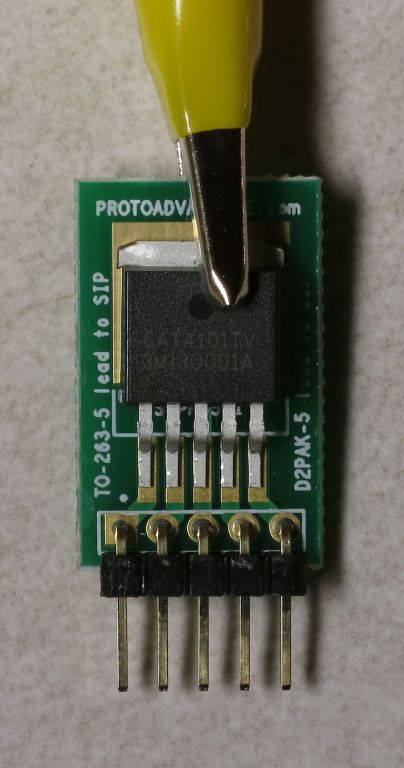

To solder the leads, the technique that works best for me is to hold the tip of the soldering iron touching both the gold pad on the breakout board and the end of the chip lead. Then apply the solder carefully to the end of the lead, and it should flow smoothly along the length where the lead touches the pad. Don't apply too much solder, or it may blob up and connect adjacent pads/leads, requiring cleanup and a re-do. When you're done, it should look something like this:

.. figure:: ../figures/cat4101_board/cat4101_board_05.jpg
   :align: center
   :width: 5cm

Double-check to make sure there are no shorts between leads. Do this for all 8 CAT4101 chips.

.. note:: 
   
   You'll get the CAT4101 chips in a hermetically-sealed envelope with a desiccant inside, including a note that tells you to keep them sealed until use, with limits on temperature when assembling. While you should certainly keep them in the sealed package until you're ready to solder them, these precautions are primarily for SMD assembly. In SMD assembly, the entire part is stuck into an oven that melts a solder paste to attach the CAT4101 chip to a PCB board / heat sink, so the entire part gets hot.
   
   There's an encapsulant inside the chip that can absorb moisture from the air, and if it absorbs too much before heating it can "popcorn" from the steam, swelling up and breaking the chip package. Unless you hold the soldering iron on the chip for a prolonged period of time, it's almost impossible to "popcorn" the chip with hand-soldering.

Now that you've got your 8 CAT4101s neatly soldered on the breakout boards, it's time to do some cutting. While my experience has been that the CAT4101s never get warm enough to justify heatsinks, I prefer to play it safe and put heatsinks on them just in case. But to attached the heatsinks, you'll need to cut off part of the breakout boards to access the bottom of the chip. Mark each breakout board as shown below, above the chip leads and below where the bulk of the chip lays on the breakout board:

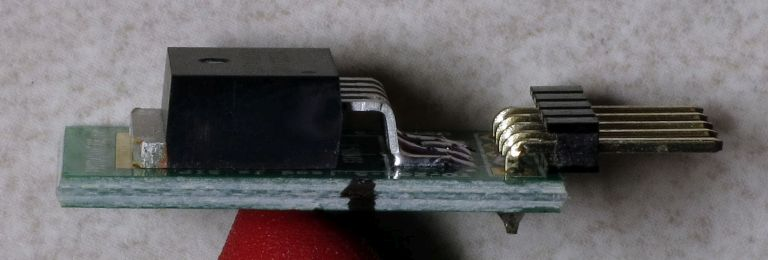

.. figure:: ../figures/cat4101_board/cat4101_board_07.jpg
   :align: center
   :width: 8cm   

Now saw/cut the breakout board on the back to remove the upper part. I've used both a hacksaw blade and a Dremel with a cutoff wheel to do this; any fine saw blade or cutter will likely do just as well (e.g. jeweler's saw). You don't have to cut all the way through - if you get about 2/3rds through, you can usually bend the board to break it off. There will be one metal connection running to the upper part of the board, but don't worry about that - bend/cut it off to detach it.

.. warning::
   
   Be careful in this step not to cut through either the chip leads or the chip itself. While you're at it, please take care to not injure  yourself. Safety glasses are mandatory, and I use a dusk mask to keep from breathing in powdered PCB.

When you're done, you should have a nice pile of CAT4101s on trimmed breakout boards, and the trimmed part of the boards:

.. figure:: ../figures/cat4101_board/cat4101_board_08.jpg
   :align: center
   :width: 8cm

Throw out the trimmed board pieces, and put the CAT4101/breakout boards someplace safe for now. Try not to put any sideways pressure on the chips relative to the boards, as the leads can bend. I've bent many of these, and bent them right back without problems, but I'm sure they can break if bent far enough, or enough times.

One more component requires a breakout board, and that's an RJ-45 (Ethernet) jack. Here's a bottom view:

.. figure:: ../figures/cat4101_board/cat4101_board_09.jpg
   :align: center
   :width: 8cm

And an oblique view (the red thingie at bottom is a plier handle used to prop up the jack):

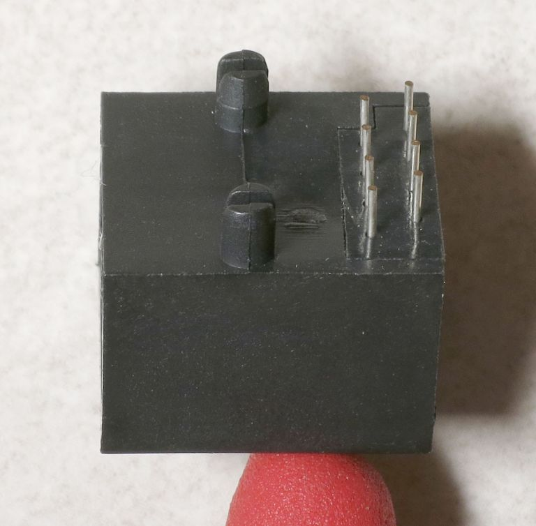

You can actually solder the leads on the right to a standard PCB board if it has a set of holes that have matching spaces, but in this case we have evenly-spaced holes 0.1" apart, so that won't work. Breakout board to the rescue. I didn't have any unsoldered RJ-45 breakout boards available, so I borrowed this pic from Digikey:

.. figure:: ../figures/cat4101_board/cat4101_board_11.jpg
   :align: center
   :width: 8cm
   
You will need to break off an 8-pin segment of one of your 40-pin 2.54mm single row pin header strips, and solder it to the underside of the breakout board, so that the short pins poke up from the lower pins of the board as seen above. Solder one pin first, then straighten the set of pins if necessary by remelting the solder on that one pin and re-positioning the 8-pin header strip so that it's perpendicular to the board. Then place on the RJ-45 jack on the top side of the board so that the 8 staggered pins go through the 8 staggered holes, pressing down so that the two large pins on the RJ-45 jack go through the two large holes as seen above. Solder the 8 staggered pins to the holds, and you're done. It should look like this:

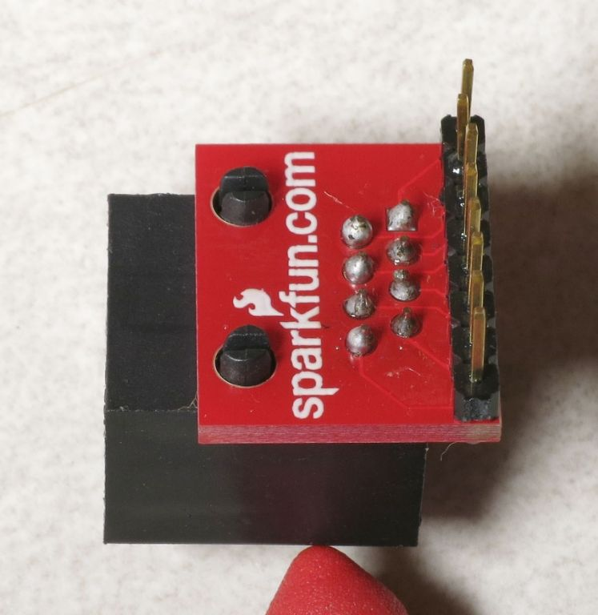

.. figure:: ../figures/cat4101_board/cat4101_board_13.jpg
   :align: center
   :width: 8cm   

.. figure:: ../figures/cat4101_board/cat4101_board_14.jpg
   :align: center
   :width: 8cm

Time to start putting together the low-side driver board with the CAT4101s. First step is to install the connector on the 11 x 8.5 cm protoboard. This is the `spec'ed component <http://www.dx.com/p/double-sided-glass-fibre-pcb-prototype-board-for-arduino-11-x-8-5cm-148584#.V1SUkZErKUl>`_, but if you can't find one that size, you can use another one up to 11.5 cm in the long (horizontal) dimension, and 11 cm in the short (vertical dimension), which will fit in `the enclosure <http://www.polycase.com/dc-96p>`_ I've been using. Bit smaller in horizontal dimension will work, but if it's too small you may have problems getting all the components and wiring to fit; probably won’t work if it’s a bit smaller in the vertical dimension. If you use a larger enclosure, then you can use a larger protoboard; don't go smaller with the enclosure, or the controller boards may not fit.

The connector is a right-angle male header, which comes in a 40-pin length:

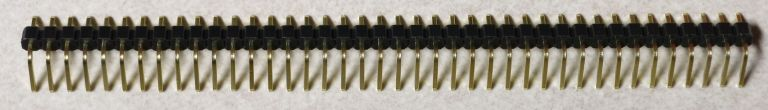

We need a 20-pin connector, but it's easy to break the 40-pin in half:

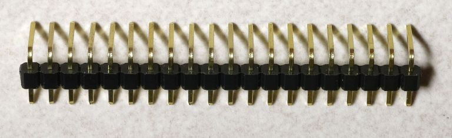

You're going to be soldering the connector to the protoboard as far to the upper left as you can get:

.. figure:: ../figures/cat4101_board/cat4101_board_17.jpg
   :align: center
   :width: 6cm
   
The short pins go into the protoboard for soldering. The plastic base of the pins needs to be flush with the protoboard, so that the long pins are parallel to the protoboard. It can be tricky to do this. I approach this by inserting the connector into the board, flipping it upside down, placing it on the soldering work area, and taping it down:

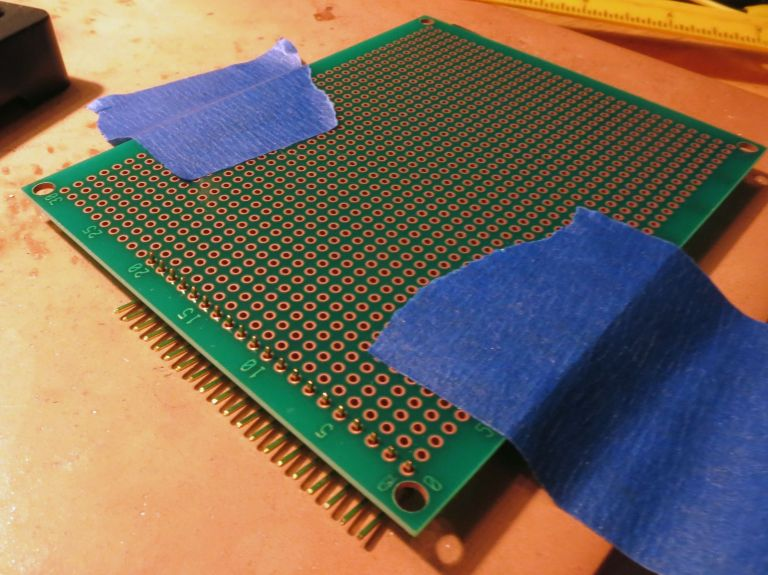

Solder a pin at one end, then remove the board and see if the connector is flush with the board. If not, reheat the solder connection and twist the connector to make it flush with the board. Caution: Make sure you don't do what I've done a couple of times, and press on the same pin that's touching the soldering iron ;-). Check again to see if it's flush. If yes, solder the pin at the opposite end, and check to make sure that it's flush as well. When both ends are flush, solder one more pin somewhere near the middle of the connector, and make sure that's flush, too. If you've done it right, the male connector on this board should plug cleanly into the female connector on the MOSFET shield you assembled in the previous steps (no bending required):

.. figure:: ../figures/cat4101_board/cat4101_board_19.jpg
   :align: center
   :width: 6cm

.. note::
   
   In schematic wiring drawings, the wire lines are drawn from one hole on the shield or protoboard to another. The wires connecting these holes should have the insulation stripped from their ends, and have the bare lead inserted into the hole. The bare lead should then be connected to the specified nearest component/connector lead.

Time to install the CAT4101 LED driver breakouts and associated components onto the protoboard. Here's a crude circuit schematic:

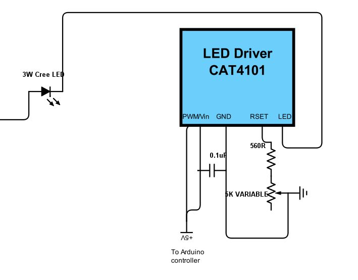

There are 5 leads on the CAT4101. From left to right:

1. EN/PWM: Enables the current from the LED driver. PWM is pulse width modulation, a way to control apparent light intensity by varying the input signal voltage - not used in this system.
2. Vin: Powers the chip with +5V.
3. GND: connects to ground.
4. RSET: Connects to a resistor that sets the output current per this curve (from the datasheet).
5. LED: Connects to the ground lead of the 3W LED you're lighting up.

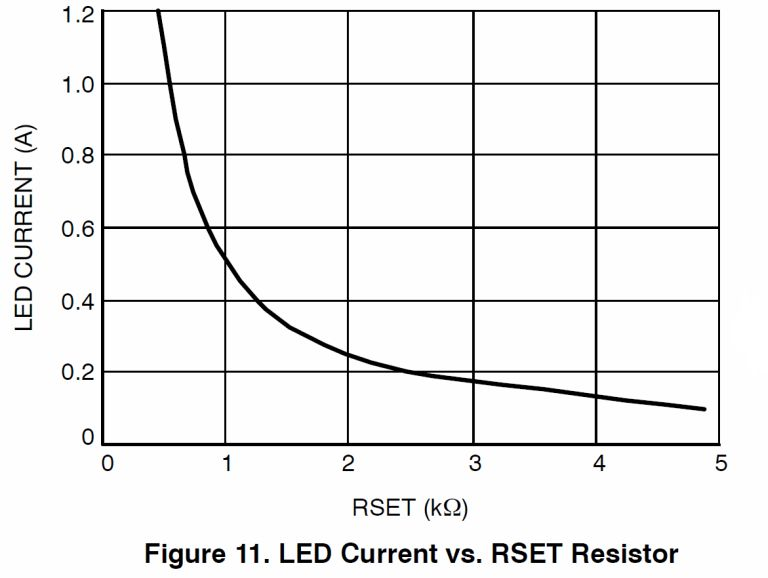
   
   LED current vs. RSET Resistor

In my circuit, EN/PWM and Vin are shorted together, and both are connected to an Arduino output that supplies +5V. I tried a constant +5V connection to all the CAT4101 driver Vin pin 2s, and a separate Arduino connector to all the EN/PWM pin 1s, and wound up with weird issues like multiple LEDs lighting up when only one should have. Shorting 1 and 2 together and hooking them up to the Arduino pin output fixed that problem, as both the power supply and enabling voltage are turned on and off at the same time.

The 0.1 uF capacitor between the input voltage and ground is recommended by the manufacturer to reduce input noise. I'm guessing it's probably not necessary in this use case, but it's cheap to play it safe. Plus, it makes some upcoming wiring connections a bit easier.

The RSET graph above shows the current going as high as 1.2 A, but the recommended max current for both the CAT4101 and the 3W LEDs is 1 A, which the datasheet says corresponds to a resistance of 549R. The 560R resistor in the current is the closest higher standard resistor value, and is there to make sure you don't accidentally send too much current through the CAT4101 and LED. The 5K variable resistor is there to let you adjust the current to a specified value. 

Three reasons for this:

1. The current v. RSET curve is steep at lower resistances, so even small circuit variances between different CAT4101 circuits can result in significant differences in current. The variable resistor lets you set a specific current for every CAT4101 circuit, which insures that all LEDs will have the same light intensity.
2. If you're in a remote location and running from battery power, turning down the intensity will prolong battery life. Your exposure times may need to be a fraction longer, but that shouldn't add too much extra time to the cycle.
3. When using USB microscopes, the light intensity at full 1A current is so high that it can saturate the image sensor. Turning down the current reduces the intensity to a usable level.

Here's the protoboard with connector (from the previous step), with the locations for the CAT4101s circled in red:

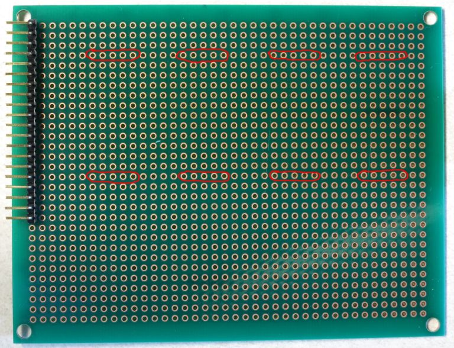
   
This is with the recommended protoboard. If you use a different size, you'll have to reposition these slightly. But read all the following instructions for your protoboard, to make sure the new positions don't interfere with upcoming components or wiring.

I usually start by installing 4 CAT4101s on the top row:

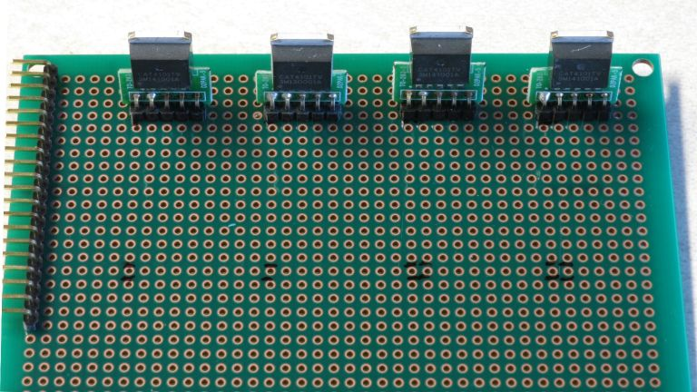

By not installing the second row right away, I get a little extra room in front for access. The black marks are where I marked the pin 1 position for all the CAT4101s. Notice the extra marks on the lower right - that's where I got it wrong the first time. Measure twice, solder once ;-). I start by soldering the pin 1 lead in place, then flipping the board over and seeing if the CAT4101 breakout is flush with the board and perpendicular. Spoiler: it almost never is. Touch the soldering iron to the pin 1 connection to re-melt the solder, then re-orient the breakout board manually until it's flush and vertical (as seen above).

Next, install the capacitors. Push the two capacitor leads into the holes next to CAT4101 pins 2 and 3, on the back side of the board, like this:

.. figure:: ../figures/cat4101_board/cat4101_board_24.jpg
   :align: center
   :width: 8cm   

Push them in as far as you can - the more capacitor lead you get on the bottom, the easier subsequent steps will be. Flip the board over, and position the capacitor leads like this:

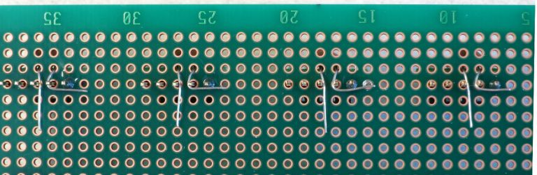

The lead next to the center pin 3 (GND) should be laid flat and straight touching pin 3 and extending beyond. The lead next to pin 2 (Vin), should wrap around pin 2, and then be laid flat against pin 1 (EN/PWM). Solder the leads to the pins they're next two; make sure both pin 1 and pin 2 are soldered to the lead next to them. **Don't trim the excess leads - you'll need them in a bit**.

Next, install a 560R resistor on the front side of the chip, next to pin 4 (RSET):

.. figure:: ../figures/cat4101_board/cat4101_board_26.jpg
   :align: center
   :width: 8cm

Orientation doesn't matter with resistors, but my OCD usually compels me to make sure they're all oriented the same way. Flip the board over, and flatten the resistor leads like this, but don't solder them yet:

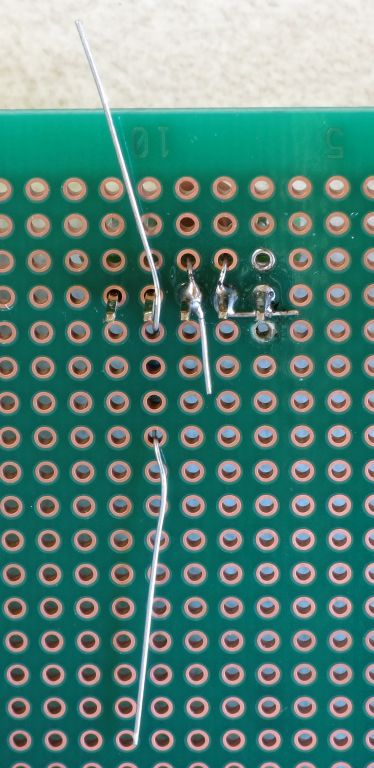

This pic also shows how the capacitor leads should have been soldered (missed taking that pic).

Now take a 5K trim pot:

.. figure:: ../figures/cat4101_board/cat4101_board_28.jpg
   :align: center
   :width: 8cm

Cut off the lead furthest from the screw on top, converting it into a variable resistor:

.. figure:: ../figures/cat4101_board/cat4101_board_29.jpg
   :align: center
   :width: 8cm

Insert it next to the GND pin (pin 3) on the top of the protoboard:

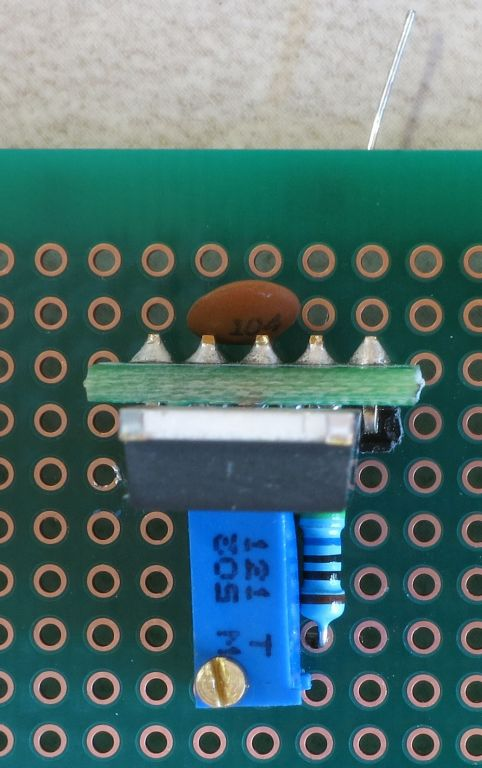

It's a snug fit, but not soldering the 560R resistor means you should be able to nudge it to the side and make everything fit.

Now flip the board over, and arrange the variable resistor leads this way:

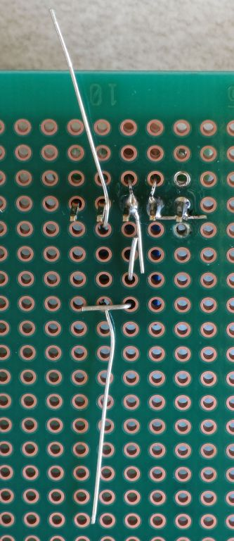
   
The variable resistor lead furthest from the CAT4101 chip should be bent over to touch one of the 560R resistor leads. The variable resistor lead closest to the chip should be bent towards CAT4101 GND pin 3, overlapping and touching the capacitor lead that's already soldered to pin 3. Now solder the 560R resistor lead at top to pin 4 (RSET) on the CAT4101, solder the bottom 560R lead to the variable resistor, and solder the other variable resistor lead to the capacitor lead. Should look something like this:

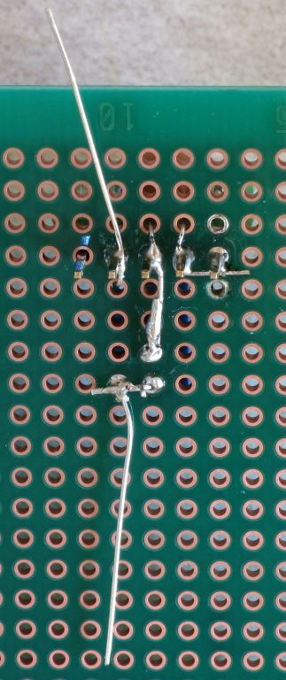

Trim off the excess resistor leads, and you're done with this CAT4101 circuit. Repeat for the other 3 CAT4101s in the first row:

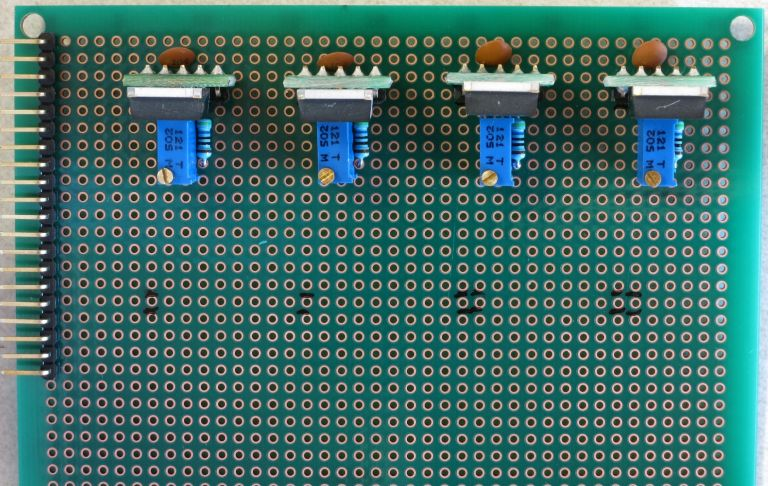

Which should look like this on the bottom, after all the soldering is done:

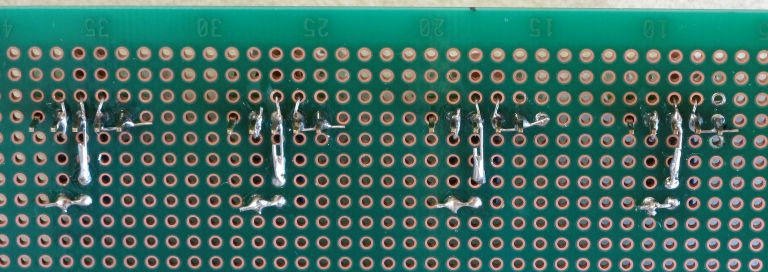
   
Now repeat the process with the second row of CAT4101s. Install the CAT4101 breakouts:

.. figure:: ../figures/cat4101_board/cat4101_board_35.jpg
   :align: center
   :width: 8cm

Then first install the capacitors, then the 560R and 5K variable resistors:

.. figure:: ../figures/cat4101_board/cat4101_board_36.jpg
   :align: center
   :width: 8cm   

Which should look like this on the bottom:

.. figure:: ../figures/cat4101_board/cat4101_board_37.jpg
   :align: center
   :width: 8cm
   
Isn't that nice, neat and clean? Don't get used to it - you're about to mess it up with a bunch of wires. On the plus side, you have a lot more room to work with on this board than you had on the MOSFET driver shield, so the amount of cursing you'll do should be a lot less.

But before adding the wires, there are a few additional items that need to be soldered on the protoboard. First, the RJ-45 Ethernet jack on its breakout board:

.. figure:: ../figures/cat4101_board/cat4101_board_38.jpg
   :align: center
   :width: 8cm

If you're using the protoboard recommended in the parts list, this is the correct position for it, all the way down in the lower-left-corner. Sliding the whole protoboard into the MOSFET shield board, it will just barely clear the edge of the board (and if it doesn't, a bit of filing should fix that):

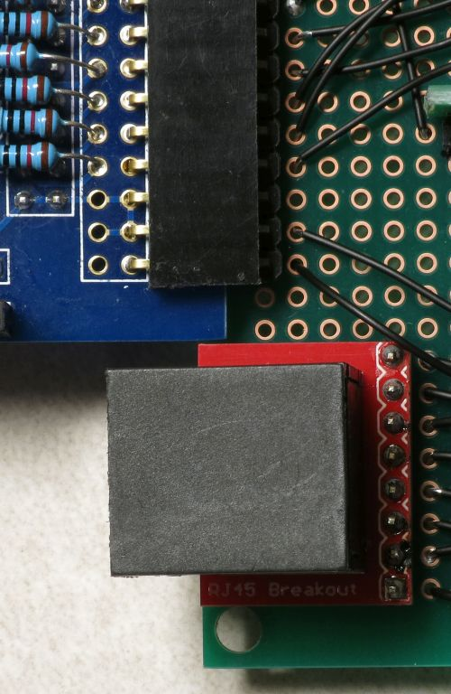

If you use a protoboard of a different size, and in particular one that's smaller in the vertical dimension, you will probably have to re-orient the RJ-45 so that it faces downwards in order to make it fit. Not a big deal.

Unlike previous connections, where you want the connector to be flush with the board, for this connection you want the RJ-45 jack to tilt until the black knobs on the bottom touch the board:

.. figure:: ../figures/cat4101_board/cat4101_board_40.jpg
   :align: center
   :width: 8cm
   
Solder it into place using the first and last pins.

Next, put the buzzer in place on the board as shown below (+ on the right), and solder the two pins to hold it in place:

.. figure:: ../figures/cat4101_board/cat4101_board_41.jpg
   :align: center
   :width: 8cm

Now break off a strip of 5 male header pins:

.. figure:: ../figures/cat4101_board/cat4101_board_42.jpg
   :align: center
   :width: 8cm   

And solder it next to the buzzer (1st and last pins):

.. figure:: ../figures/cat4101_board/cat4101_board_43.jpg
   :align: center
   :width: 8cm
   
It's a tight fit, but the 5-pin female header on the USB panel connector should still fit (or break out your file again):

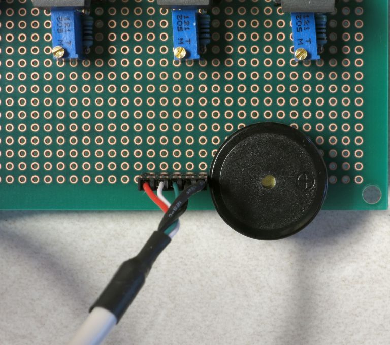

Finally, you'll be soldering a 2-pin male header next to the 5-pin header you just did, and a two-pin female header on the middle right of the board, as shown here:

.. figure:: ../figures/cat4101_board/cat4101_board_45.jpg
   :align: center
   :width: 8cm   

For the male header, use a blob of solder to connect the pins on the 2-pin and 5-pin header that are next to each other. This 2-pin header is for a jumper that will optionally power a servo to fire the camera shutter for those cameras that don't support remotes. Make sure the solder only touches the adjacent pins, and no other:

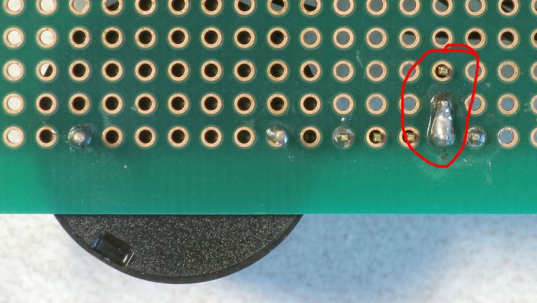

Next step is to wire up leads from the CAT4101s to the appropriate connectors. First, the LED connections that will ultimately connect to the ground (negative) lead on the LEDs, running along rows of the LED matrix (the rightmost CAT4101 connection in the schematic below, aka pin 5, LED in the figure below). Then, the connections from the Arduino to the CAT4101, that supply power and enable the CAT4101 (the two leftmost connections, pins 1 and 2, PWM and Vin in the figure below).

   
Each CAT4101 controls a separate row of the LED matrix, identified in the picture below with numbers 1-8 for the 8 maximum possible rows.

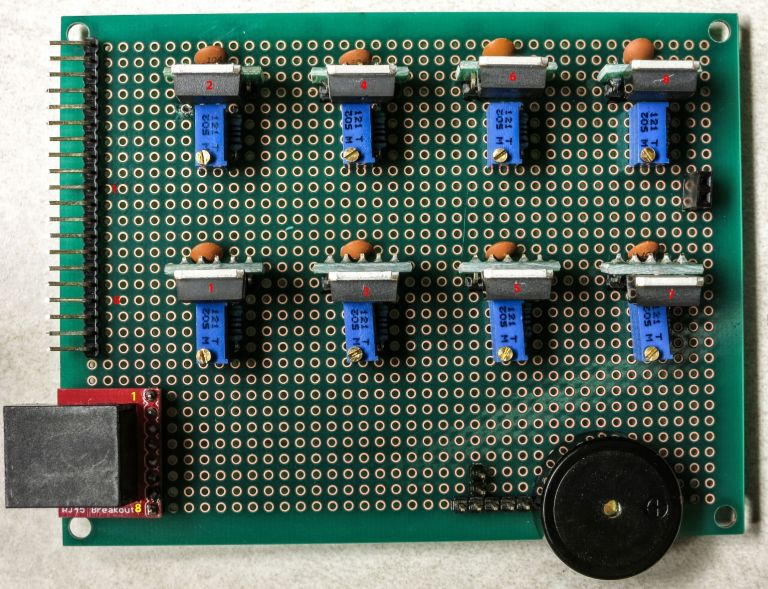

The connector on the left has the numbers 1 and 8 next to the positions where pins 1 and 2 on the 1 and 8 CAT4101s are wired to the corresponding Arduino outputs that power and enable the CAT4101s; the remaining connection numbers 2-7 are sequential between the 1 and the 8, of course.

Similarly, the numbers 1 and 8 on the RJ-45 breakout board (lower left) are where you'll use the Kynar 24 AWG wire to link the pin 5 connection on the CAT4101 to the breakout board for the corresponding number, with the other pins corresponding to connections 2-7. I usually do the LED connection first - here's a schematic showing the wiring to be done between pin 5 and the RJ-45 breakout (in red):

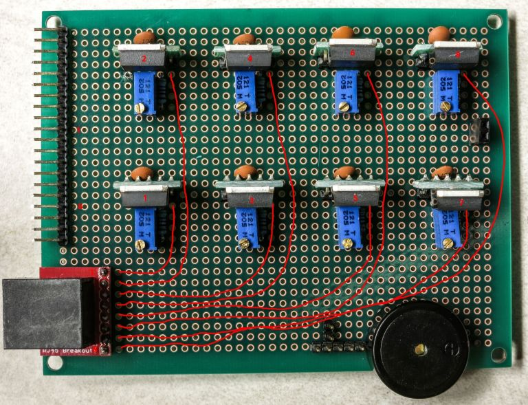

You don't have to follow the wiring path exactly - it only matters that the matching connections are soldered correctly. Here's how my board looks after that step:

.. figure:: ../figures/cat4101_board/cat4101_board_49.jpg
   :align: center
   :width: 8cm
   
Next step is to electrically connect pins 1 and 2 on the CAT4101s to the corresponding pin on the protoboard connector on the left, which will receive control/power voltages from the Arduino. Since these were already shorted together when you installed the capacitors, you only need to solder the wire to pin 1. You can use the Kynar AWG 24 wire, but if you have thinner wire, you can use that as well, since this connection carries very little current (<20 mA). Here's the wiring schematic; I used a mix of red and white in drawing the wires to make it clearer, the color has no other significance:

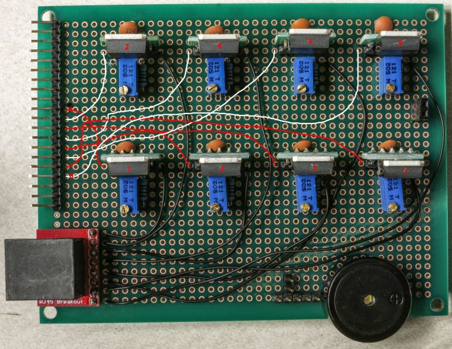

Once again, you don't have to copy the exact wire layout, you just have to make sure CAT4101 connection goes to the correctly numbered pin on the connector. Here's how mine looked after this step:

.. figure:: ../figures/cat4101_board/cat4101_board_51.jpg
   :align: center
   :width: 8cm   

Time to finish wiring up the CAT4101 board. First step is to hook up the ground pins on all 8 CAT4101s to a common ground pin header on the right. Not going to draw all the wires here, as it's already too complicated. Plus, the exact layout of the wires doesn't matter - as long as the center pin of every CAT4101 gets connected to ground, the way the wire is laid out on the board doesn't matter. Here's a schematic showing where the ground wires should come off of the CAT4101s center pin, and where the ground two-pin female header on the right the wires should hook up to:

.. figure:: ../figures/cat4101_board/cat4101_board_52.jpg
   :align: center
   :width: 8cm
   
It's a bit difficult to see the exact connection spot, since the capacitors obscure it. So here's a side shot from the back, with the ground wires already soldered in place to the center CAT4101 pin (which is also already soldered to one of the two capacitor leads):

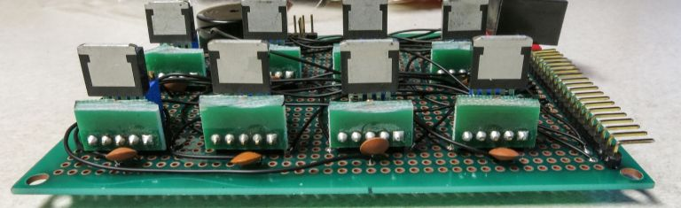

And here's an oblique view that shows the ground wire connections to all 8 CAT4101s:

.. figure:: ../figures/cat4101_board/cat4101_board_54.jpg
   :align: center
   :width: 8cm   

Here's a view from the top, with all the ground wire connections in place:

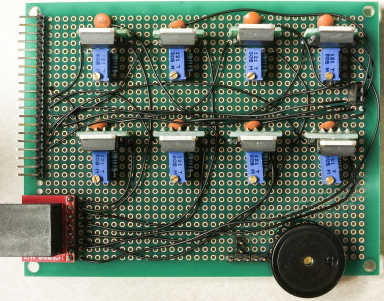

See how all the ground wires go to the two-pin female header on the right? Flip the board over, and the bare wire leads should all be bent over to overlay the header pins. Then use a lot of solder to make sure all the wire leads and pin headers are electrically connected; that's what the solder blob on the right below is:

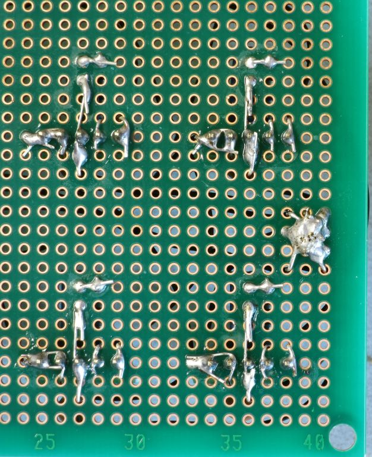

Notice also how the wire lead from the ground wire connection is soldered to the center pin of the visible CAT4101s, and also to one of the capacitor leads.

You may be tempted to make this connection with shorter jumper wires between adjacent CAT4101 chips. Don't - it's specifically not recommended in one of the CAT4101 datasheets; they say that every ground connection should go independently to a single "star" ground that each CAT4101 connects individually to. I actually tried the jumper approach once, and ran into weird problems with LEDs turning on when they should be off.

Next step is to wire up the USB control pin and beeper pin from the connector at upper left to the appropriate positions. The pic below shows where the connections should be made:

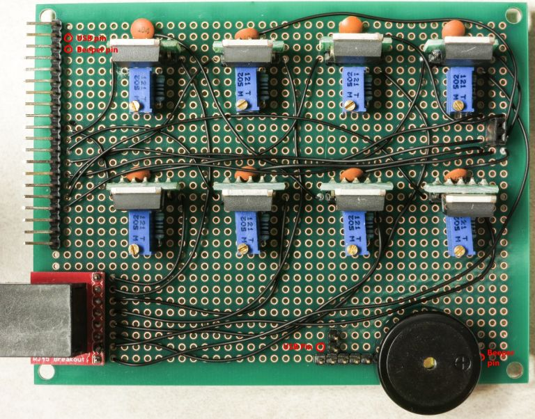

Here's how it looks on top after the wires have been connected:

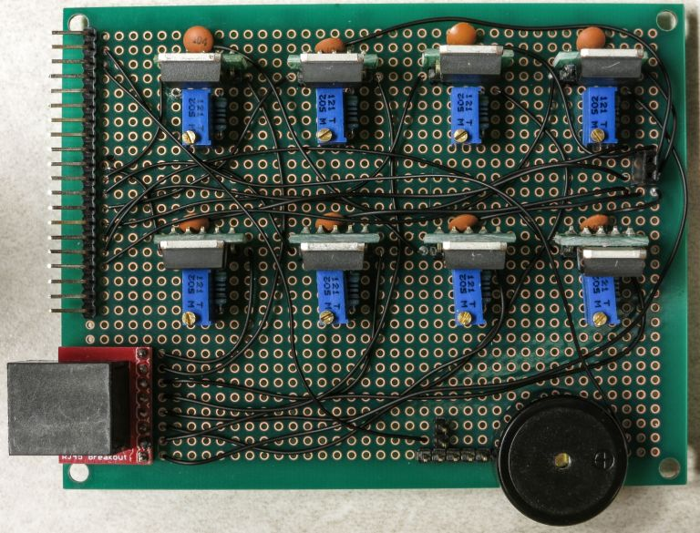
   
The 5V power supply for the servo shutter, and the ground connection for both the USB and beeper, need to be hooked up:

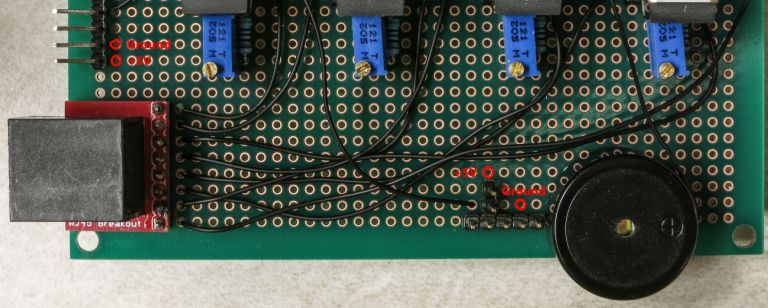

The 5V connection is straightforward, it just gets soldered to the top pin of the two-pin female header:

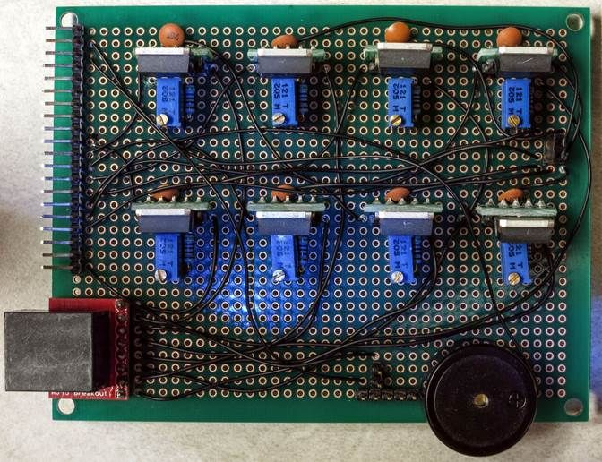

The ground connection is a bit more complicated, since it needs to be connected to multiple pins. Trim the insulation a bit longer on the right end of the lead, and when you insert it in the specified position, bend it around that fourth pin on the 5-pin male header so that it touches the 5th pin on the header and heads over towards the beeper ground pin. Then bend the beeper ground pin over to make contact with the wire lead. It should look something like this:

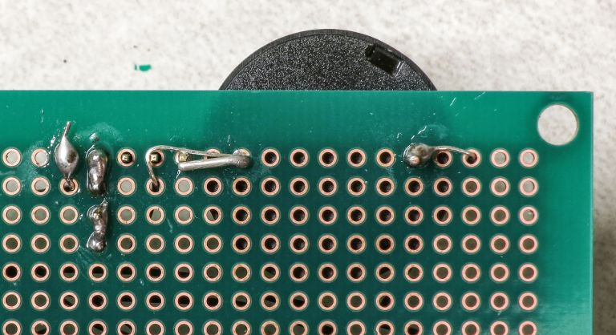

Now lay the solder on thick so that all those pins and the wire are electrically connected:

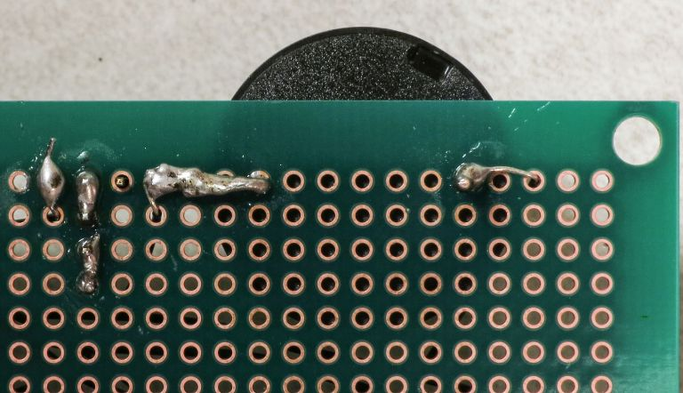

Check that all the pins/wires are soldered as you see above. On the top side, the board should now look like this:

.. figure:: ../figures/cat4101_board/cat4101_board_63.jpg
   :align: center
   :width: 8cm

Originally, the board was done at this point. However, since I decided to add a servo shutter system to operate cameras that don't have a remote capability, I decided to add an additional electrical connection to the 5-pin male header that the USB panel connector will be hooked up to. And I wanted the option to be able to disconnect this if I didn't need it, to remove the possibility of problems or damage to cameras with misapplied voltages. So I added a two-pin male header to the bottom, soldered a wire connection from the connector at upper left to the left pin, and a wire connection from the right pin to the one remaining unsoldered pin on the 5-pin male header. Here's what it looks like; the drawn red traces parallel the actual wire connections:
   
.. figure:: ../figures/cat4101_board/cat4101_board_64.jpg
   :align: center
   :width: 8cm
   
And here's what it looks like without those red traces, and all the wiring done:

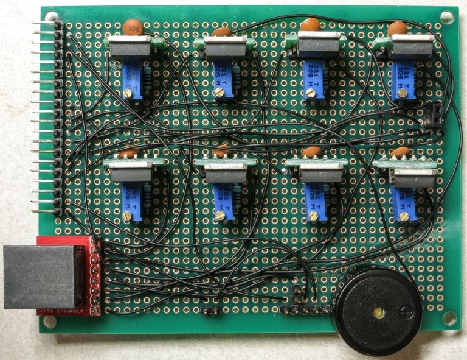

Double-check all the wires you see here to make sure your board has a corresponding connection. If they all check out, you're done with this board, and with the most difficult wiring of the entire project. Yay!

One more step, which I don’t have a picture of. The Ethernet jack in the lower left-hand corner is held on only by the 8 soldered pins. That’s reasonably strong, but it could use some reinforcement. Take some adhesive, and fill in the gap between the red Ethernet PCB board and the green PCB board. Thick stuff you can stick into the crack is best; take care not to block the Ethernet jack. I used Plastiweld, but hot glue or silicone adhesive would be reasonable alternatives.
