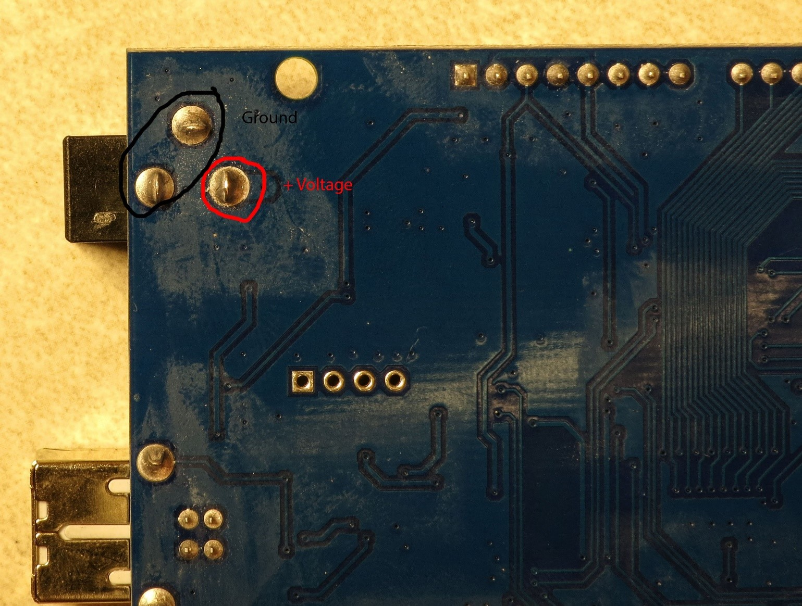
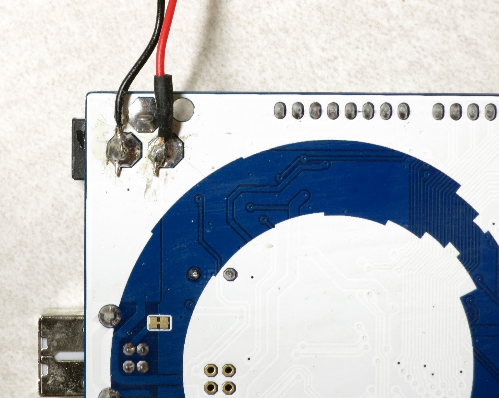
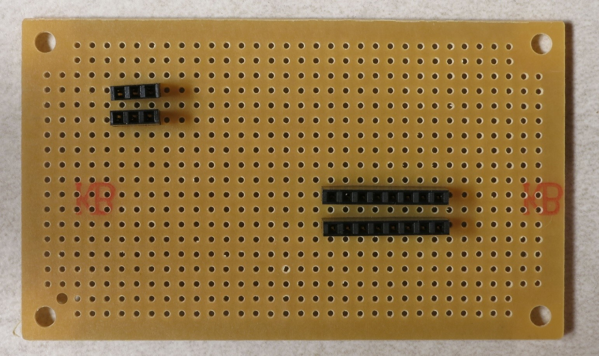
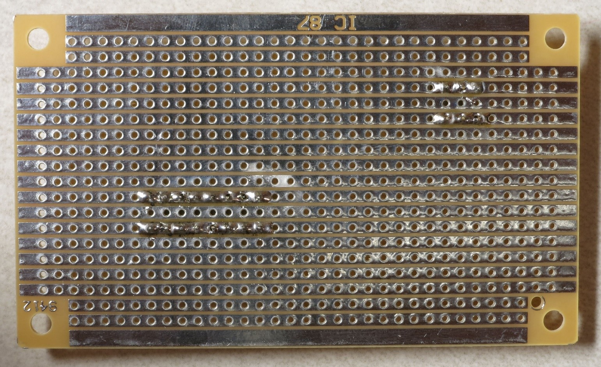
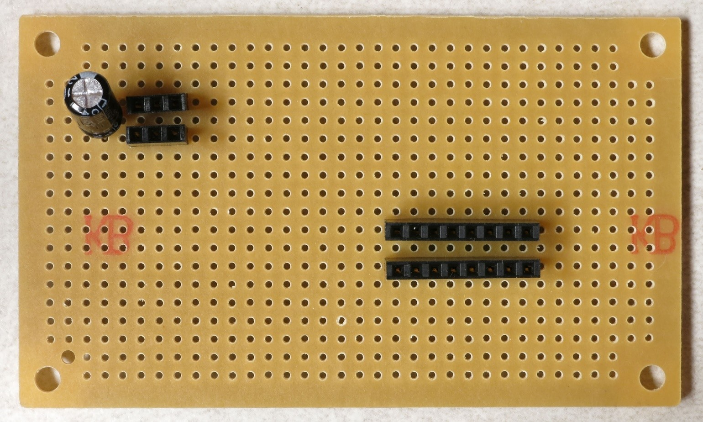

Power supply connections
========================

This section deals with power supply connections for both the LEDs and the Arduino.

The Arduino Mega is designed to supply up to 500 mA of current from the +5V connection when running from a USB connection. That's not enough to power the 1A LEDs in this RTI system, so a separate power supply (8-12V) capable of supplying up to 2A of current is specified (2A because I've had problems with noise from power supplies that are only spec'ed for 1A). While there's a Vin header on the Arduino board that supplies full voltage from the power supply, I believe it shares the 500 mA current limit as well. So I decided to power the LEDs directly from the 8-12V power supply, bypassing the Arduino completely.

On the bottom of the Arduino Mega, near the power supply jack, are three solder connections to the power jack. Two connect to the power supply ground, while the third connects to the power supply positive voltage (8-12V):

You will need to solder 22 AWG wires to both the positive voltage connection and one of the two ground connections; cut two pieces of wire about 4" (10 cm) in length, and strip the insulation of both ends of each piece of wire. The usual convention is that positive voltage is indicated by a red wire, while ground is a black wire.

There are large blobs of solder on the connections, so it may take a while to get the solder to melt. Use a large soldering iron or gun if you have one, otherwise either use a chisel tip on your soldering iron for maximum heat conduction or wait a long time using a regular point tip for the solder to melt. Then press the bare wire lead into the melted solder blob and let it cool; if necessary, add more solder to cover. It should look something like this:

I used a small piece of heat shrink tubing on the red wire to make sure it wouldn't short out against the ground connections.

There are going to be a fair number of connections required to both the +8-12V/GND connections directly from the power supply, and also the +5V/GND connections from the Arduino board; for the latter, more connections than are actually available on the Arduino. To solve this pin connection shortage, you will need to solder two 3-pin female headers to a strip protoboard for the high voltage supply and ground, and two 5-pin female headers for the Arduino +5V and GND connections:

If you flip this strip protoboard over, you'll see that instead of every hole being independent of each other as on a plain protoboard, holes in a single row are electrically connected to each other with a metal strip. So if you solder every header pin to that metal strip, as in this picture, all the sockets in each individual female pin header will be electrically connected to each other:

Finally, although the +8-12V power supply should produce a fairly clean, noise-free voltage, I added a 100 uF electrolytic capacitor across the 3-pin headers to play it safe and smooth out any residual noise. The capacitor is soldered to the strips so that the side with the white indicator goes on top, as seen in this picture:

That white capacitor indicator goes to the ground side, and that's the header side where you will plug in the black ground wire from the Arduino; the + voltage red wire will plug into the other header. That will leave the other two female header sockets on this strip free to supply power and ground to the LEDs, and also to power an LED that indicates when the power supply is plugged in. No capacitor is need for the 5-pin headers, since it receives voltage that's already been filtered by the Arduino.

You now have the ability to power up the system to turn on the high-power LEDs. But to test both the system and the LEDs, connection wires will need to be soldered to the LEDs so that they can be hooked up to the system. That's the next step.