Preparing the Star LEDs for installation in the dome
====================================================

When you receive your 3W LEDs in standard star packages, they'll like show up attached together, like this:
 
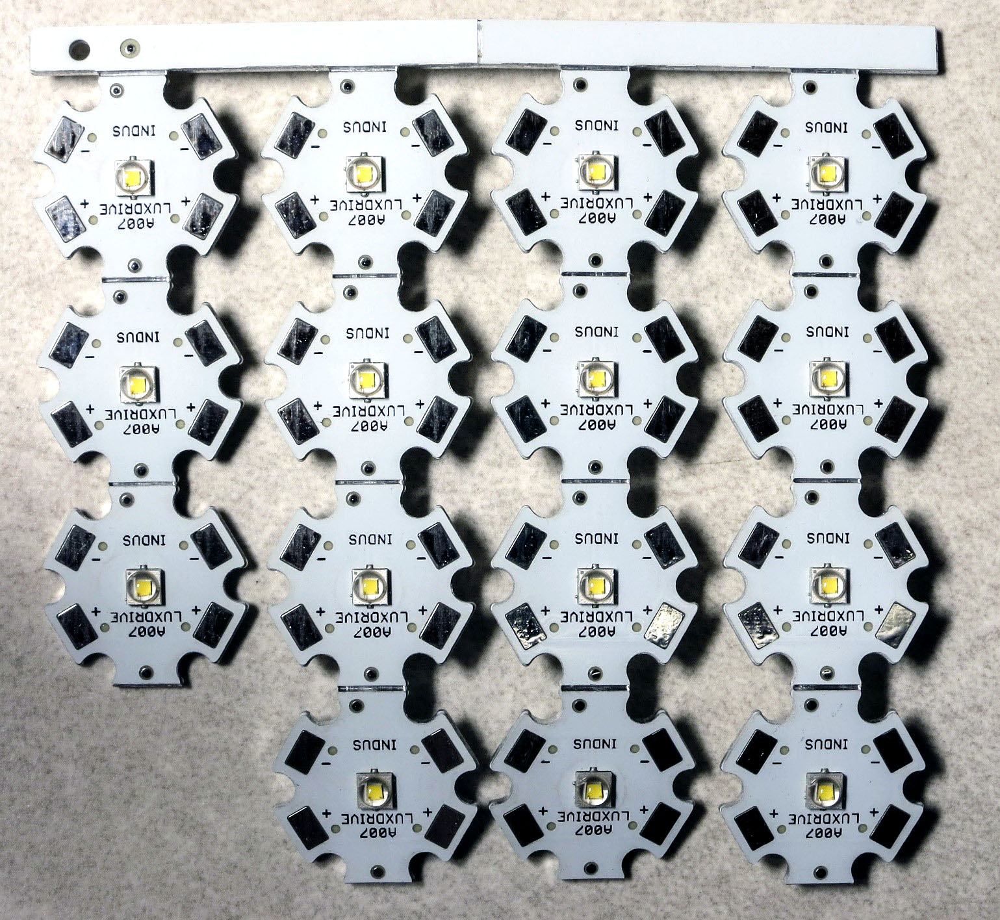

Just bend them back and forth along the scores until they detach from the metal strip and each other.

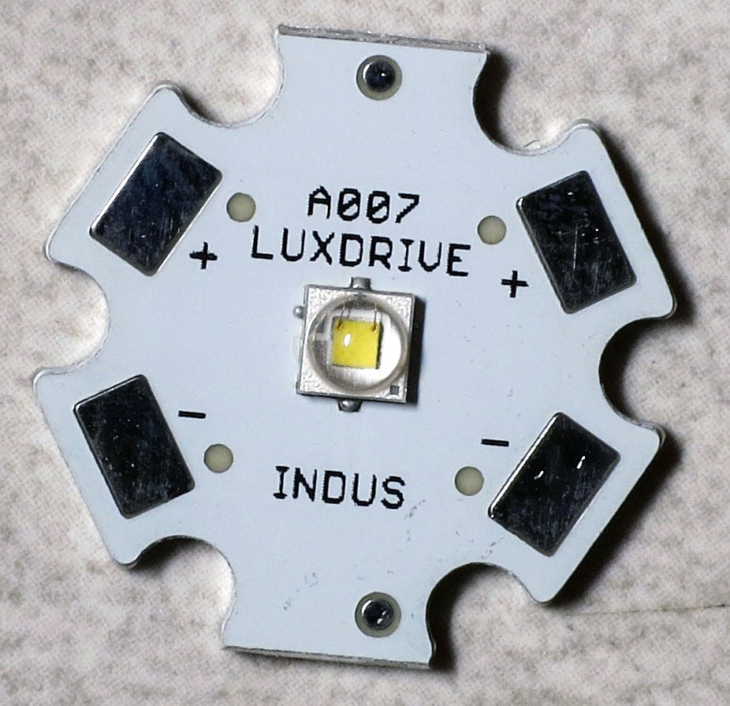

You're going to be soldering wires to one of the plus and one of the minus pads. There's a guide to soldering these star LEDs at `LEDSupply.com <http://www.ledsupply.com/blog/guide-to-soldering-high-power-leds/>`_, along with a `YouTube video <https://www.youtube.com/watch?v=57uTqcBbgVw>`_ demonstrating the technique.

But I'm recommending a few changes from their approach for the LEDs for the RTI system:

1. Solder wires to opposite pads, not adjacent ones.
2. Don't tin the wires - in this case, they're so thin (24 AWG) that it's not effective.
3. If you have one, use a chisel tip on your soldering iron.
4. When heated, lay the chisel tip against one of the pads so that the flat part is roughly perpendicular to the surface of the LED pad. Then apply the solder wire to the place where the flat part of the chisel tip and the LED pad touch. 

The solder should melt and flow smoothly across the pad to create a nice blob across the pad. Repeat on the other pad, then repeat for every single LED you have.

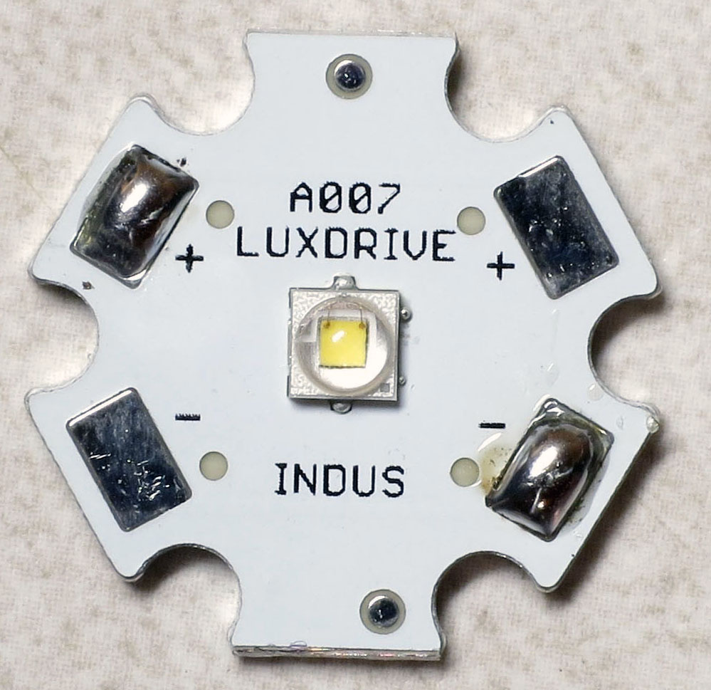

Grab your Kynar 24 AWG wire spool, and strip about 3/16" of insulation (about 3-4mm) off the end. You can make it a bit longer, but try not to make it shorter. Then cut off about 1" of the wire from the spool (about 2.5cm), including the bare lead. 

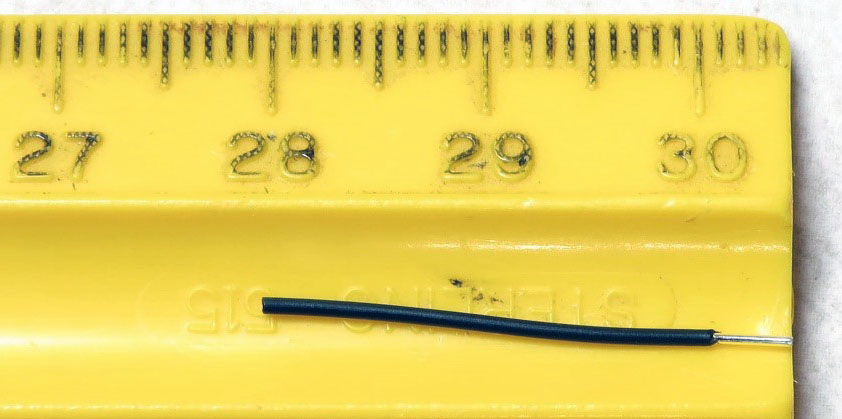

Repeat this so that you have two of these wires for every LED. Hold the bare wire lead against the solder blob, and press the soldering iron down on the wire to solder the bare wire lead to the solder blob on the LED star pad. Both wires should stick straight out from the LED pads, in line with each other:

.. figure:: ../figures/led/led_5.jpg
   :align: center
   :width: 8cm   

If you mess up, just remove the solder and wires with solder wick or a solder sucker, and try again.

Now strip about 3/16" / 3-4mm off each of the two LED wires:

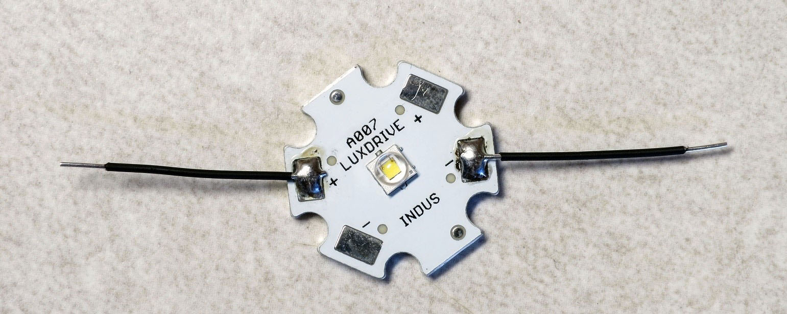

Exact length of these wires isn't critical, so if you strip off too much, don't worry about it, just clip it off.

Now you're going to crimp male Dupont pins onto each of the bare wire leads. Hopefully you coughed up the money for a ratcheting crimper, because otherwise this is going to be a bit painful. You might try practicing the following approach with some scrap wires before trying it on a real LED; it may take a bit of practice to figure it out. Here's a Dupont pin pic:

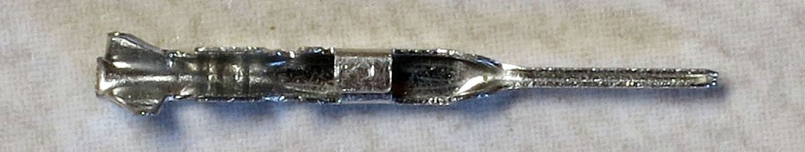

The pin part is on the right, and there are metal "wings" on the left that the crimper will push down onto an inserted wire and insulation to hold it in place. See that squarish bit in the middle? You want to make sure that you don't stick that into the crimper, but everything to the left of it can go in. Here's the approach I use:

1. Insert the clamp part of the male Dupont pin into the notch marked AWG 28-24, the one furthest to the end. It should go in so that the "wings" you see above face down towards the bottom of the notch. Make sure you don't insert it too far.
2. Start ratcheting down the crimper, click by click, until you see the "wings" start to bend into a rounded square shape at the end. On my crimper, that takes 4 clicks. The pin will now be held firmly in place by the crimper, with the pin sticking out  on one side:

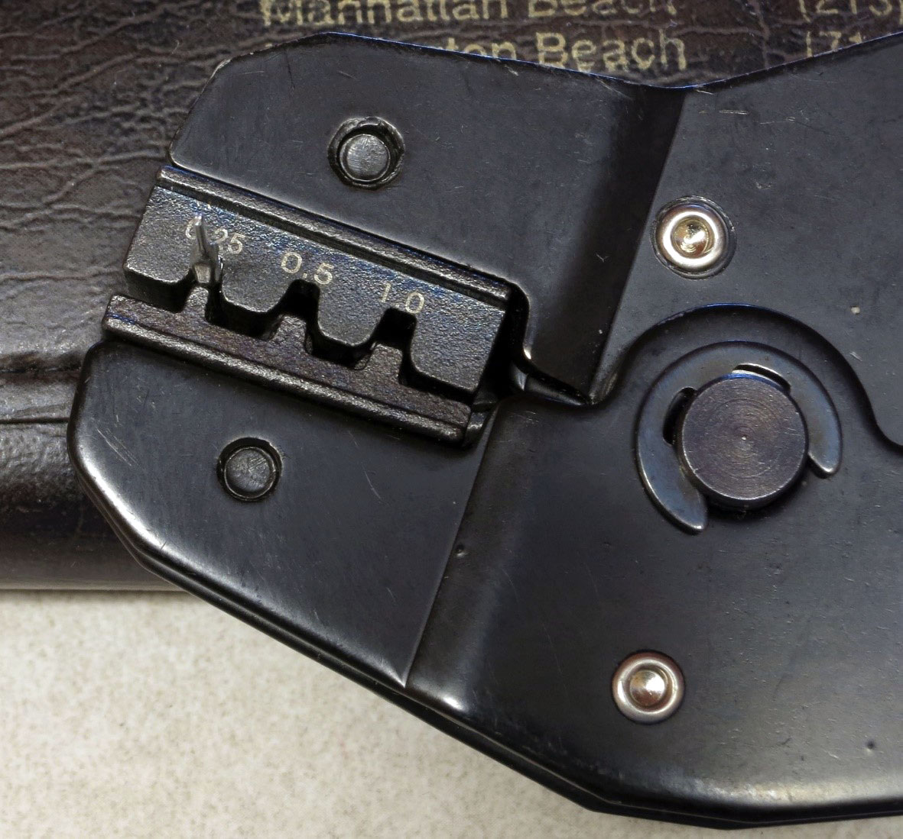

And the "wings" bent into a rounded square shape on the other side (look closely in the following pics and you'll see that):

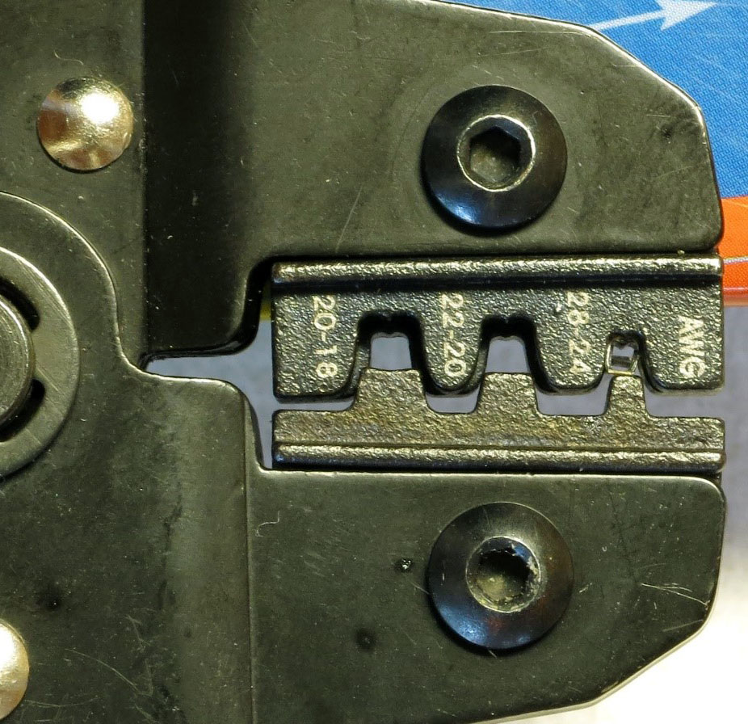

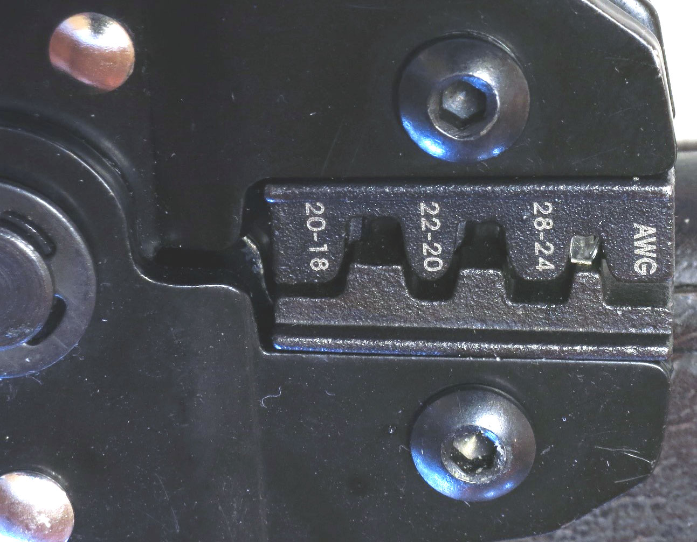

Now insert the bare lead on one of the LED wires into that rounded square so that just a bit of the insulated part goes inside the rounded square. Not super-critical here, but there will be crimps in upcoming steps where you don't want it to go in too far. It's best to hold the star LED face down for this step, with the LED facing down and the bare metal of the star facing up - this will make an upcoming soldering step a bit easier.  

Once the wire has been inserted into the proper position, squeeze the crimper completely to finish the crimping process. The crimper ratchet should release, and you can pull the wire with crimped pin out easily. Repeat on the opposite lead, and you should wind up with a wired star LED that looks like this:

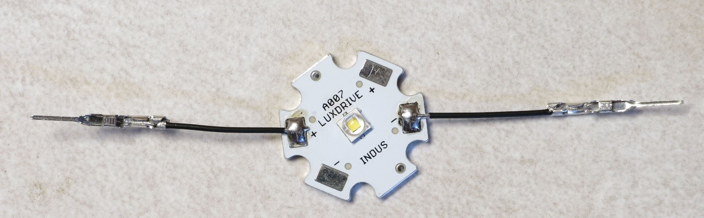

Notice how the open part of the pin faces up, and you can see the crimped wire inside the pin. In principle, the crimping should be adequate to hold the wire in place and ensure a good electrical connection. However, probably because I don't do it well, I've had problems with that. So I usually add a bit of solder to hold the wire in place. Use a narrow tip on your soldering iron, and touch the heated tip on top of the place where the wire is crimped in place. 

Then lightly touch the solder to the area with the crimped wire until just a bit of it flows into place to solder the wire. Too much solder won't hurt with these male pins, but when you solder female pins in an upcoming step, too much solder can clog up the hole and cause problems with later insertion of a male pin. So this is a good time to practice the technique to minimize the amount of solder.

The final step is to add some insulation to cover up all of the metal Dupont pins except for the end pins that will plug in to female pins. Cut two 1/2" (12 mm) pieces of 2mm heat shrink tubing for each LED:

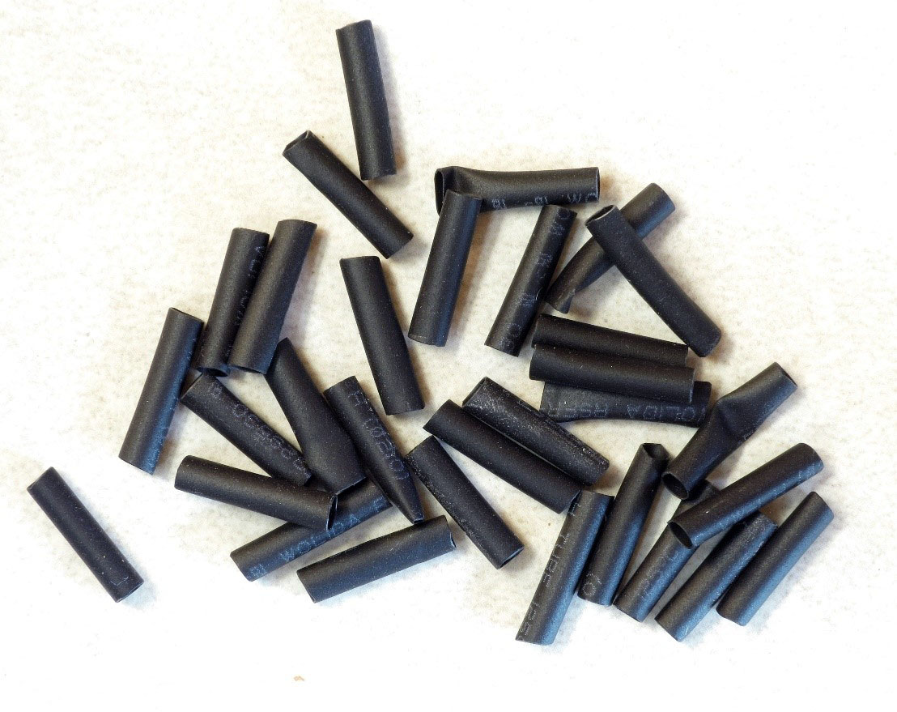

Place them over the crimped pins, and heat them to shrink them:

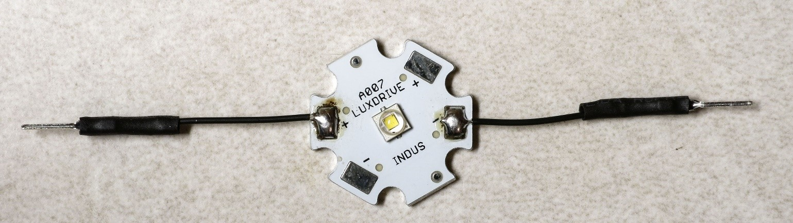

How to heat them? There are two common approaches:
 
1. Wave a flame, typically from a cigarette lighter, briefly underneath the heat shrink tubing. Not crazy about this approach because of the burn danger, and also because if you hold it too long you can melt the tubing instead of just shrinking it. But it is cheap and readily available.
2. Use a source of hot air. I have used a standard hair dryer to do this successfully, but it requires the "High" setting, and you have to hold the heat shrink right next to the heating element. A heat gun, if you have it, works much better, since it reaches higher temperatures than the hair dryer. You can find one online for `less than $20 <http://amzn.to/2bjHWOI>`_, and sometimes even less than $10. Also useful for stripping paint, loosening bolts, and even starting charcoal fires.

You'll need to repeat the process for every LED you have, so that they all look like the picture above. Yes, all of them.