Testing the system components
=============================

The RTI system uses an Arduino Mega Board as the system controller, to which you will need to upload various pieces of software for system testing, calibration and control. This section is a quick rundown of what you will need for this, including some special configuration issues.

First, go to the `Arduino website <https://www.arduino.cc/en/Main/Software>`_, and download the Arduino IDE (integrated development environment) appropriate for your computer’s OS; there are versions for Windows, Mac, and Linux. Install the software, then run it – if successful, it will start up either with a basic test program or an empty program window.

The Arduino IDE comes pre-loaded with a number of special libraries to support common hardware and software requirements. The RTI-Mage control software uses one of the preloaded libraries, SoftwareSerial, to support the optional Bluetooth HID adapter that triggers camera shutters for those cameras controlled by a PC (e.g. USB microscopes). But there are several additional libraries that need to be installed to support the optional OLED display, and the IR wireless remote shutter capability.

For OLED support, from the software menu select *Sketch -> Include library -> Manage libraries …*. This will bring up the Library Manager screen:

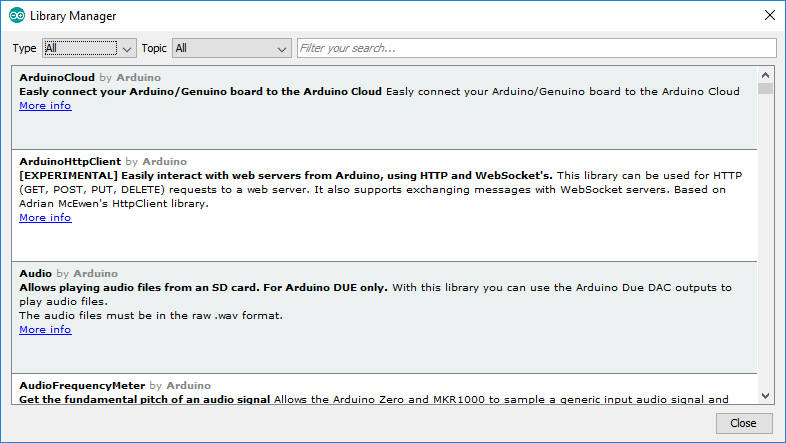

You want to install two libraries needed to drive the OLED display. The first one is the Adafruit GFX Library, which is a general graphics library, so type *Adafruit GFX* into the search box:
   
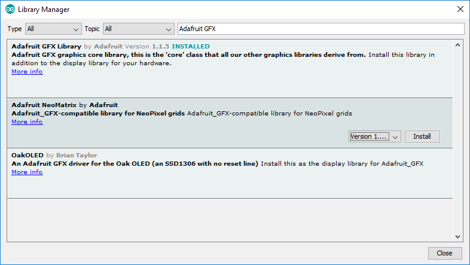

To install the library, click on the one you want and then press the *Install* button at the lower right. I already have the GFX library installed, so I’ve selected the next one down to show the Install button.

Now do the same for the Adafruit SSD1306 library; this is the actual one that runs the OLED, calling routines from the GFX library as needed.

The libraries are stored in the main Arduino data directory; on my Windows system, this is a folder called *Arduino* located in my Documents folder (not sure where on a Mac or Linux system, but it should be easy to find. There is a subfolder called *libraries* where the critical library files are stored. After installing the two libraries above, you should see folders for both of them.

Now go into the folder for Adafruit SSD1306, and open the file called *Adafruit_SSD1306.h* in any text editor. Near the top, you should see these three lines:

.. code-block:: c

   //   #define SSD1306_128_64
        #define SSD1306_128_32
   //   #define SSD1306_96_16

These lines specify the display resolution used by the library. Two slashes in front make the line a comment, so for the above lines, the default display resolution is 128 x 32. The 0.96” OLED display in the components list has a 128x 64 resolution, so you’ll have to comment out the 128x32 line, and then remove the comment slashes from in front of the 128x64 line:

.. code-block:: c

        #define SSD1306_128_64
   //   #define SSD1306_128_32
   //   #define SSD1306_96_16

Save the file, and you’re probably done with that library for now (with one minor possibility that you’ll have to go change one other OLED parameter, but I’ll get to that in a future step).

There’s one more library you’ll need to install, but this one isn’t in the Library Manager. This is the *multiCameraIrControl* library written by Sebastian Setz. Sebastian's original site is now down, but you can retrieve it from the files section on the Hackaday project page (Creative Commons license, so no problems with doing this).

This library is needed to control the wireless IR remote shutter capability of the system, which works with cameras from Canon, Nikon, Sony, Olympus, Pentax or Minolta that have an IR sensor. Download the zip file from the site above, and unzip the folder *multiCameraIrControl* into the libraries subfolder of the Arduino folder. Restart the Arduino program, and that library is ready to go.

Even if you don’t use the OLED or IR capabilities, you still need to install the libraries. The program will call for them, and if it doesn’t find them, it won’t compile successfully. You could remove references to them in the program, but much simpler just to leave them in there; even if the OLED and IR hardware isn’t installed, the Arduino won’t care.

To install a program onto the Arduino, first load it into a program window by selecting it from the *File -> Sketchbook* menu. Connect your Arduino Mega to a USB port on your computer; if it’s the first time, the computer will have to install drivers for it. From the *Tools -> Board* menu, select Arduino Mega 2560. On the *Tools -> Port* menu, once the Arduino has been recognized by the computer, there should be a *COM* port listing for it; select that port to tell your computer where to send the program data.

Once the configuration is done, click on the right-facing-arrow icon near the top to upload the program to your Arduino. Status messages will show up at the bottom, and if everything works successfully, you should see a *Done Uploading* message at the bottom. If you get an error message, double-check to make sure you’ve selected the right Arduino board and COM port.

Preparing the LED connect cables for testing
--------------------------------------------

Now that all the LEDs are wired up, there are two simultaneous tests that need to be done:

1.	Test the LEDs to make sure they’re all wired up and working properly
2.	Test the MOSFET/CAT4101 driver board combination to make sure it’s working

In order to do this, there needs to be a way to connect the LEDs to the driver board combo.

Take the two Ethernet cables you have (red and whatever other color you’ve chosen), and cut about 6” (16 cm) off one end, including the jack.

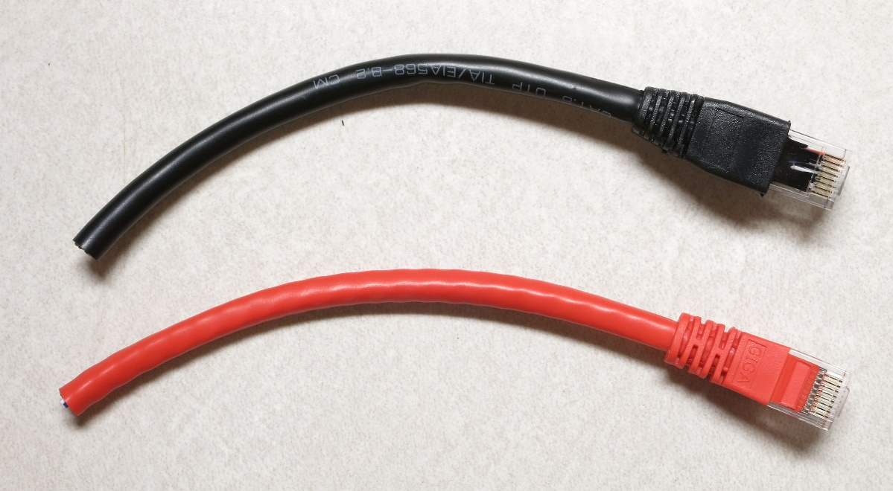

Use a sharp utility or razor knife to slit open the external  insulation at the cut end of each cable (cut about 2-3” down the length of the cable), taking care not to cut the wires inside. Then remove the insulation.

.. figure:: ../figures/test/test_4.jpg
   :align: center
   :width: 8cm

Trim off the external insulation; if the cable has internal plastic ribbing, like the one above, trim that off as well. Separate the 8 wire strands, and strip about 3 mm of insulation off the end of each one.

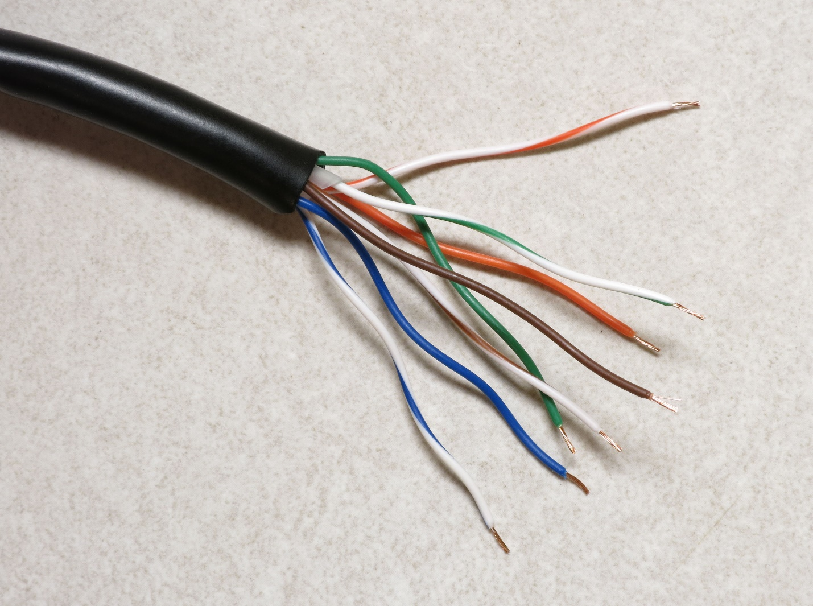

Now crimp female Dupont pins onto the end of each wire, using the same technique as when you crimped male pins onto the LED wire. Here’s a female pin, with the crimpable end on the left:
   
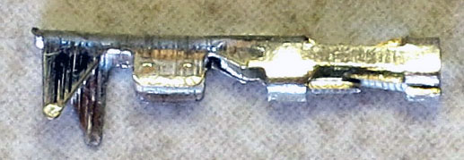

When crimping be careful not to insert the wire too far into the Dupont pin, as that may make it difficult later to insert a male pin into the female pin socket. I usually solder the wire to the pin as well for a more secure hold, but be careful with this. Unlike the Kynar wire you soldered to male pins in the previous step, this insulation melts very easily. You just want to touch the soldering iron to the wire crimped in the pin, and immediately touch the solder to the tip of the iron until it just flows a bit; then lift the iron up right away. If you get it wrong, just cut off the pin, strip the wire insulation, and try again. This is good practice for an upcoming step.

.. figure:: ../figures/test/test_7.jpg
   :align: center
   :width: 8cm

Repeat for the other Ethernet cable:

.. figure:: ../figures/test/test_8.jpg
   :align: center
   :width: 8cm

The ground cable connector (black in this case) will plug into the Ethernet jack on the CAT4101 board. The red positive voltage cable needs to plug into the MOSFET driver board, but it can’t do so directly because there’s no Ethernet jack on that board (no room for it). So we have to modify one of the two Ethernet panel jack cables to plug into the 8-pin male header on the MOSFET driver board. Here’s what that cable looks like:
   
.. figure:: ../figures/test/test_9.jpg
   :align: center
   :width: 8cm

You want to cut the jack end off as close to the end as possible; that’s the bottom connector in the previous picture. Take care not to cut off the female panel end, the top one above. If you do, you will be very sad, as you’ll have to get a new one. Also, you have two of these Ethernet panel jack cables; only cut the jack end off of one of them.

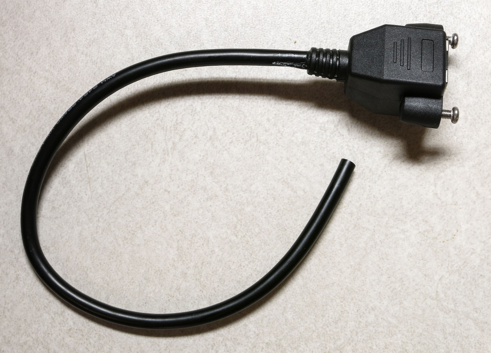

Once again, use a sharp utility knife or razor to cut the insulation about 2” down the length of the cable on the cut end, then trim off the cut insulation, and strip about 3mm off the end of each wire.

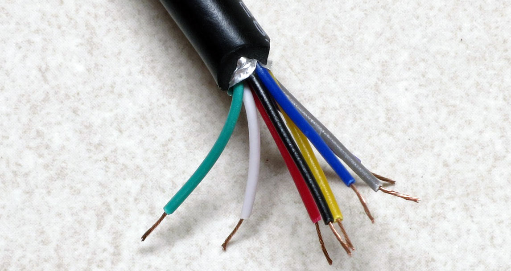

Now crimp female Dupont pins onto the end of each of these wires, and solder them. As before, be careful not to insert the wire too far into the pin crimp end, but make sure that the insulation does go slightly into the pin crimpers. Don’t have a picture of this, but it will look similar to the ends of the Ethernet cables you did before.

Now there’s a small problem you have to figure out. If you take a look at the first two cables in this step, there’s a good chance they have different wire colors than the Ethernet panel cable you’re currently working with. So you’ll need to figure out which wire color on the Ethernet panel cable corresponds to the matching wire on the Ethernet cable. That’s because each wire connects to a numbered pin on the Ethernet jack, and you want to make sure to have matching pin numbers everywhere. Here’s the numbered wiring color code for the Ethernet cable (standard T568B cable):

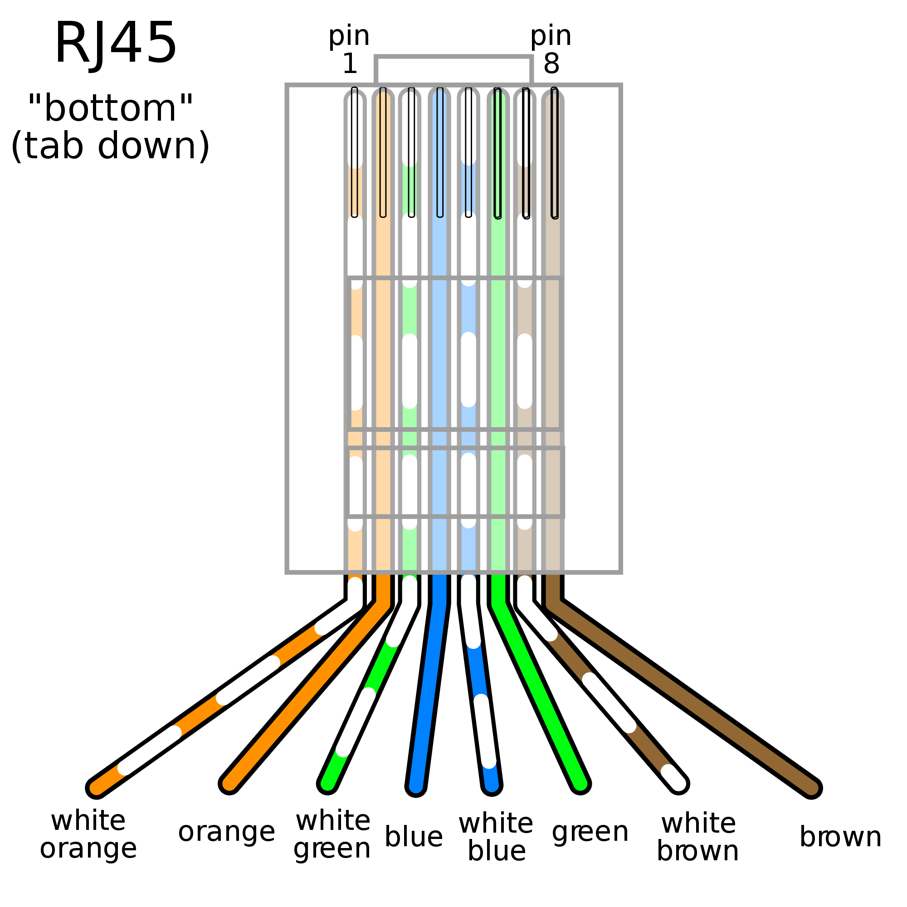
   
   Source: http://www.polesio.co/utp-cable-wiring/wiring-imgs-199686/

To figure out which wire on the Ethernet panel cable corresponds to the correct wire on the Ethernet cable, plug the Ethernet cable into the panel jack, then use the continuity checker on your multimeter to figure out which wire is connected to which. In this case, I wound up with the following correspondences:

=====   ============  ========
Pin 1   White/Orange  Green
Pin 2   Orange	      Red
Pin 3   White/Green	  Yellow
Pin 4   Blue	      Gray
Pin 5   White/Blue	  Purple
Pin 6   Green	      Blue
Pin 7   White/Brown	  White
Pin 8   Brown	      Black
=====   ============  ========

Your wire matchups may differ; just be sure to write down which color corresponds to which pin.

Next, grab the 8-pin 2.54mm single row female pin header, and insert the female Dupont pins into the large end of the header in pin order, i.e. #1 at the top, then #2, #3 all the way down to #8 at the other end. The pins need to be pushed all the way down into the header, not just until the end of the pin is flush with the top of the header. You may need to use a small screwdriver, or a thick wire, to push it all the way in. The top of the female Dupont pin (with the crimped wire visible) should be inserted into the header so that it will be visible in the header’s open hole, like this:

.. figure:: ../figures/test/test_13.jpg
   :align: center
   :width: 8cm

A couple of points here:

1. I cut the wires a bit shorter than 2”, and it was a pain to get them to fit; that’s why I recommend at least 2” in length.
2. I have the wires in correct order here, from 1 on the right to 8 on the left, but I would have done better to put them in in the reverse order. See that little arrow at the top left? That’s supposed to indicate pin 1. It’s not a big deal, as long as I remember to insert this cable into the 8-pin male header on the MOSFET driver board so that the #1 wire (green) is at the top. But doing them in reverse, I wouldn’t have to remember which color wire is the #1 wire.
3. Test the connections using a multimeter, to make sure that none of the wires got damaged when you inserted them into the female pin header.
4. I used some hot glue to glue the wires in place so that they wouldn’t pull out by accident, and I’d recommend that once you’ve tested the connector to make sure it’s working properly, you use some kind of glue to do the same. When inserting or removing this connector, never pull it out by the wires – always pull on the connector.
5. If you can’t find an 8-pin 2.54mmm single row female pin header, you can use 8 1-pin female Dupont connectors, one for each wire. It’ll be a bit of a pain as you’ll have to connect each of the 8 wires individually to the MOSFET driver board, but it can be done.

Test of the electronics and LEDs
--------------------------------

Now that you’ve got all the cables done, it’s time for the big test of the electronics and LEDs.

Connect the Arduino Mega to your PC with the USB cable, and upload the testing program System_tester.ino into the Arduino Mega controller using the Arduino IDE; you’ll find that program in the Files section. Disconnect from the cable when done.

Plug the MOSFET driver board shield into the Arduino. Do this slowly and carefully – it’s easy to misalign pins, or bend them when inserting the shield.

.. figure:: ../figures/test/test_14.jpg
   :align: center
   :width: 8cm
   
Plug the CAT4101 board into the MOSFET driver board.
   
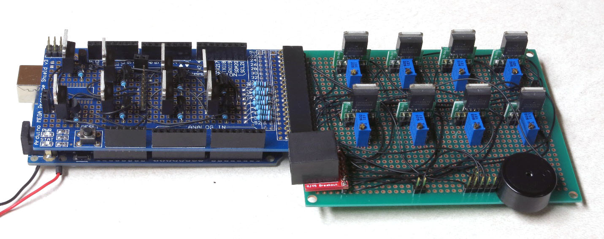

Plug the black ground wire soldered to the Arduino power input into the top left header of the power strip board (next to the capacitor half marked with a white stripe), and plug the red positive wire into the bottom left header.

.. figure:: ../figures/test/test_16.jpg
   :align: center
   :width: 8cm

Connect a jumper wire between the positive power strip header and the two pin header on the lower left side of the MOSFET shield board (the blue wire in this picture):

.. figure:: ../figures/test/test_17.jpg
   :align: center
   :width: 8cm

Connect a ground header on the MOSFET driver shield to the two-pin female header in the top center of the board using a jumper wire, the brown wire in this picture.

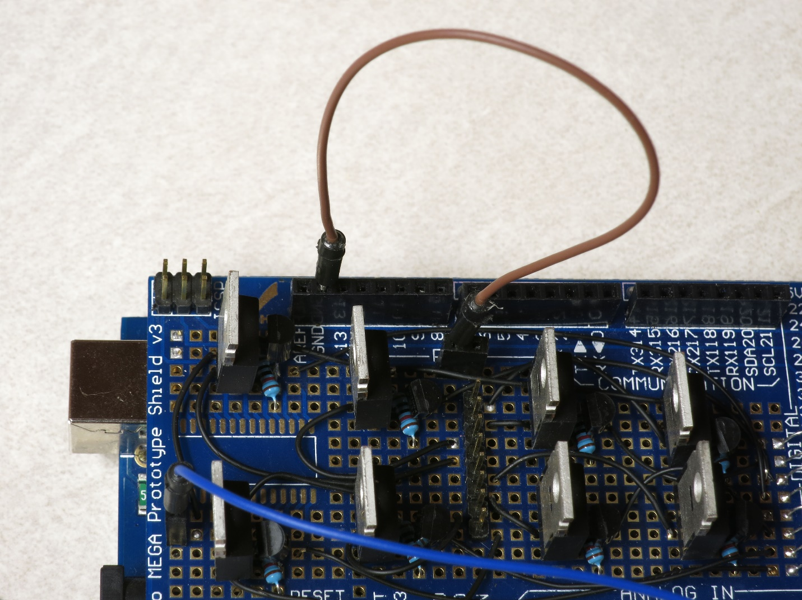

Connect a jumper wire to the ground power strip header on the power board, and the two-pin header on the far right of the CAT4101 board (the green wire in this picture):

.. figure:: ../figures/test/test_19.jpg
   :align: center
   :width: 8cm

Plug the unmodified Ethernet panel cable into the Ethernet jack on the CAT4101 board, then plug the ground Ethernet tester cable into the panel jack.
   
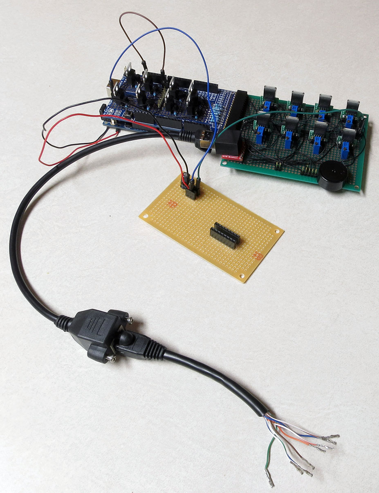

Plug the modified Ethernet panel cable, with the 8-pin female header, into the 8-pin male header on the MOSFET board. Make sure that pin/wire #1 is at the top.

.. figure:: ../figures/test/test_21.jpg
   :align: center
   :width: 8cm

Plug the red Ethernet cable with the female Dupont pins on the end into the modified Ethernet panel cable connected to the MOSFET driver board; this will be the positive voltage supply to the LEDs.

.. figure:: ../figures/test/test_22.jpg
   :align: center
   :width: 8cm

Connect multimeter leads to the male header pins at the bottom of the CAT4101 board, and set the multimeter to a voltage scale greater than 5V DC. When the tester is running, it will turn on and off voltages to two of these pins, and supply constant 5V to a third pin. Here’s the connection to the pin that supplies 5v to the USB cable or IR LED to fire the camera shutter, which should cycle on and off:
   
.. figure:: ../figures/test/test_23.jpg
   :align: center
   :width: 8cm

And here’s a closeup of that:

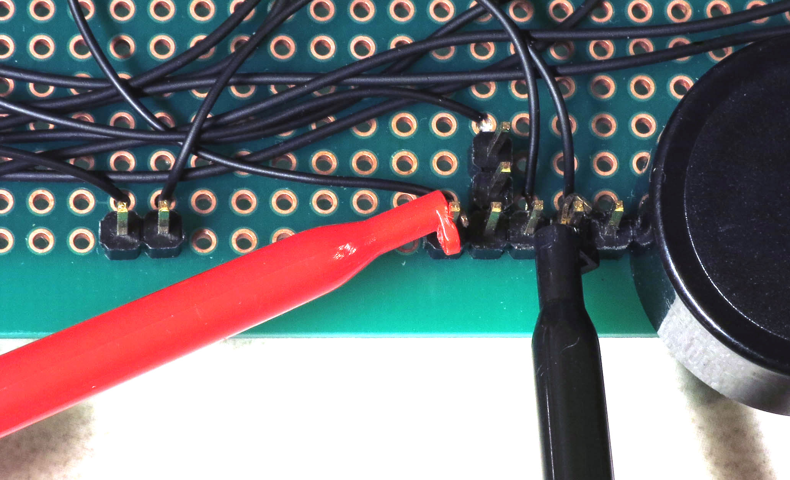

Here’s a closeup of the testing connection for the servo control pin; this one should also cycle on and off:

.. figure:: ../figures/test/test_25.jpg
   :align: center
   :width: 8cm
   
And here’s the connection for the constant 5V that powers the servo:

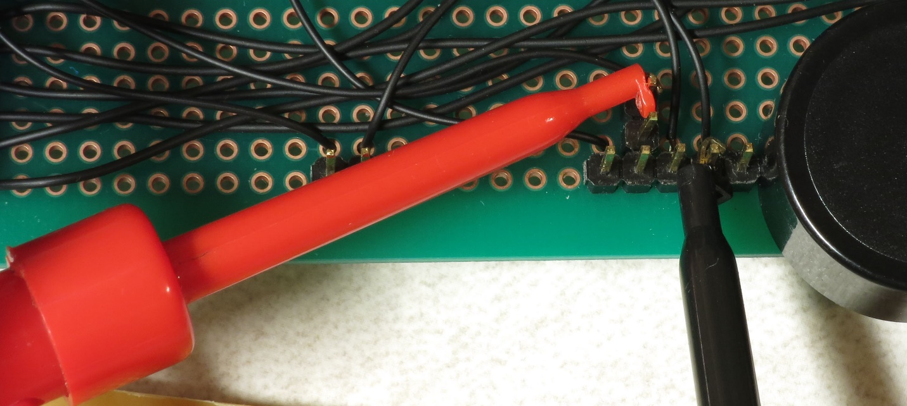

Grab 8 LEDs, and plug the positive LED wire into the positive Ethernet connector wires (should be from the red one, coming from the MOSFET driver board). Then plug the negative LED wire into the matching wire from the ground Ethernet connector from the CAT4101 board. In other words, orange/white to orange/white, green to green, white/brown to white/brown, etc.

You’re connecting the #1 column wire to the #1 row wire, the #2 column wire to the #2 row wire, etc.. The tester program will turn on matching row/column number drivers simultaneously, which should light up that LED.

.. figure:: ../figures/test/test_27.jpg
   :align: center
   :width: 8cm

Now you’re ready to plug in the 9V power supply into the Arduino – the full setup should look something like this:

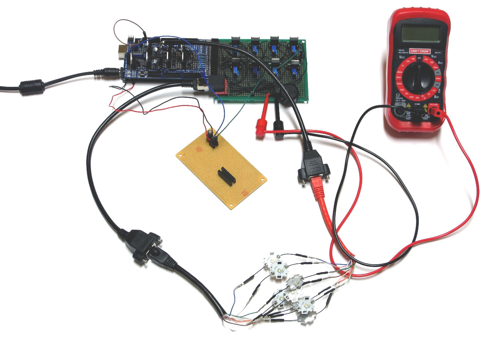

If everything is working correctly, the beeper should sound, and each LED should turn on individually in sequence for 0.25 seconds (250 milliseconds), then turn off. While the LED is on, the multimeter voltage should read zero when connected to either the USB/IR pin or the servo control pin; when the LED is off, it should read zero. When connected to the servo power supply, it should always read 5V. 

If everything is working as it should, it will look something like this `video <https://www.youtube.com/watch?v=Eaq4MBhZI1o>`_.

If it’s not working, here’s some quick things to check:

1. Make sure the + leads on the LEDs are connected to the wires from the red cable, which should in turn connect to the MOSFET driver board.
2. Make sure the LEDs are connected to wires of matching colors.
3. Make sure the female 8-pin header is firmly connected to the MOSFET driver board, and that the #1 pin connection is at the top.
4. Double-check to make sure that all the jumper and power wires are correctly positioned, and firmly seated in the female headers.
5. Make sure the power supply is properly plugged in.

If it is working, then once you’ve cycled through all 8 LEDs at least once, unplug the power supply and disconnect all 8 LEDs, setting them aside. Select a different set of LEDs, and connect them to the wires as you did the first set. 

Plug in the power supply, and let the LEDs run through at least one full cycle to make sure they’re all working. Once that’s done, repeat the process until you’ve tested every LED to make sure they’re all working correctly.
