Controller software, calibration, and acquisition
=================================================

Control system software
-----------------------

If you’ve gotten to this point, then all the hardware you need to do RTI is complete, with the exception of some minor optional extras. So it’s time to load the software into the Arduino that makes the control box fully operational for acquiring RTI datasets. The software’s name is RTI-Mage_Main_Control, and the latest version will always be in the Files section of the Hackaday project page.
But before you upload it to the Arduino, there are some constants you may want to modify, either right away or sometime in the future. Load the program into the Arduino IDE, and you’ll see right at the top a whole bunch of constants are defined. Many of them are hardware related, so if you modify those, the system may not work. But there’s a number of them that can/should be modified depending on your needs. Here are the relevant program strings, what they mean, and how you can change them.

.. code-block:: none

   String Current_setting="700mA";

This is a text string that shows up on the boot-up splash screen, telling people what the current output value you set earlier is. The system has no way to detect the current output setting, so you should definitely specify it here. Make sure it stays in quotes.

.. code-block:: none

   const unsigned int Min_Data_Transfer_Time=500;   // minimum time after LED goes off to save photo data
   const unsigned int Max_Data_Transfer_Time=6000; // maximum time after LED goes off to save photo data

These are the minimum and maximum values for the “Delay” time, controlled by the right “Delay” knob on the front panel. This delay is to allow the camera time to save the photo it’s just taken to memory. For high-quality DSLRs, this time can be a fraction of second; for lower-end cameras, it can take a few seconds. The values are in milliseconds, thousandths of a second, so the number above correspond to 0.5 seconds and 6 seconds. Feel free to modify either of these if you feel the values are too high or too small for your needs. Make sure you only enter an integer value, no decimal point.

.. code-block:: none

   const unsigned int Min_LED_Time=100; //minimum time LED is on for picture to be taken
   const unsigned int Max_LED_Time=4000; // maximum time LED is on for picture to be taken; set by USB microscope time

These specify the minimum and maximum times the LED light is on during picture taking, controlled by the left “LED” knob on the control panel. This will depend on the exposure time required. Don’t increase the maximum time unless you absolutely have to, since the longer the LED is on, the warmer it gets. For example, I sometimes have these set to a wider range (100 to 8000) since one of the USB microscopes I’m using requires a long exposure time, roughly 6 seconds. However, for that system I also have the current set to a very low value of 150 mA, so it won’t get hot despite the longer on time.

.. code-block:: none

   const unsigned long White_Balance_Time=3000; //time for one white balance LED before switching to the next one
   const unsigned long White_Balance_Max_Time=24000; //maximum total time for white balance before it turns off (to prevent LED stress)

Pressing the black “WB” button starts a long light cycle, where the LEDs in a single row are lit up in succession, each for the time specified by the White Balance time. This is to allow you to set the camera white balance, focus, and exposure parameters. The time is limited to prevent the LEDs from getting too warm, and the Max_Time is set to turn off the function after a limited time, to keep it from going forever. I wouldn’t modify these unless you absolutely have to.

.. code-block:: none

   const unsigned long Min_LED_On_Time=500; //Minimum on time for LED in manual mode
   const unsigned long Max_LED_On_Time=4000; //Maximum on time in manual mode for LED (to prevent overheating); turn back on with white balance button. Higher values not recommended.

These are the minimum/maximum LED on times in manual mode; you set the actual value using the LED potentiometer knob. Probably shouldn’t modify these unless absolutely necessary. If the LED goes off in manual mode before you have a chance to press the camera shutter, pressing the black WB button will turn that LED back on again.

.. code-block:: none

   const unsigned int Frequency=1000; //Sets default frequency of beeper (in Hz, cycles per second)

Sets the base frequency for the beeper in Hz; 1000 Hz was chosen as the default because it’s a balance between high human ear sensitivity and annoyance. Lower frequencies are more pleasant, but the ear’s response drops off significantly below 1000 Hz. Frequencies up to 5000 Hz have a better ear response, but sound more annoying. Change this if you like, won’t affect actual operation. And remember that there is a switch on the control box that turns off all sounds.

.. code-block:: none

   const unsigned int Rows=8; //Number of Rows being used (cathode connection to CAT4101s)
   const unsigned int Columns=8; //Number of Columns being used (anode connection to MOSFET driver outputs)

These two are the most important variables to modify. The defaults of 8 are the maximum number of rows and columns the RTI-Mage control box can support. If you are using a dome with fewer rows or columns, you should modify these values accordingly. These values are also displayed on the boot-up splash screen.

.. code-block:: none

   const int Shutter_Voltage_Time=100; //Time for 5V at USB to either fire CHDK or remote wired shutter.

This is the length of the positive voltage pulse used by the CHDK or wired remote shutter systems. This value has worked fine for every Canon camera I’ve used with CHDK. If you’re having problems getting your wired remote cable to work, you might try increasing this value.

Camera constants
----------------

Below the constant variables is a section of commands related to using the IR remote shutter function with various makes of cameras. Only one camera make can be enabled at any time. The default is Canon. To change to a different make, take the two Canon lines:

.. code-block:: none

   Canon CanonCamera(USB_Camera_Pin);
   String Camera_type="Canon";

And put two forward slashes in the beginning of each line; this makes the line a comment that the program interpreter will ignore. Remove the slashes from the similar lines for the desired camera make, and that will enable those lines. You’re not quite done yet – you need to change one more line as well. Scroll down in the program to the IR Shutter subroutine, where you will see another set of commands with camera makes associated with them, e.g this one for Canon:

.. code-block:: none

   CanonCamera.shutterNow();

As above, put two forward slashes at the beginning of the line you want to deactivate (Canon in this example), then remove the two forward slashes from the make you want to activate.

Once you’ve modified whatever constants you need to, upload the program to the control box. Once uploaded, you don’t need to have the system connected any longer to your computer via the USB cable; in fact, it won’t serve any purpose at all.

A quick visual review of the controls/jacks on various panels of the control box:

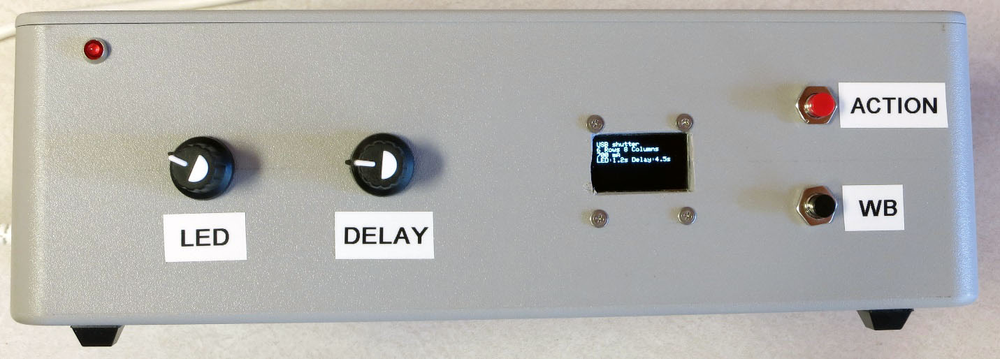
   
   Front

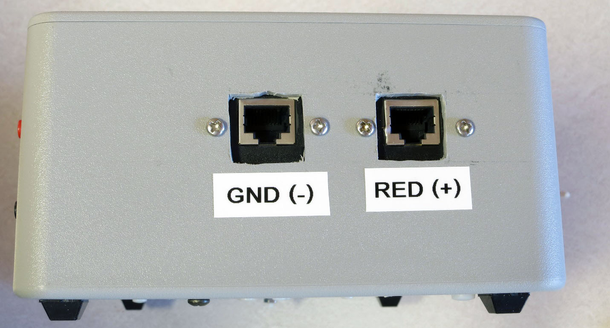
   
   Right

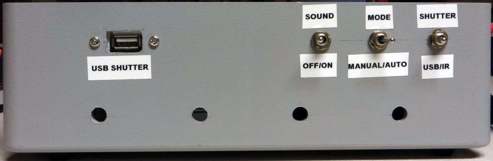
   
   Rear

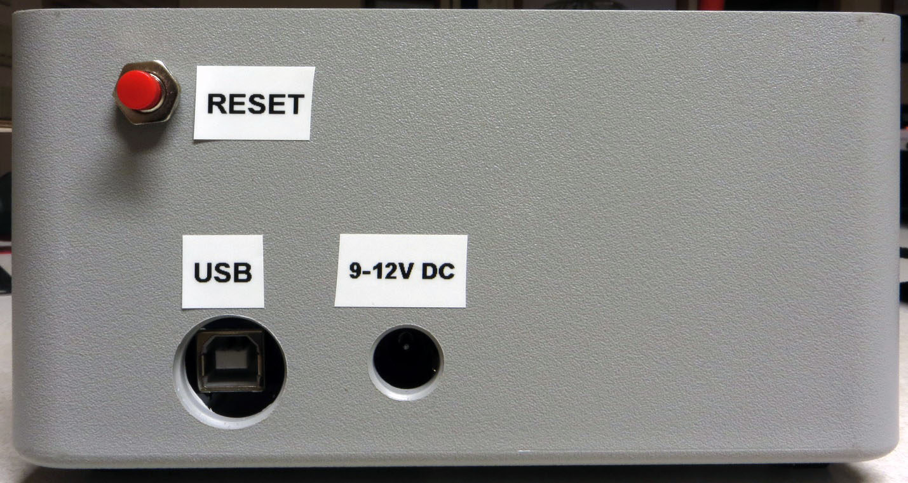
   
   Left

Disconnect the USB cable in the jack on the left panel connecting the Arduino to your computer, as it’s not necessary. If you haven’t already, connect the positive and ground cables from the LED dome to the control box (“red to the rear”, “close to the ground”). Now plug in your 9-12V 2A+ DC power supply into the jack on the left. If the Sound switch is on, you should hear 3 rising tones. 

If you haven’t installed the OLED screen, ignore the following OLED-related screens and descriptions, but be aware that the descriptions of modes and functionality is the same. If you’ve installed the OLED display, you will see the following splash screen for 5 seconds:

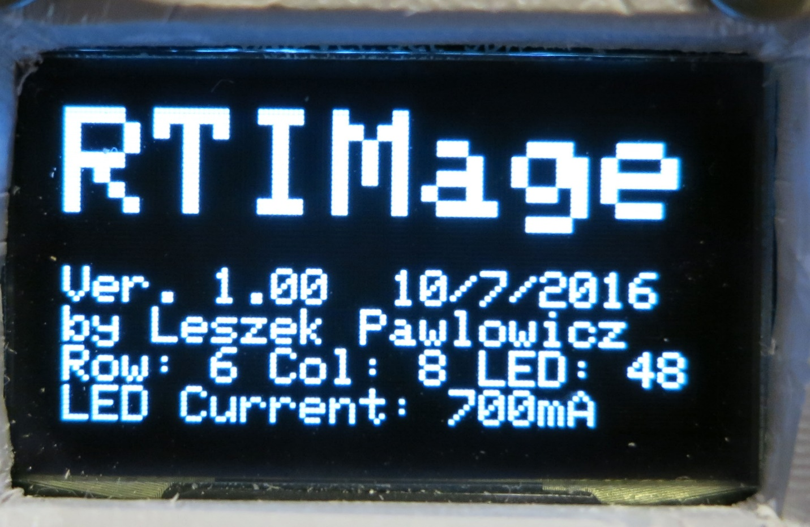

This will show you the software version and date, the number of rows/columns/LEDs (handy in case you use the box to control multiple domes with different numbers of LEDs), and the current value you set before uploading the program. After 5 seconds, the OLED screen goes to the main settings screen:

.. figure:: ../figures/calibration/calibration_6.jpg
   :align: center
   :width: 5cm

This is where you see the setting of the three mode switches (first three lines), then the status of the LED on time and the Delay time (in Auto mode). In Manual mode, there is no Delay time, so the screen will look a bit different:

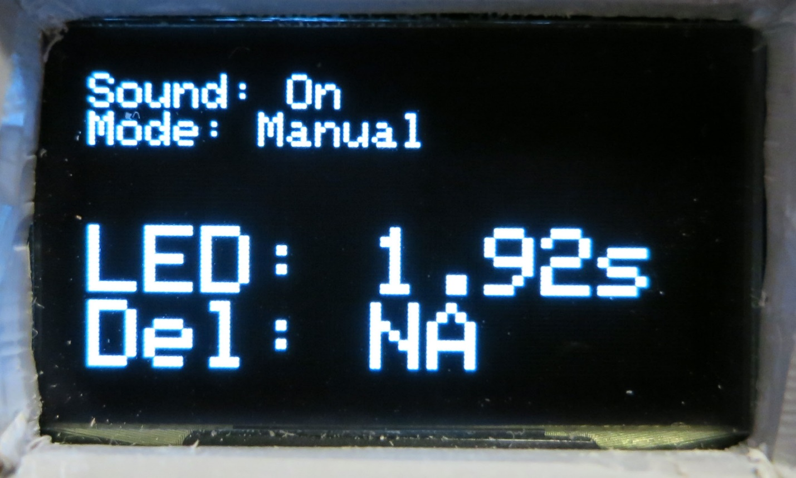

Switch back to Auto mode. The first picture was with the Shutter mode in “USB setting”; switch to the “IR/Bluetooth” shutter setting, and you’ll see this:

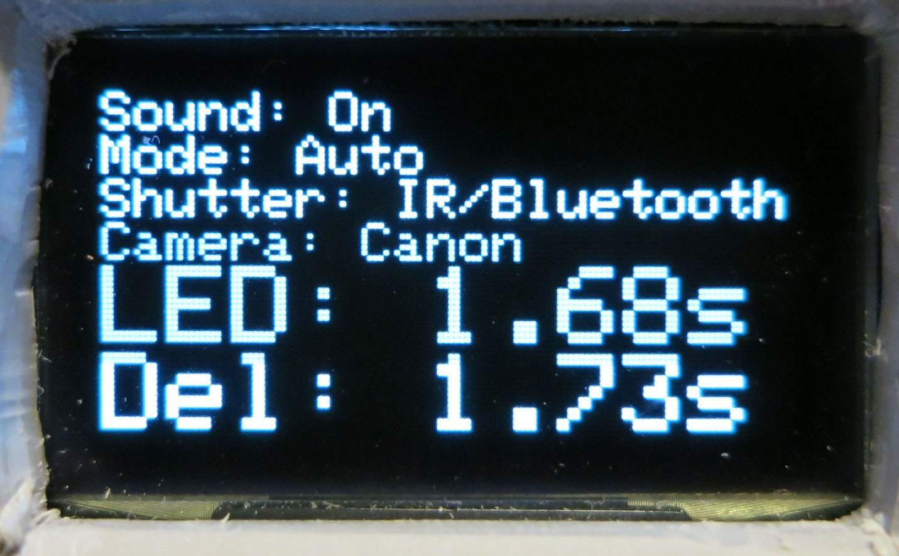

Not only does the shutter mode change to IR/Bluetooth, but there’s a new line that indicates what camera make the IR remote can control. The default is Canon, but as mentioned above, you can change this in the control software to any supported camera model (CanonWLDC100, Nikon, Sony, Pentax, Olympus and Minolta).

Now push the black WB button (lower right on the front panel). The LEDs on the top row will each light up in sequence for the time set by the constant mentioned above. This will give you the time needed to set the exposure values, white balance, and focus. If you press the red Action button, the next row of LEDs down will start lighting up, and additional presses will push you down one row further. This is mainly intended to check that if you are photographing multiple objects simultaneously, neither object will cast a shadow on the other one for low LED lighting angles. Pressing the black button briefly will turn off this mode, or you can wait for the cycle to end automatically.

With the control box in Automatic mode, press the red Action button – the LEDs in the dome will now start turning on in sequence. If the sound is on, you’ll hear a beep every time an LED lights up. The time the LED is on, and the time between one LED going off and the next going on, is set with the two knobs on the left front panel. Try playing with these during this Action sequence – the times will update automatically during the sequence. If you check the OLED screen, you’ll see it’s changed to this:

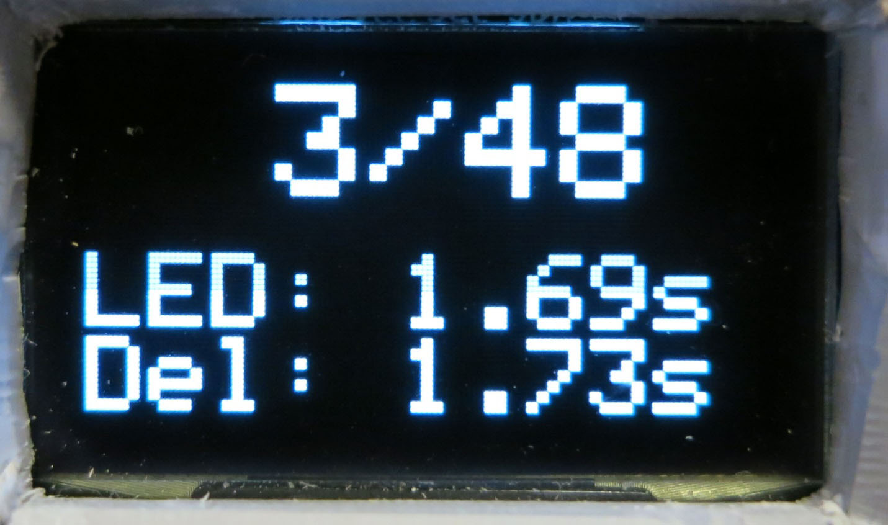

It will show you on top the number of the LED currently on, and how many total LEDs there are, so you can see how far along in the process you are. On the bottom are the LED on and Delay times, which you set with the front knobs. Once the series is completed, and all LEDs have been turned on and off, the OLED display returns to the main settings screen. If the sound is on, you’ll hear three short beeps to indicate the photo cycle is done.

Now change the mode to Manual. Press the Action button, and the first LED will light up for the time set by the LED knob; you’ll see that time in the Manual status screen in the lower half. 

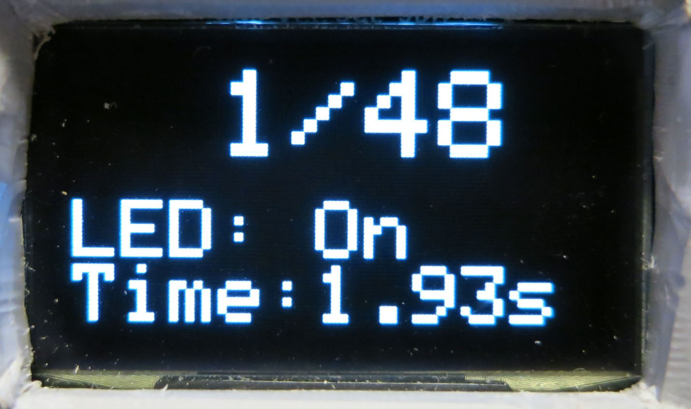

The Delay knob has no function in this mode. During the time the LED is on, you should be engaging the shutter button on your camera manually. If the LED goes off before you have a chance to press the shutter, the display will change to show you that:

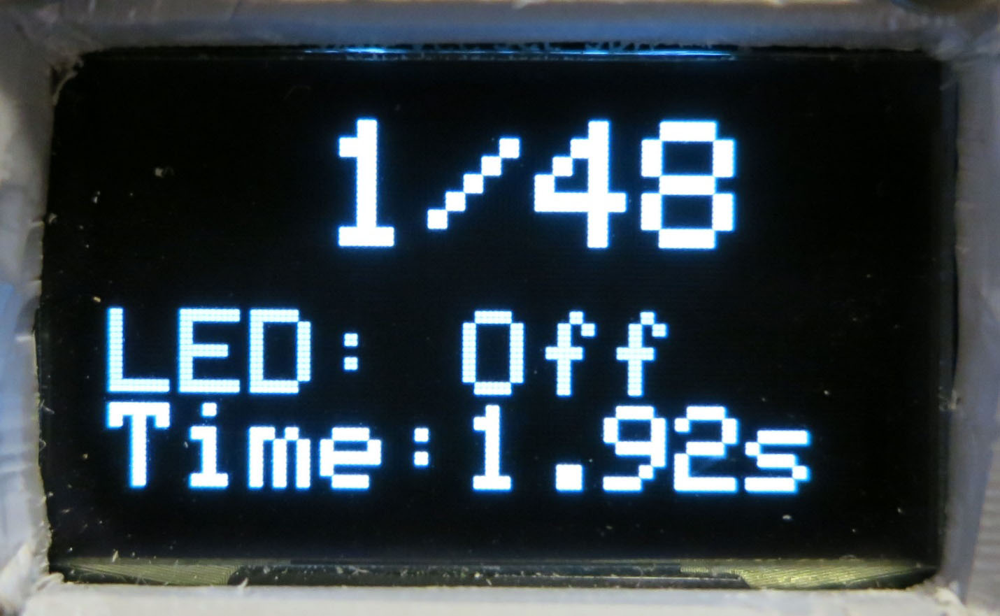

Pressing the black WB button will light the same numbered LED again for the same period of time. Once you’ve taken the photo, you can advance to the next LED by pressing the red Action button. The OLED display will keep track of which number LED you’re currently on. When you’ve lit the last LED and taken the last picture, press the red button one last time. The OLED display will go back to the settings screen, and you’ll hear three short beeps.

If you need to stop an Auto run, or if anything seems to go wrong, just press the Reset button on the top rear of the left panel.

Play with these functions and controls for a few minutes to make sure you understand how the system functions; there really aren’t that many, so shouldn’t take you too long to figure it out. Now you’re ready to start doing some actual photography, beginning with some required system calibration information.

System calibration
------------------

In creating an RTI dataset from the photos you generate with the RTI-Mage, software fits a separate curve of pixel luminance as a function of lighting angle for every pixel in the image, using the pixel luminance data from the photos you’ve taken. It knows which lighting angle was used for each photo with a special text file called a “light position” file, with a .lp extension.

The first line of the file contains the total number of photos, while the remaining lines contain the path of each individual photo, along with information about the lighting angle. More specifically, it contains the x,y,z projections of the lighting angle vector from the center of the photograph out to the light source. Here’s a few lines from one of my lp files:

.. code-block:: none

   48
   H:\RTI_Data\Hackaday_field_point_PTM\jpeg-exports\Hackaday_field_point_01.jpg 0.13742885 0.44443336 0.8852075
   H:\RTI_Data\Hackaday_field_point_PTM\jpeg-exports\Hackaday_field_point_02.jpg -0.21295299 0.39356261 0.8942927
   H:\RTI_Data\Hackaday_field_point_PTM\jpeg-exports\Hackaday_field_point_03.jpg -0.4445167 0.11216316 0.88872063
   H:\RTI_Data\Hackaday_field_point_PTM\jpeg-exports\Hackaday_field_point_04.jpg -0.39619443 -0.2289121 0.8891733
   H:\RTI_Data\Hackaday_field_point_PTM\jpeg-exports\Hackaday_field_point_05.jpg -0.11848045 -0.46047336 0.879731
   H:\RTI_Data\Hackaday_field_point_PTM\jpeg-exports\Hackaday_field_point_06.jpg 0.24940234 -0.41810092 0.873493
   H:\RTI_Data\Hackaday_field_point_PTM\jpeg-exports\Hackaday_field_point_07.jpg 0.45666453 -0.12569694 0.88071436
   H:\RTI_Data\Hackaday_field_point_PTM\jpeg-exports\Hackaday_field_point_08.jpg 0.4082768 0.20535836 0.8894594
   H:\RTI_Data\Hackaday_field_point_PTM\jpeg-exports\Hackaday_field_point_09.jpg -0.06528884 0.61326444 0.78717476
   H:\RTI_Data\Hackaday_field_point_PTM\jpeg-exports\Hackaday_field_point_10.jpg -0.47801396 0.36893168 0.79711485
   H:\RTI_Data\Hackaday_field_point_PTM\jpeg-exports\Hackaday_field_point_11.jpg -0.6062705 -0.072234996 0.7919711

And so on for the full set of 48 photos. You can open a .lp file in any text editor.

For simplicity, the length of the vector from the center to the light source is normalized to a dimension of one. Take all the numbers in one line, square them, add them up, and they should add up to one.

You could measure the angles of every single LED in the dome, and calculate these values, but that would be a pain. Fortunately, there’s an easier way, using highlights in a shiny black or red sphere.

Here’s a photo of such a shiny sphere taken inside the RTI dome with one of the LED lights on:

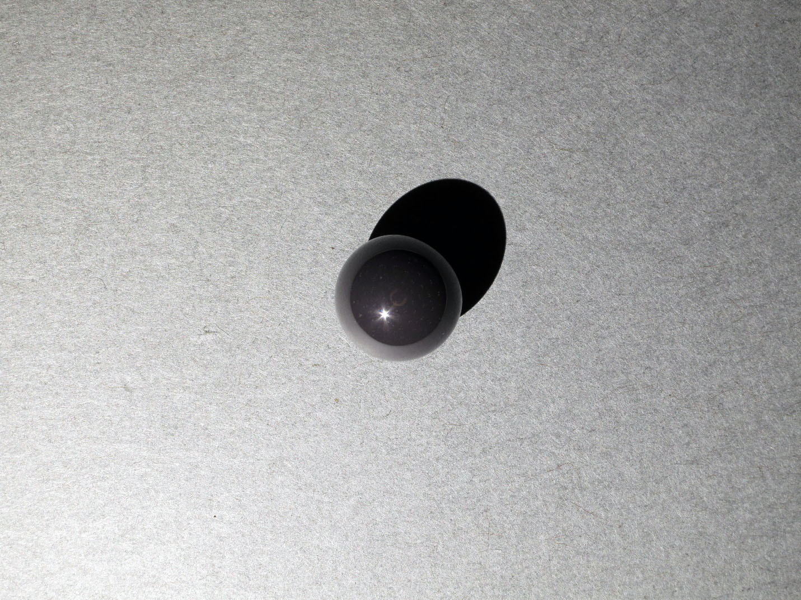

See the bright spot on the surface of the sphere? That’s a specular highlight from the LED. If it’s a perfect sphere, you can use the position of that highlight relative to the rest of the ball to calculate the lighting angle when the photo was taken. This would still be a pain to do if you had to measure and calculate the angle manually; fortunately, there’s software that can do this for you automatically.

First, we need to get a full set of photographs of such a shiny ball using the RTI dome. The ball above is a 12mm silicon nitride ball, with a very smooth and dark surface. However, you could use a shiny black marble, a ball bearing dipped in ink, or any other dark shiny object  as long as it’s spherical in shape. When you photograph it in your dome, it will need to be at least 250 pixels across in the photo, or else the software may have trouble picking out the highlight. But you also don’t want it to be too big, as you may not get accurate angular positions if you put a large sphere in a small dome.

This step will walk you through the process of getting the light position calibration data you need. This will be almost identical to the process of photographing an object/artifact in the dome; the only real difference will be in the post-processing.

Let’s start by setting up the dome stand. I put the stand on top of a dark cloth to minimize back-scattered light, but truthfully it makes little difference – I’ve done runs with and without the cloth, and can’t see any difference in the results.

I’ve put my lab jack in the middle of it, which is what the shiny ball (or any object) will sit on, and raised it to be at the same height as the top of the dome rim (usually a few mm above the stand base that the dome will sit on). Don’t worry about getting it perfectly centered – there’s room to move it around inside of the stand. I put a gray background on top of the lab jack, and place the shiny black ball as close to the center as I can. It’s gray so that you can distinguish the black sphere from the background. Once again, don’t worry about precise positioning:

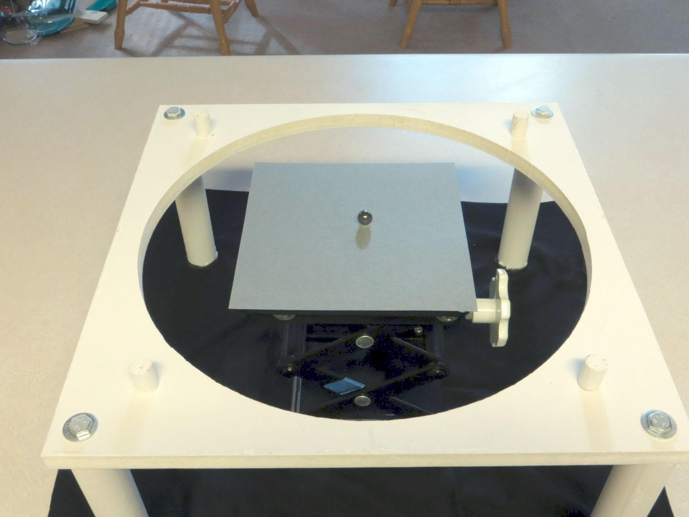
   
If the ball is a perfect sphere, it will definitely have a tendency to want to roll away. If you look closely at the base of the sphere, you’ll see there’s a small plastic washer that the ball is sitting on, which keeps it in place. Whatever washer you use, make sure it’s smaller than the diameter of the ball.
Time to put the rest of my RTI-Mage system parts in place:

1. Dome on top of the stand.
2. Ethernet cables from the dome plugged into the control box.
3. Camera in position on top of the dome (my Canon S110 in this case)
4. A micro-USB cable running from the USB Shutter jack on the rear of the control box to the USB input of the camera (this will fire the shutter automatically using CHDK). If you were using a different remote mode, like the IR remote cable, you would have that plugged into the same jack, with the LED pointed at the IR sensor of your camera. You can also do this procedure in Manual mode.
5. 9-12V DC power plugged into the control box.
6. Correct mode and shutter setting. In this case, I’ll be running in Auto mode, with the shutter set in USB mode for firing the Canon.

.. figure:: ../figures/calibration/calibration_14.jpg
   :align: center
   :width: 8cm

Once the system is setup and ready to go:

1. Set the camera to its Manual setting, where you set fixed exposure time and aperture values. 
2. Press the black WB button, which turns on the top row of LED lights for a prolonged period. Use this lit time to:

   a. Center the object in the camera view screen by moving the lab jack or dome around.
   b. If possible, zoom in the camera as much as you can to get the largest possible image of the sphere.
   c. Focus on the sphere by partially depressing the shutter button.
   
3. Determine the proper exposure settings. Set the aperture as small as possible to get good depth of field, all parts of the sphere in focus. Then set the exposure time so that the LED reflected highlight is clearly visible on the sphere, but the edge of the sphere is clearly defined against the background. The first picture above is a pretty decent example of that, but you could make the exposure a bit lighter or darker than that and still get acceptable results.
4. Set the JPG picture quality to the highest level. If you can shoot in RAW format, do that, and convert to JPG later on.
5. You will want to use your camera’s manual focus mode. Auto focus can work sometimes, but it will take longer to acquire the full dataset since the camera will have to re-focus for every picture. And for shallow lighting angles, autofocus can sometimes have problems because of the reduced lighting intensity. What I normally do with my Canon cameras is an initial autofocus with a half-press of the button, then switch over to manual focus mode. Normally, the camera will keep the same focus set with the autofocus button.

So here’s a shot of the camera view screen with the dome lights on, after I’ve done all of the above steps:

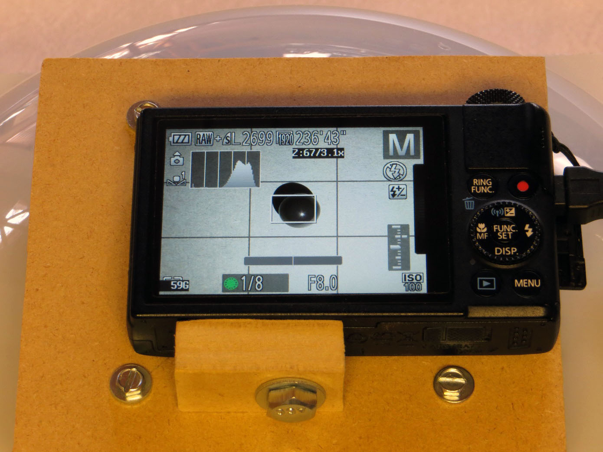

Now it’s time to set appropriate values for the LED and Delay times. The LED time, set by the left knob control, determines how long the LED is on when taking the picture. Too short, and the LED may turn off before the picture is taken; too long, and it will extend the time for the photo acquisition needlessly. The Delay time is to allow the camera to store the image on the SD card, and then display it on the screen so that you can check it. Too short and the camera won’t be able to keep up; too long, and once again the total acquisition time will be longer than necessary.

Start by setting both knobs in their middle position.  Press the red Action button to start the Automatic process. If the LED time is too short, and you’re only getting black pictures, make the LED time longer. If the LED is on for too long, reduce the LED time bit by bit until you wind up getting a black picture, then turn it back up to a longer length. After you set the correct LED time, work on the Delay time in a similar fashion. You may have to go back and forth between the two knobs until you find the right balance of times that takes the picture, but doesn’t waste too much time. With time, you’ll figure out roughly where to set these knobs as you change the exposure parameters.

When you’ve got the times set the way you want, stop the running Auto mode by pressing the Reset button. When the controller has rebooted, start up the Auto mode again, and hopefully you’ll see something like this (sped up to minimize the viewing time; it’s not that exciting) `video <https://www.youtube.com/watch?v=7loX4rX_1Ug>`_.

Once the run is done, you should have 48 photos of the black sphere, each taken at a different lighting angle:

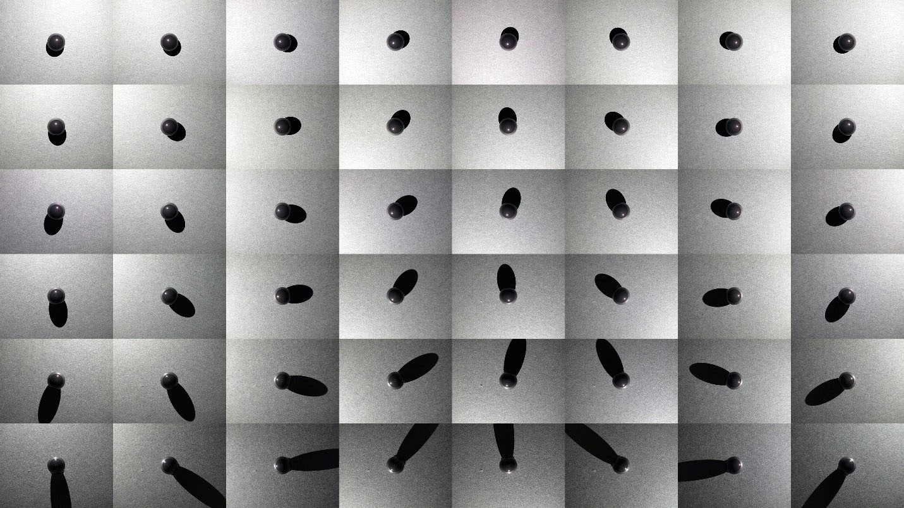

Transfer all these image files to a folder on your computer.

The position of each highlight on the sphere is related to the lighting angle when the photo was taken. Using that, we can create a calibration file that will allow you to process any set of photos from this system easily, as long as the camera is oriented in the same position, or close to it. That’s true for any camera you might use. So make some kind of reference mark on the dome to indicate how the camera should be oriented. If for some reason you need to have absolute precision for this calibration, you can just do a calibration run for the first photo set, then use that calibration data for all subsequent photos sets you shoot of the objects of interest (as long as you don’t move the camera).

To extract the calibration info, we’ll need to use a free program called `RTIBuilder <http://culturalheritageimaging.org/What_We_Offer/Downloads/Process/index.html>`_, available from Cultural Heritage Imaging. You’ll also need to have Java installed on your computer. 

Install the program on your computer. While you’re at it, you might as well download and install the RTIViewer program, which you’ll use to actually view your RTI datasets. It’s also available at the `CHI website <http://culturalheritageimaging.org/What_We_Offer/Downloads/View/index.html>`_.

.. note::
   
   Both of these programs are free, freely distributable and open source. CHI has done indispensable work in developing the RTI technique, including making these programs available for free (unlike one European university I could mention). If you use their software on a regular basis, make a donation, preferably on a yearly basis; I do.

After installation, run RTIBuilder. Be advised, the program is a little flakey; a new version is in the works, but the release date is unknown. The biggest quirk is that any filenames or filepaths you use must not have any spaces in them. 

Sometimes you’ll get a warning, other times you’ll just get cryptic error message.
When you first run the program, you’ll get the startup screen. Enter a name for the project at the top (no spaces), and select the Highlight Based (HSH Fitter) option.

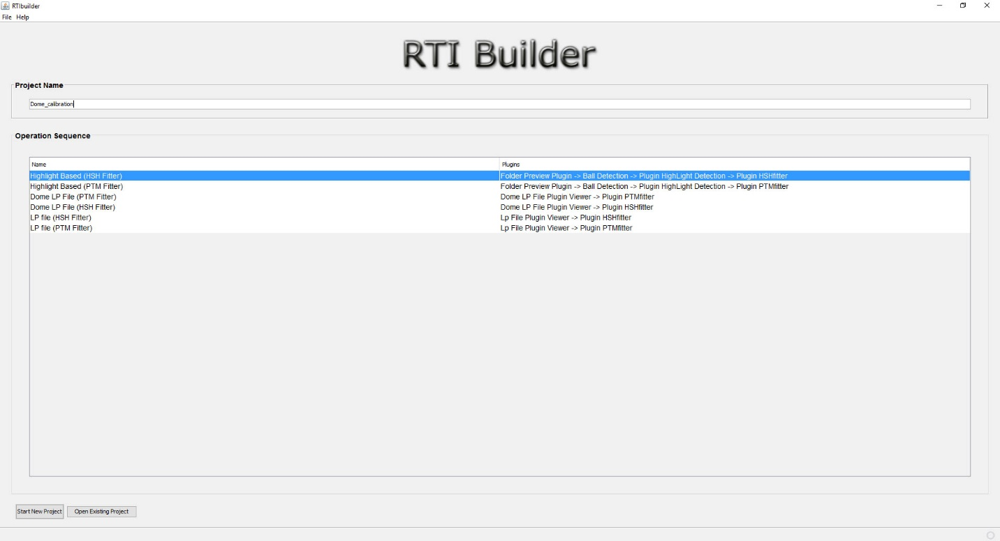

The Start New Project button at the bottom should now be active, click it. You’ll get this window:

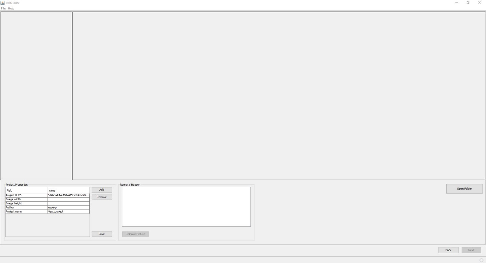

What it wants is the location of the sphere pictures you took. But time for a few quirks of RTIBuilder. First, you need to create a project folder to hold the pictures; give it any name you want, except make sure that there are no spaces in the folder name or drive path. Secondly, you’ll need to create a subfolder inside the project folder named “jpeg-exports”, no quotes, dash mandatory.

Copy all the sphere highlight photos into this folder. Finally, if the photos have a capitalized “JPG” extension instead of “jpg”, the program will give a fatal error message at the very last step. So you may need to rename all of the pictures with a “jpg” file extension. In Window, the simplest way to do this is to shift-right-click on the folder, choose “Open command window here”, then type “ren *.JPG *.jpg” in the window that pops up. Don’t know how to do this with a Macintosh, but I’m guessing there’s a way.

Once you’ve taken care of that, in RTIBuilder click the “Open Folder” button, then choose the project folder from the “Open” dialog; don’t choose the “jpeg-exports” folder. The program should then load in all the sphere highlight pictures in the folder:

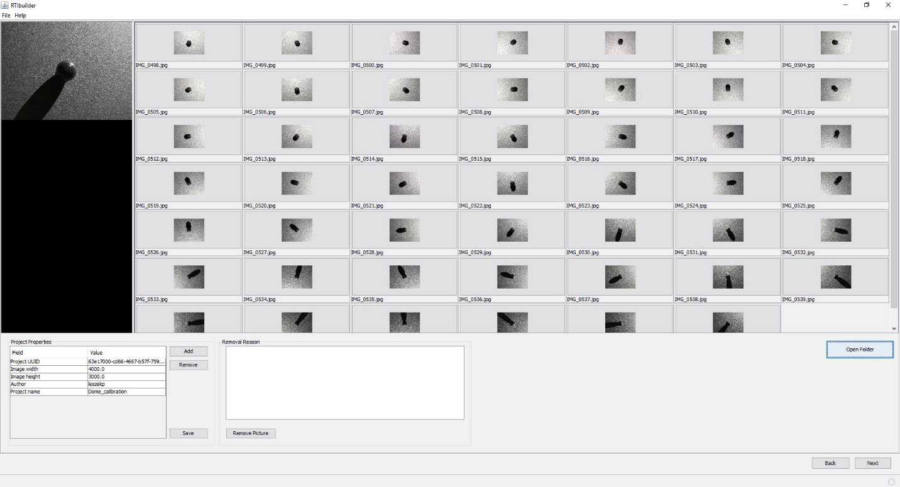

Make sure that all the pictures came out clear and in focus; if not, you’ll just have to shoot another set. Click on Next when ready, and you’ll get this screen:

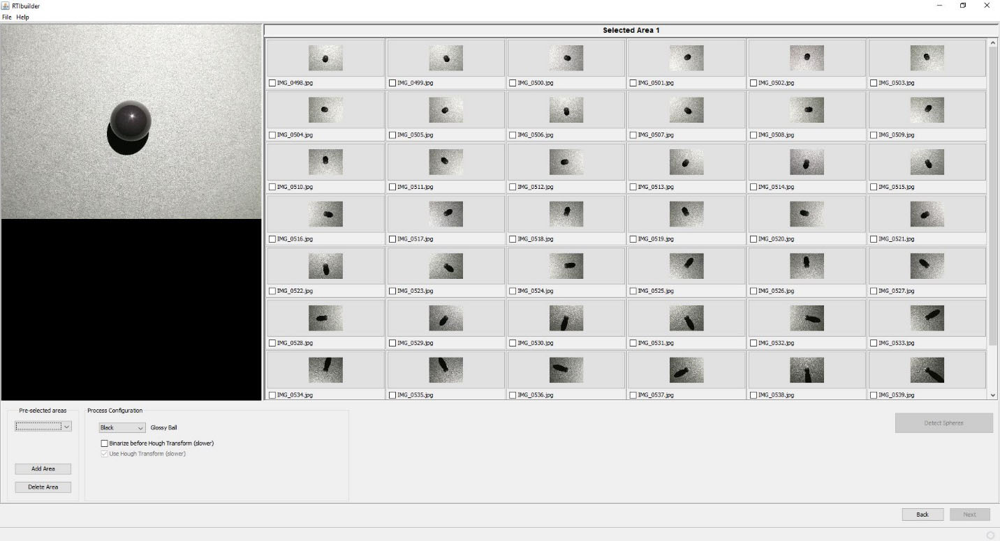

Click and drag in the picture at upper left to draw a green square that covers the sphere plus a small margin on the outside:

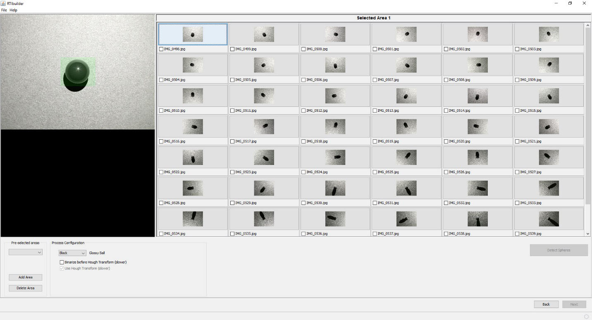

Click on the “Add Area” button at lower left:

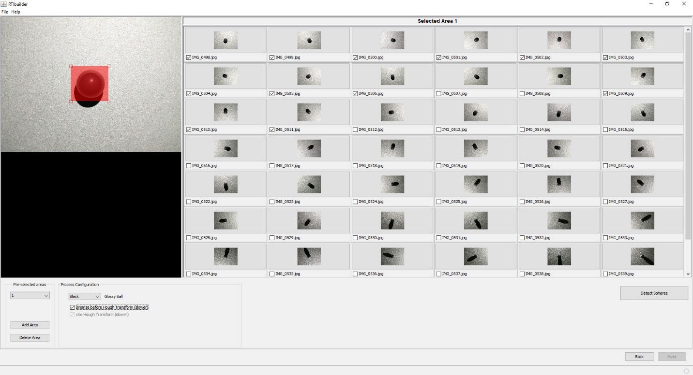

The area you defined will now be in red. If you want to refine that selection, you can click and drag the controls on the corners of the red area. But as long as you have the entire sphere selected, plus a little bit of margin, you should be fine. There’s a check box for “Binarize before Hough transform (slower)” at lower left. This improves threshold detection, but not sure exactly how.

Nevertheless, I usually check this box – slower is better, right?

When done, click the “Detect Spheres” button at lower right. Next screen:

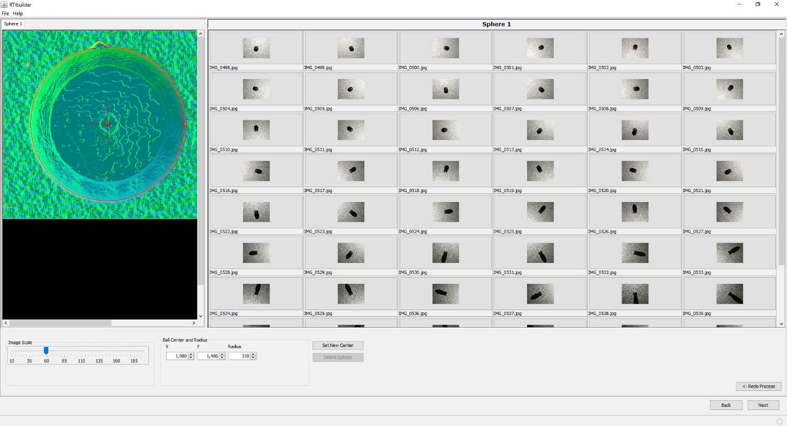

The program has analyzed all the pictures, and shown you its best guess as to the position of the edge of the sphere against the background, and its center. Use the slider at lower left to change the size of the image. Clicking any of the thumbnails will put that image inside the viewer; try clicking on a number of pictures to see whether the program’s guess for the radius/center of the sphere was correct.

If it’s a bit off, you can correct it using the X/Y/Radius controls to modify those parameters, then clicking on “Set New Center” when done. Caution: if the Radius value is less than 250, the program may have problems getting an accurate calibration; you may need to reshoot the photo set with either a higher zoom factor or a larger black sphere.

When you’re happy at this stage, click the Next button:

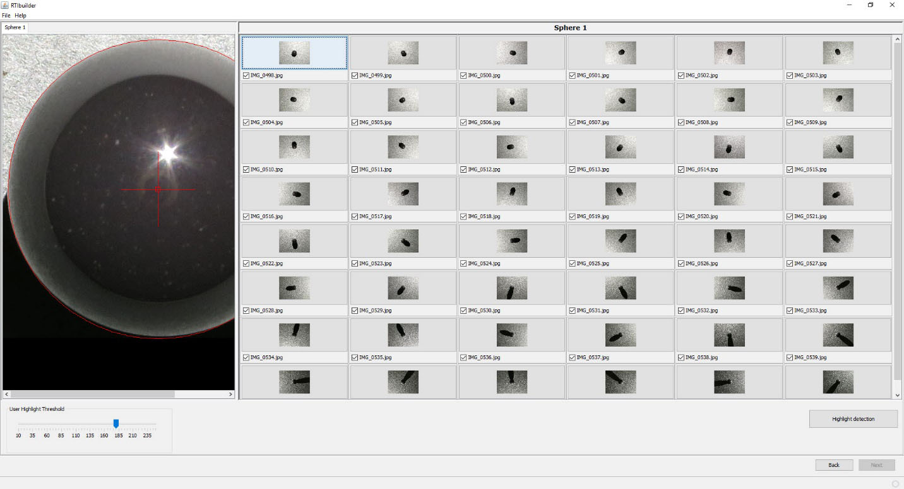

The radius and center will still be displayed here; if you decide you’re unhappy here, just click on the Back button to go to the previous screen. Otherwise, click on the “Highlight detection” button; the program will now examine the spheres and find the exact center position for every highlight on every picture. When done, you’ll see this:

.. figure:: ../figures/calibration/calibration_25.jpg
   :align: center
   :width: 8cm

Notice that the radius/center marks are now gone, replaced with a small cross inside of the highlight; this is where the program thinks the center is. In this case, it looks pretty good. Clicking on other thumbnails will bring up a different picture, and it’s worth checking a few of these to make sure that the program has done a good job:

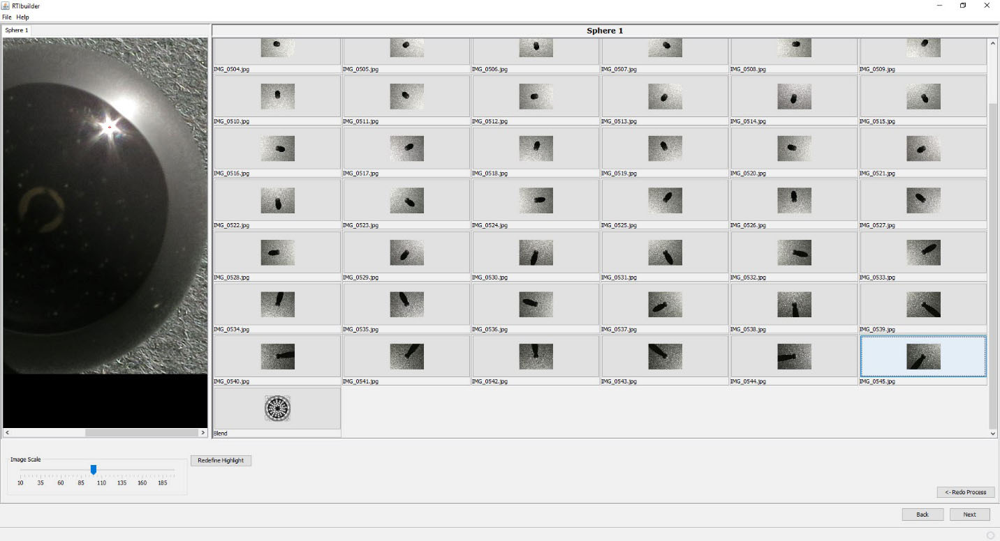

If the results aren’t satisfactory, click on the “Redo Process” button, and try setting a different value for the “User Highlight Threshold”. I’ve never had to do this, so I don’t know how well that works.
After doing the highlight detection, the program adds one more image to the set of the thumbnails, called “Blend”:

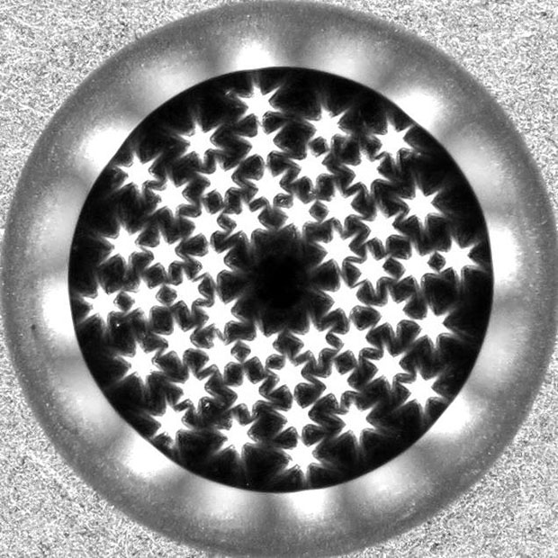

This is a blend of all the images, showing the highlights reflecting the distribution of LEDs inside the dome.

Why the star pattern? Diffraction from the shutter, accentuated because you’re using a small aperture for the best focus. I’ve never had a problem with this, but if you’re having problems getting good highlight detection, try shooting a calibration photo set with a slightly larger aperture.

When you’re happy with highlight detection, click Next:

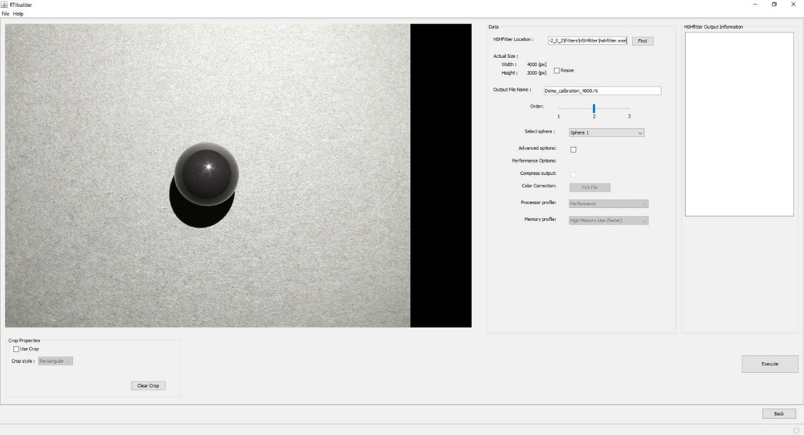

Leave all settings as is, and click Execute. The program will generate an lp calibration file for these photos, and then process them. If you look in the project folder, you’ll now see a folder called “assembly-files”. Look in there, and you’ll see two .lp files (both identical), which combine the calibration data with the names and paths of the photos, used for processing. Here’s a few lines from one of them:

.. code-block:: none

   48
   H:\RTI_Data\Hackaday_dome_calibrations\write_up_3\jpeg-exports\IMG_0498.jpg 0.13417545 0.45608342 0.8797641
   H:\RTI_Data\Hackaday_dome_calibrations\write_up_3\jpeg-exports\IMG_0499.jpg -0.22573107 0.40408084 0.88643336
   H:\RTI_Data\Hackaday_dome_calibrations\write_up_3\jpeg-exports\IMG_0500.jpg -0.46390244 0.1131883 0.8786256
   H:\RTI_Data\Hackaday_dome_calibrations\write_up_3\jpeg-exports\IMG_0501.jpg -0.4129351 -0.24111442 0.8782644
   H:\RTI_Data\Hackaday_dome_calibrations\write_up_3\jpeg-exports\IMG_0502.jpg -0.12138778 -0.4695002 0.8745482
   [...]

First line is the number of photos, remaining lines start with the photo name and path, and angle information appended to the end.

What we need to do now is extract out the number and angle information from this file, so that we can then append it to any new photo dataset created with the RTI-Mage; once again, that will be valid for every photo set where the camera is oriented the same way it was when you shot the calibration set. To do this, I’ve created a simple utility called RTI_Processor, which you can find in the file section; unzip the folder to any location, then run the RTI_Processor.exe program file (no installation required). Sorry Mac people, but only Windows for now.

Where’s the source code? This is a preliminary VB .Net version, replacing an older VB6 version, but it’s still not clean, and is missing some new features I want to add. When that is done, I’ll release the source code. It may be possible to compile .Net programs to work with Macs, but I don’t know enough about this to say for sure.

.. figure:: ../figures/calibration/calibration_29.png
   :align: center
   :width: 8cm

Go to the LP Tools menu, and select “Create lps from lp”. Navigate to the “assembly-files” folder, then select and open one of the two .lp files. You’ll then get the option to save a new file with the .lps extension. Give it a descriptive name, and save it in the same folder as the RTI_Processor program.

What’s this .lps file? It’s very similar to the .lp file, except that all the filenames and paths have been stripped out:

.. code-block:: none

   48
   0.13417545 0.45608342 0.8797641
   -0.22573107 0.40408084 0.88643336
   -0.46390244 0.1131883 0.8786256
   -0.4129351 -0.24111442 0.8782644
   -0.12138778 -0.4695002 0.8745482
   0.24190147 -0.4294567 0.87008655
   0.45700282 -0.13436723 0.87925756
   0.40734085 0.2106088 0.88866043
 
As with the .lp file, .lps files can be opened in any text editor.

One final step. In RTI_Processor, open this new lps file with File -> Open (or Ctrl-O). Select the lps file you’ve just saved; this loads it into the program as the set of angle positions it will use for subsequent processing. If this is the main dome you will be using, choose “Save current lps as default”, and it will load this dataset in automatically whenever the program starts.

If you use multiple domes, you’ll need to make sure you’re using the right data for the right dome in this program, which may require you to specifically load in the correct lps file for that specific dome every time. Whenever you load in a custom lps file, it will show the name at the lower left:

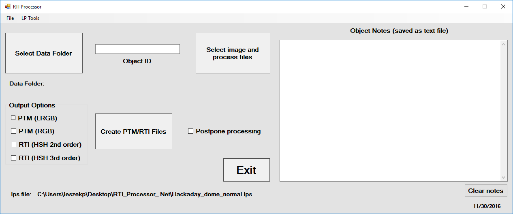

The default.lps file will always show up there when you start the program. If you load in a different lps file, then want to go back to the default, there’s a menu item under File that will let you do that.

Calibration is out of the way, and for the most part you only have to do this once (I’ll discuss one exception in a future step). Now you’re ready to do RTI on your first real object. You’ll need this RTI Processor program to handle data, so don’t get rid of it.
 
Been a long road to this point, but you’re now ready to photograph your first real object, convert the photos into an RTI dataset, then view it. Start by putting your object on the sample stage, with the top roughly at the same position as the bottom of the dome. Here, I’m using a modern replica projectile point:

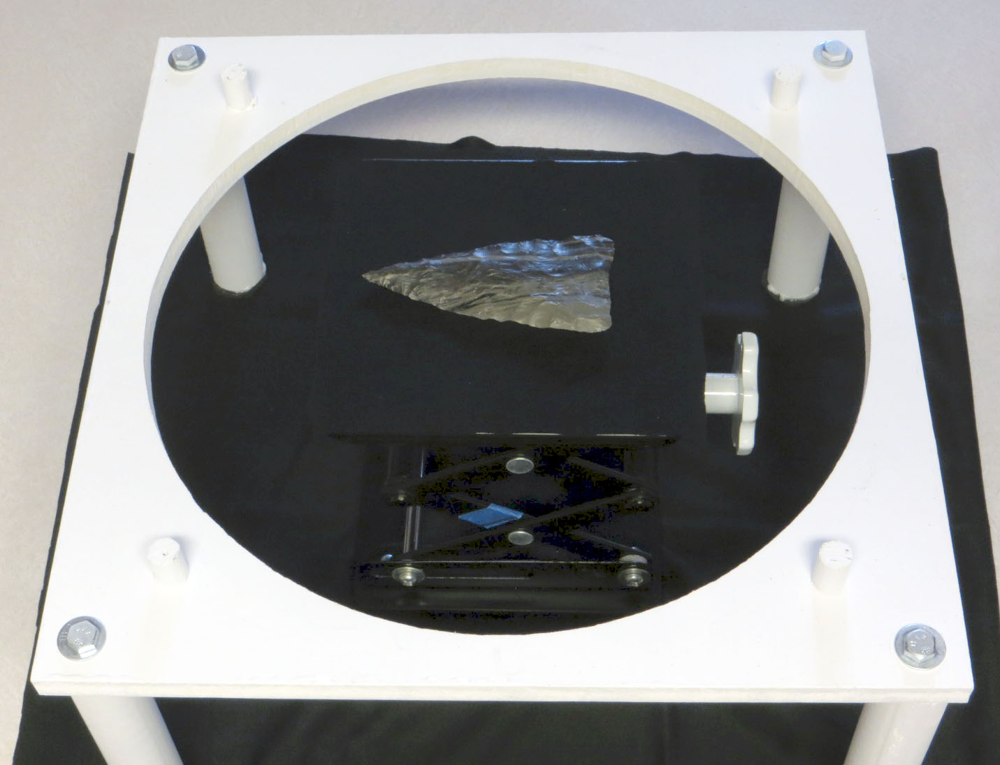

Many of the following steps are cut-and-paste from the previous calibration step.

Time to put the rest of the RTI-Mage system parts in place:

1. Dome on top of the stand.
2. Ethernet cables from the dome plugged into the control box.
3. Camera in position on top of the dome (my Canon S110 in this case)
4. A micro-USB cable running from the USB Shutter jack on the rear of the control box to the USB input of the camera (this will fire the shutter automatically using CHDK). If you were using a different remote mode, like the IR remote cable, you would have that plugged into the same jack, with the LED pointed at the IR sensor of your camera. You can also do this procedure in Manual mode.
5. 9-12V DC power plugged into the control box.
6. Correct mode and shutter setting. In this case, I’ll be running in Auto mode, with the shutter set in USB mode for firing the Canon.

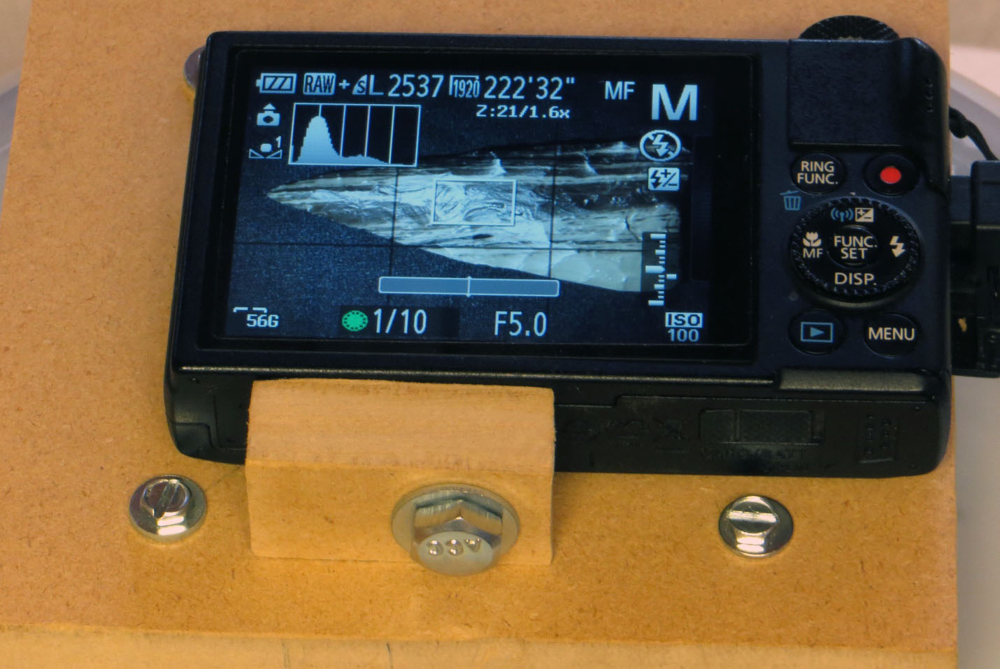

Once the system is setup and ready to go:

1. Set the camera to its Manual setting, where you set fixed exposure time and aperture values. 
2. Press the black WB button, which turns on the top row of LED lights for a prolonged period. Use this lit time to:

   a. Center the object in the camera view screen by moving the lab jack or dome around.
   b. If possible, zoom in the camera as much as you can to get the largest possible image of the sphere.
   c. Focus on the sphere by partially depressing the shutter button.
   d. If you have a gray card, set the camera white balance (WB).
   
3. Determine the proper exposure settings. Set the aperture large for short exposure times, small for greater depth of field (at the cost of longer exposure times). Then set the exposure time so that the object is properly exposed. If your camera has a histogram display, use it to help figure out the correct exposure settings.
4. Set the JPG picture quality to the highest level. If you can shoot in RAW format, do that.
5. You will want to use your camera’s manual focus mode. Auto focus can work sometimes, but it will take longer to acquire the full dataset since the camera will have to re-focus for every picture. And for shallow lighting angles, autofocus can sometimes have problems because of the reduced lighting intensity. What I normally do with my Canon cameras is an initial autofocus with a half-press of the button, then switch over to manual focus mode. Normally, the camera will keep the same focus set with the autofocus button.

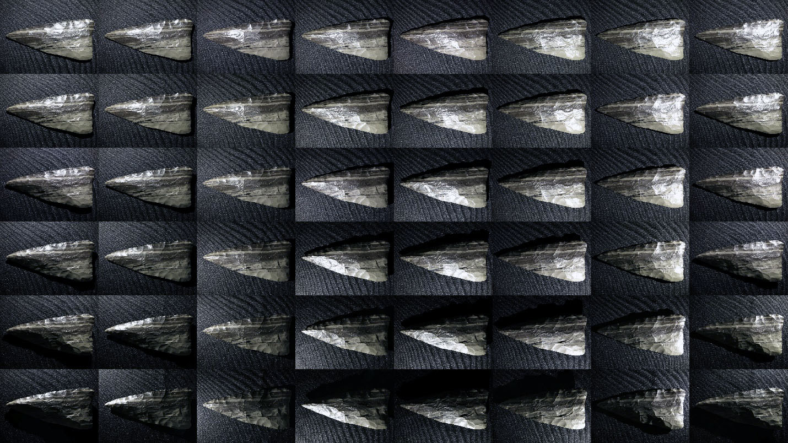

Now it’s time to set appropriate values for the LED and Delay times. The LED time, set by the left knob control, determines how long the LED is on when taking the picture. Too short, and the LED may turn off before the picture is taken; too long, and it will extend the time for the photo acquisition needlessly. The Delay time is to allow the camera to store the image on the SD card, and then display it on the screen so that you can check it. Too short and the camera won’t be able to keep up; too long, and once again the total acquisition time will be longer than necessary.

Start by setting both knobs in their middle position.  Press the red Action button to start the Automatic process. If the LED time is too short, and you’re only getting black pictures, make the LED time longer. If the LED is on for too long, reduce the LED time bit by bit until you wind up getting a black picture, then turn it back up to a longer length. After you set the correct LED time, work on the Delay time in a similar fashion. You may have to go back and forth between the two knobs until you find the right balance of times that takes the picture, but doesn’t waste too much time. With time, you’ll figure out roughly where to set these knobs as you change the exposure parameters.

When you’ve got the times set the way you want, stop any running Auto mode by pressing the Reset button. When the system has rebooted, start up the Auto mode again, and hopefully you’ll see something like this (sped up to minimize the viewing time; it’s not that exciting) `video <https://www.youtube.com/watch?v=yh37DKYI01w>`_.

This process will generate a full set of pictures at different lighting angles:

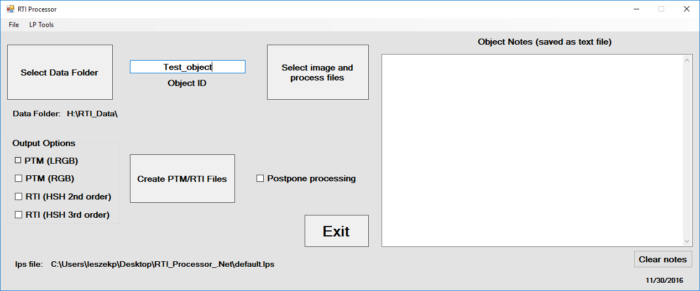

Copy these pictures over to your computer.

You’ll be using the RTI_Processor software, and for the most part it’s ready to go. There’s one exception. The program is a front-end for command line programs that take the photos, and convert them into RTI datafiles. There are two types of these files. PTM files have a binomial quadratic fit to the light curve at every pixel; RTI files fit 2nd and 3rd order Legendre polynomials to that curve. RTI files are a better fit, but PTM files have more visualization options in the RTIViewer software. You can create both of them with RTI_Processor as long as the command line programs are in the directory.

The RTI fitter, called hshfitter.exe, is open source and is included in the RTI_Processor folder you downloaded from the Hacakday Files section. The PTM fitter, ptmfitter.exe is not open source; HP makes it freely available, but you have to go to the HP website to download it. Go to `HP Labs <http://www.hpl.hp.com/research/ptm/downloads/agreement.html>`_, accept the licensing agreement, then download the Windows PTM Fitter zip file. Unzip the contents into the RTI_Processor folder, and you’re good to go.

Start up the RTI_Processor software; make sure the proper .lps calibration file is loaded in. In this case, it’s the default file loaded in upon program start, but you can choose another one using the File menu.

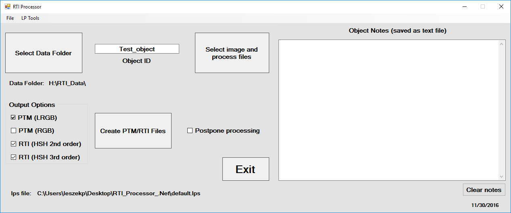

First, click on the “Select Data Folder”, and choose the location where you want to store the processed files. This location must have no spaces in its name. Unless you need to change this location, you only have to select it once. The program will check to make sure you’ve entered a Data Folder before letting you go on anywhere else. Next, enter some kind of ID name for the object; no spaces allowed. Here’s how my program looks. I’ve loaded a special lps file (see in the lower left hand corner), I have H:\RTI_Data as the data folder, and the name of the object is Test_object.

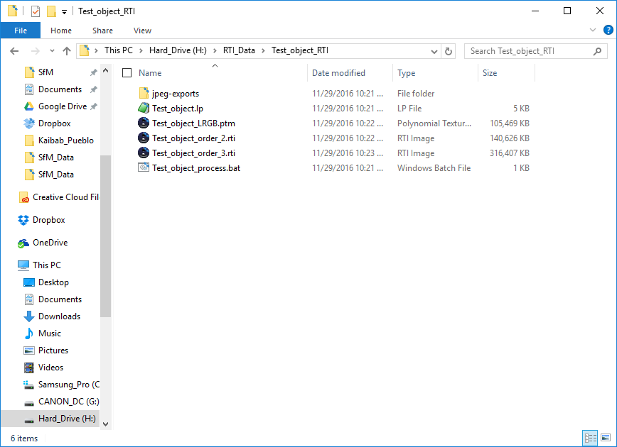

Click on the “Select Image And Copy Files” button, and navigate to the folder that has the photographs taken with the RTI-Mage system. Note: photos must be in JPG format. Double-click on any picture, and the following will happen:

1. The program will create a subfolder in the data folder with the Object ID name, plus “_RTI” appended to it.
2. It will create a jpeg-exports subfolder in that folder, copying all the JPG files there, renaming them by Object ID and photo number, and making sure the file extension is lower case (jpg, not JPG).

You’ll get a pop-up when all the files have been copied over.

Next, you need to choose what output files you want to get. There are four choices:

PTM (LRGB)
  Creates a file that fits a single binomial quadratic curve to just the luminosity, and assumes the RGB color values don’t change with light. This would be the normal choice for PTM file output. On Windows systems, the largest image size that can be processed with this option is 24 megapixels; if your photos are larger than this, you’ll need to crop or resize all of them to use this option successfully.
PTM (RGB)
  Fits separate light curve files to the R,G,B colors of every pixel. This is only useful for objects whose color changes with lighting angle. On Windows systems, this only works with smaller images (< 8 megapixels), so you’ll need to crop or resize all your images.
RTI (HSH 2nd order)
  Fits a 2nd order Legendre polynomial (9 coefficients) to the light curve for every pixel.
RTI (HSH 3rd order)
  Fits a 3rd order Legendre polynomial (16 coefficients) to the light curve for every pixel.

You can choose any/all of these by checking the boxes next to them. However, for most cases, I only select PTM (LRGB) and RTI (HSH 2nd or 3rd order). I haven’t photographed a single object whose colors change with lighting angle, so PTM (RGB) is pointless. RTI (HSH 3rd order) can sometimes give better results than just 2nd order, but not always.

There’s also a box at left where you can enter information about the object; it’s saved as a text file in the working directory. I put this in, but never use it – the .Net version will eventually have a more sophisticated metadata file capability.

Final option: the Postpone processing box. If this is unchecked, the RTI datafile creation process starts immediately. If checked, the commands are added to a batch file called “master_batch.bat”, located in the root Data Folder directory.

Depending on the size of the images, it can take a few minutes to process these datafiles. By postponing process, you can line up a queue of files to be processed, and when you’re ready, run the master.bat program to process all of them at the same time, say overnight.

For this example, I’ll process a PTM and RTI output file right away:

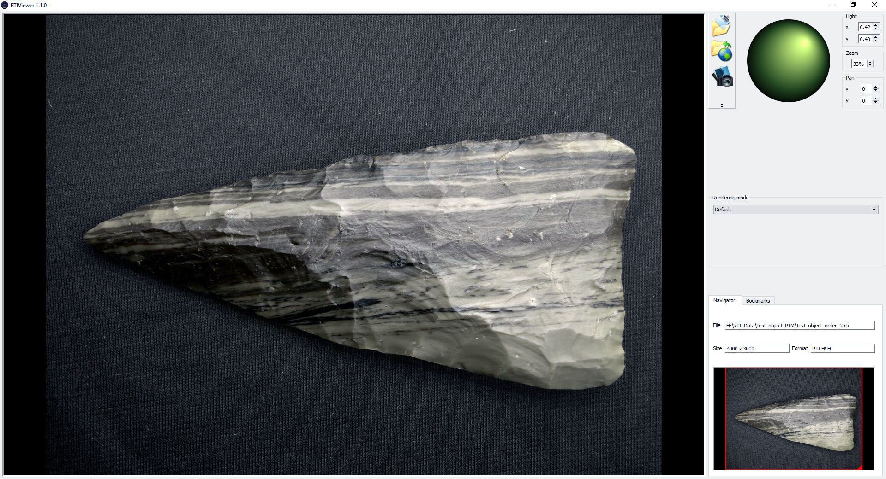

Push the Create PTM/RTI Files button, and it will run a batch file that will generate the RTI data files; you’ll see a command window open up, and watch the progress of the processing. When the window closes, the processing will be done, and you’ll see the following files/folders in the working directory:

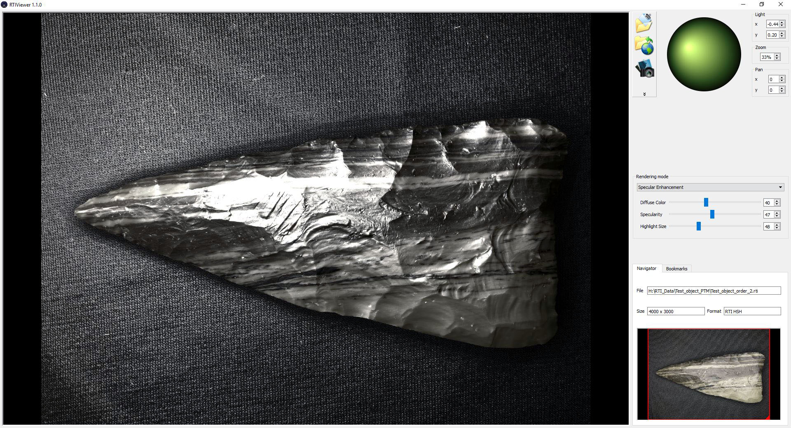

jpeg-exports
  As mentioned above, contains the copied renamed photographs from your RTI dome run.
Test_object.lp
  The light position file used by the fitting programs. This is plain text, so you can view it in any text editor.
Test_object_LRGB.ptm
  The PTM datafile. If you’ve installed the RTIViewer program, double-clicking on it will load it into the viewer.
Test_object_order_2.rti
  The 2nd order RTI datafile. 
Test_object_order_3.rti
  The 3rd order RTI datafile.
Test_object_process.bat
  The batch file used to run the PTMFitter and HSHfitter programs. You can delete this once processing is complete.

Double-clicking will load an RTI or PTM datafile into the RTIViewer program, where you can check out all the viewing options (see the RTIViewer manual for more information on using these):

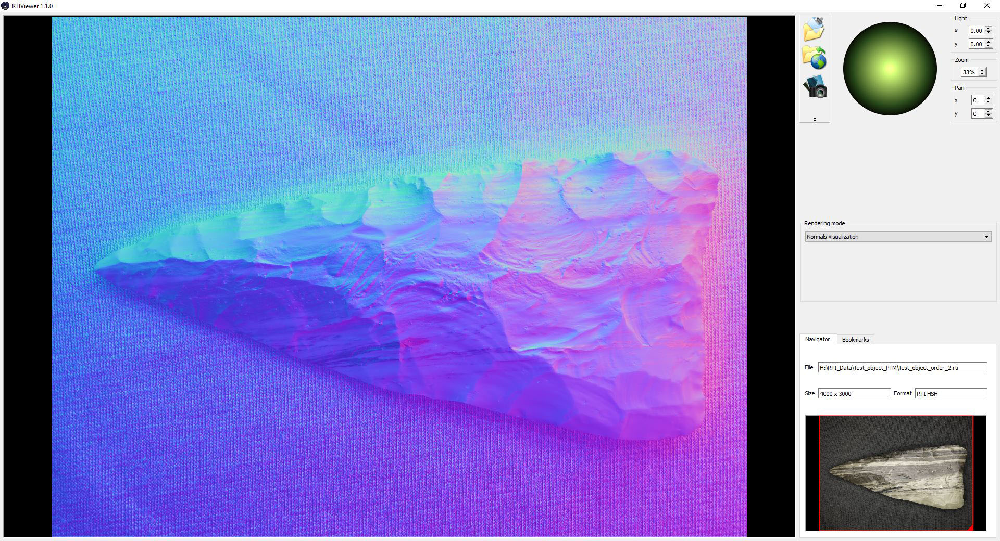
   
That’s it – repeat as often as desired. Have fun!